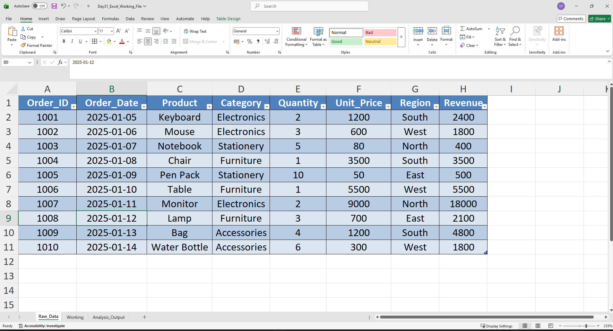
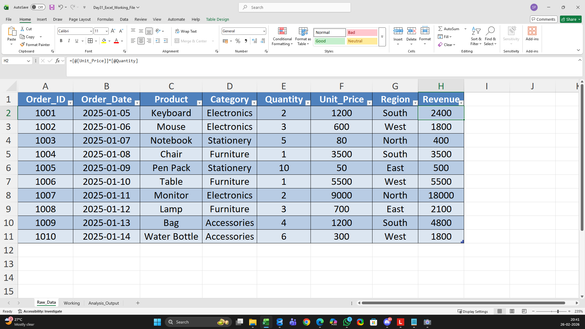

# Day 31 — Structuring Raw Business Data into Excel Tables

## 🎯 What I focused on today
As part of my journey into data analytics, I worked on turning a messy raw dataset into a structured Excel table.  

I’m learning that before analysis, the real analyst job starts with making data usable.

---

## 📚 What I practiced
- Converting raw business data into an Excel Table  
- Applying proper headers and consistent formatting  
- Making the dataset ready for formulas, pivots, and reporting  

---

## 🧠 What I’m understanding as a learner
Today showed me that most analysis problems don’t come from formulas —  
they come from poorly structured data.

By structuring data properly:
- Calculations become reliable  
- Pivot tables stop breaking  
- Reports become easier to maintain  

This is helping me think more like an analyst, not just an Excel user.

---

## 📂 Files included in this work
- Excel file showing raw data structured into a table  
- Screenshot of the table created  
- Screenshot of revenue calculation working  

---

## 📸 Work snapshots

### Structured Table

### Revenue Logic Applied

