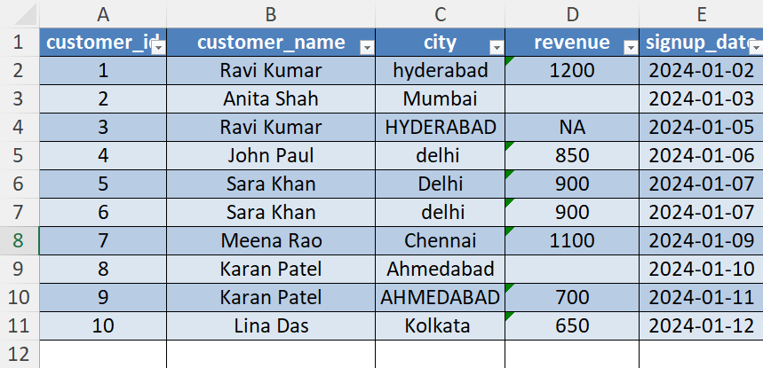
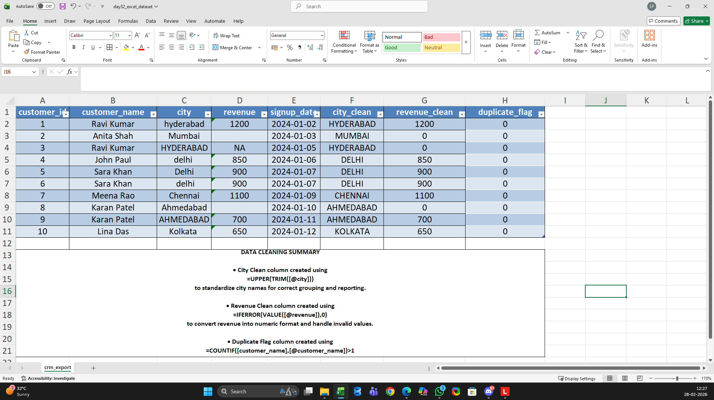

# Day 32 — Data Cleaning Techniques Analysts Use Daily

## 🎯 What I focused on today
Today I worked on cleaning a messy CRM-style dataset in Excel.  
As I continue learning data analytics, I’m realizing that real analyst work often starts with fixing bad data before any analysis happens.

---

## 📚 What I practiced
- Standardizing inconsistent text fields (names, regions, product categories)
- Handling blank and missing values properly
- Removing extra spaces and formatting issues
- Converting the dataset into a structured Excel table for analysis

---

## 🧠 What I’m understanding as a learner
This exercise showed me that:

- Analysis fails when data is inconsistent  
- Clean columns make formulas reliable  
- Structured tables reduce reporting errors  

I’m slowly learning that analysts don’t just analyze data —  
they prepare it so the business can trust the numbers.

---

## 📂 Files included in this work
- Cleaned Excel dataset ready for analysis  
- Screenshot showing table structure created  
- Screenshot showing cleaned and standardized columns  

---

## 📸 Work snapshots

### Table Structure Created

### Columns Cleaned & Standardized

