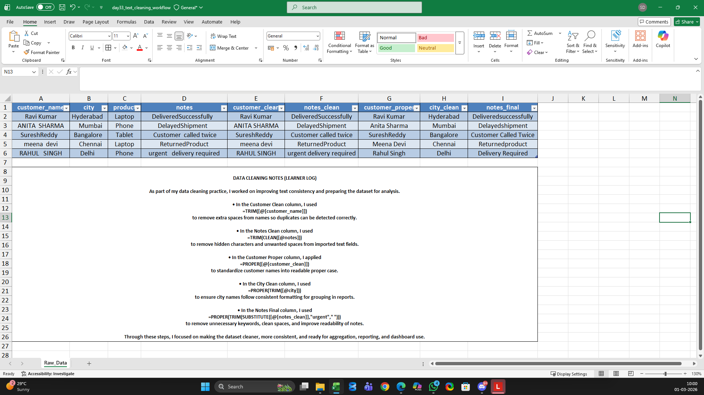
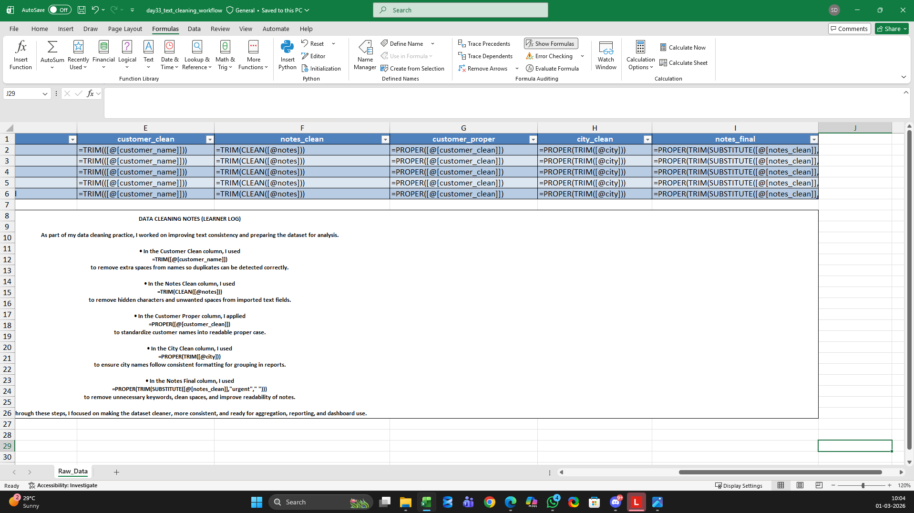

# Day 33 — Text Functions for Real Data Cleaning

## 🎯 What I worked on today
Today I focused on cleaning messy text data using Excel functions that analysts use daily in real projects.

I’m learning that small text issues can silently break filters, lookups, and dashboards — so fixing them early is critical.

---

## 📚 Skills I practiced
- Using TRIM() to remove extra spaces
- Using CLEAN() to remove hidden characters from copied data
- Using SUBSTITUTE() to standardize inconsistent values
- Creating cleaned columns instead of editing raw data directly

---

## 🧠 What I’m understanding as a learner
This exercise showed me that data problems are often not complex — they’re subtle.

If names, cities, or text fields aren’t standardized:
- Filters miss records
- Lookups fail
- Segments split incorrectly
- Reports become unreliable

Cleaning text properly makes every downstream analysis safer.

---

## 📂 Files included in this work
- Raw messy dataset used for practice
- Cleaned Excel version with functions applied
- Screenshot showing cleaned table
- Screenshot showing formulas used

---

## 📸 Work snapshots

### Cleaned Dataset View

### Text Cleaning Formulas Applied

---

## 🚀 Learning reflection
I’m documenting this 120-day journey to build practical analyst skills step-by-step.

Each day I’m trying to move closer to thinking like someone who prepares data for business decisions, not just someone who knows Excel formulas.
