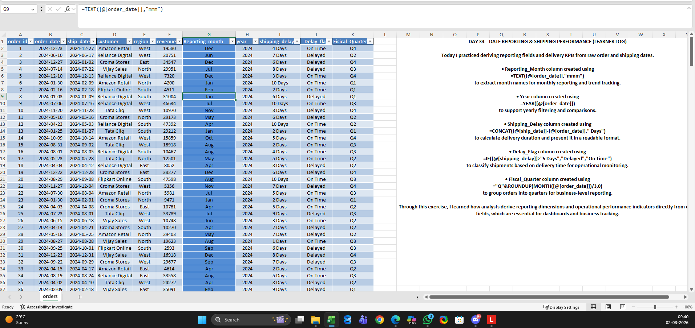
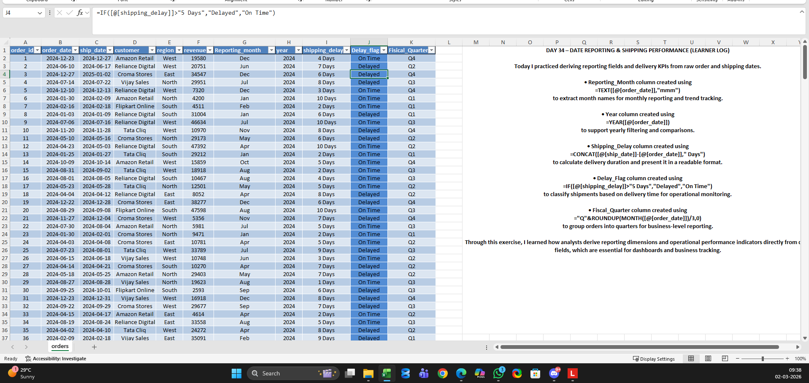
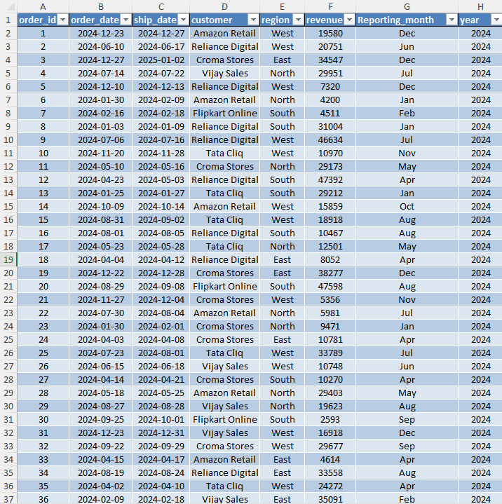

# Day 34 — Date Intelligence for Business Reporting

## 🎯 What I worked on today
Today I practiced transforming raw order dates into reporting-ready time fields in Excel.

I’m learning that analysts rarely use raw data directly. Instead, they derive reporting months, fiscal periods, and operational delay metrics before building dashboards.

---

## 📚 What I practiced
- Creating reporting month fields for dashboards
- Calculating shipping delays from order data
- Classifying orders into fiscal quarters
- Preparing time intelligence columns for reporting workflows

---

## 🧠 What I’m understanding as a learner
This exercise helped me understand how important date intelligence is in real analytics work.

Without proper time fields:
- Monthly reports misalign
- KPI trends become misleading
- Operational delays remain hidden

I’m gradually learning how analysts transform transactional data into reporting-ready datasets.

---

## 📂 Files included
- Orders dataset used for practice
- Screenshot showing reporting columns created
- Screenshot showing delay classification
- Screenshot showing reporting month structure

---

## 📸 Work Snapshots

### Reporting Month Column Created

### Delivery Delay Classification

### Date Columns Structured for Reporting

