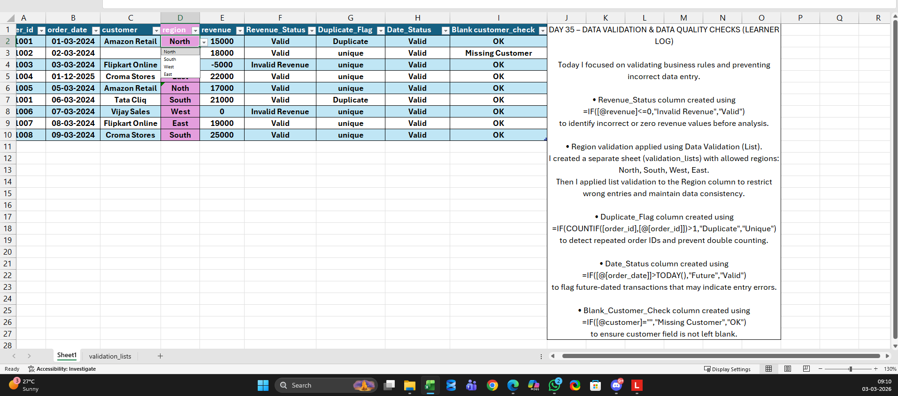
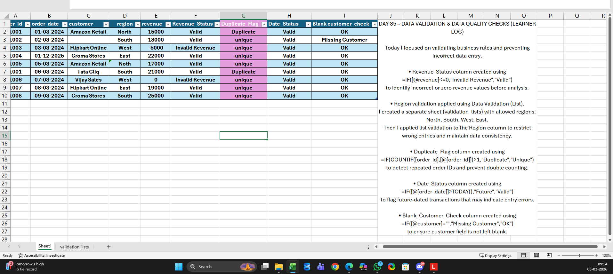
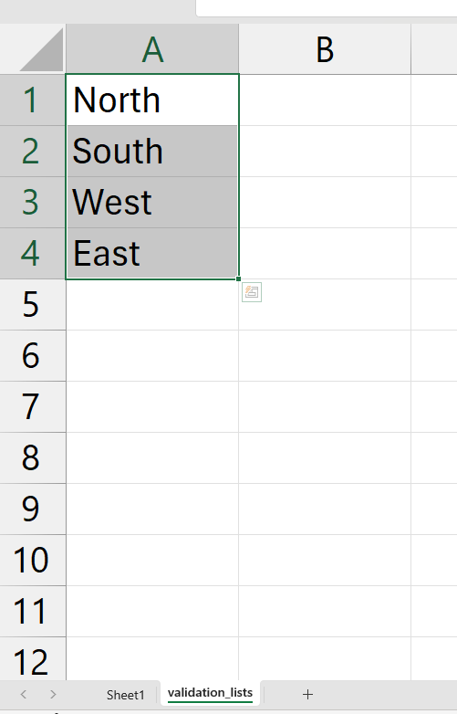

# Day 35 — Data Validation & Error Control in Analyst Workflows

## 🎯 What I focused on today
Today, I practiced how analysts prevent reporting errors before analysis even begins.

Instead of jumping into pivots or dashboards, I built validation checks directly inside Excel to control data quality issues.

---

## 📚 What I practiced
- Applying Data Validation dropdowns to control category inputs  
- Flagging negative or zero revenue values  
- Detecting duplicate order IDs  
- Identifying future-dated transactions  
- Checking missing customer names  

---

## 🧠 What I’m understanding as a learner
I’m learning that real analytics work is not just calculations —  
It’s about protecting business data from silent errors.

Small validation rules can prevent:
- Broken dashboards  
- Inflated revenue reports  
- Duplicate transaction impact  
- Incorrect regional analysis  

This exercise helped me think more like a reporting analyst, not just an Excel user.

---

## 📂 Files included
- Excel validation workflow file  
- Screenshot of validation dropdown  
- Screenshot of error flags working  

---

## 📸 Work Snapshots

### Region Dropdown Validation

### Error Flags & Duplicate Detection

### Validation List Sheet

