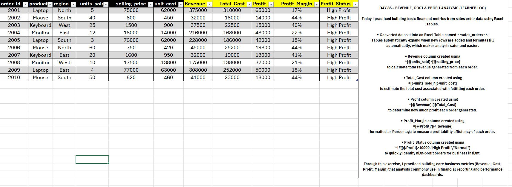
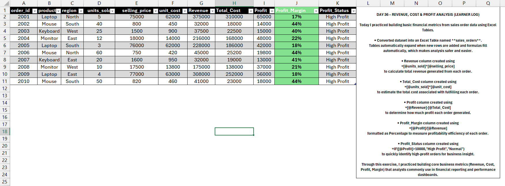
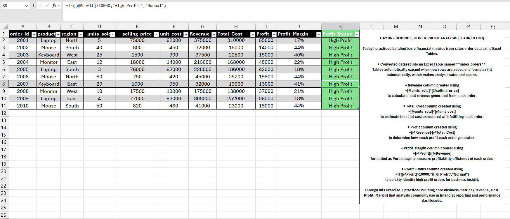

# Day 36 — Revenue, Cost & Profit Analysis in Excel

## 🎯 What I focused on today
Today I practiced transforming raw sales order data into business metrics using Excel.

Instead of just working with raw transactional data, I calculated revenue, cost, profit, and profit margin to understand the financial performance of each order.

---

## 📚 What I practiced
- Revenue calculation using units sold and selling price
- Total cost calculation using unit cost
- Profit computation per order
- Profit margin analysis
- Flagging high-profit transactions

---

## 🧠 What I’m understanding as a learner
This exercise helped me understand how analysts convert operational sales data into financial insights.

Even simple calculations like revenue and profit become powerful when structured properly in Excel tables.

I’m gradually learning how raw data becomes meaningful business metrics.

---

## 📂 Files included
- Excel file containing revenue and profit calculations
- Screenshot showing profit calculations
- Screenshot showing the profit margin column
- Screenshot showing profit classification logic

---

## 📸 Work Snapshots

### Business Calculations

### Profit Margin

### Profit Status Flag

