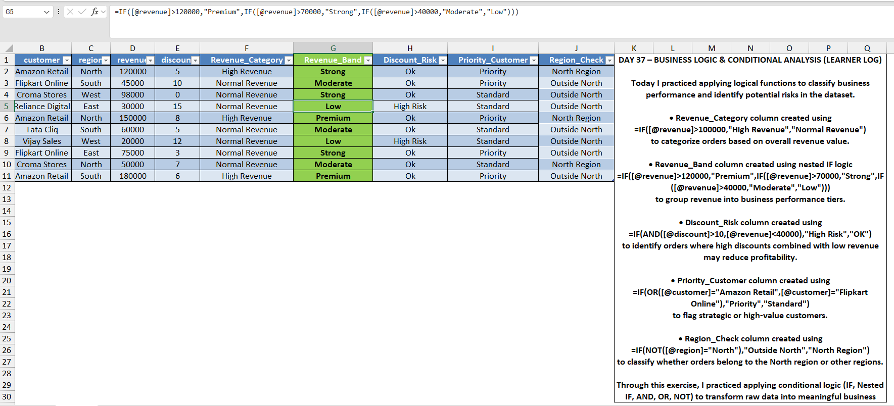
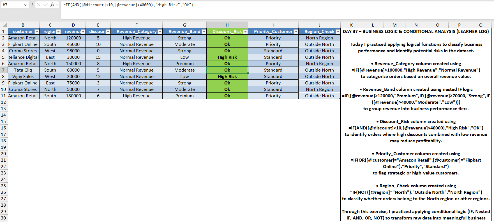
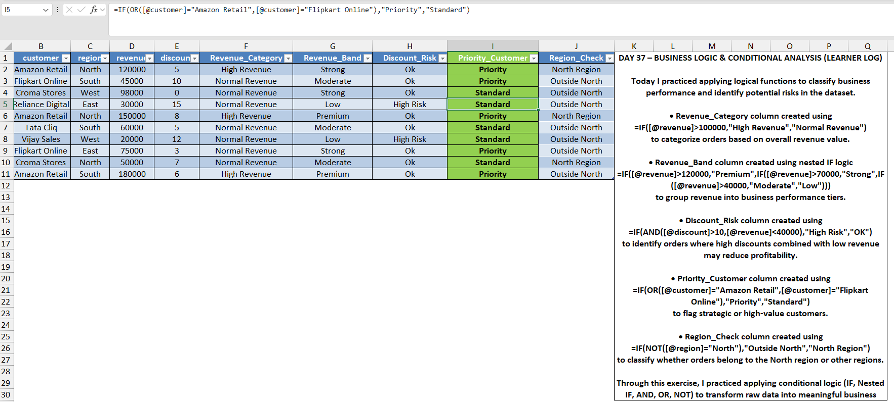

📄 README CONTENT

# Day 37 — Logical Analysis Using Excel Functions

## 🎯 What I focused on today
Today I practiced applying logical functions in Excel to simulate real business decision rules.

Using AND, OR, and NOT functions, I classified sales transactions based on revenue performance, risk levels, and priority customers.

---

## 📚 What I practiced
- Revenue classification using IF
- Multi-level revenue segmentation using nested IF
- Risk detection using AND conditions
- Priority customer identification using OR logic
- Region validation using NOT

---

## 🧠 What I’m understanding as a learner
This exercise helped me understand how analysts convert raw business rules into automated logic inside Excel.

Logical formulas allow analysts to build rule-based analysis without manual checking.

---

## 📂 Files included
- Excel file containing logical analysis formulas
- Screenshot showing revenue classification logic
- Screenshot showing discount risk detection
- Screenshot showing priority customer identification

---

## 📸 Work Snapshots

### Revenue Logic

### Discount Risk Detection

### Priority Customer Logic

---
