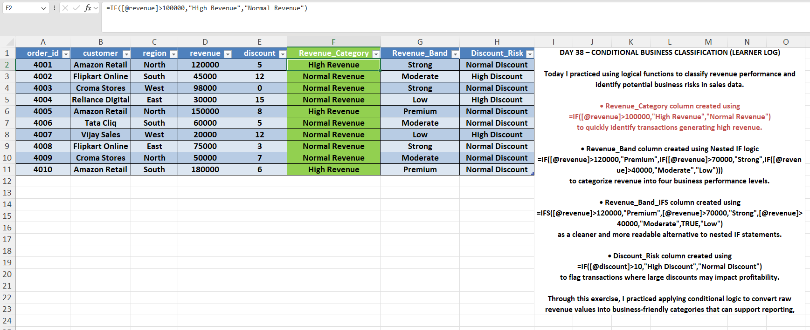
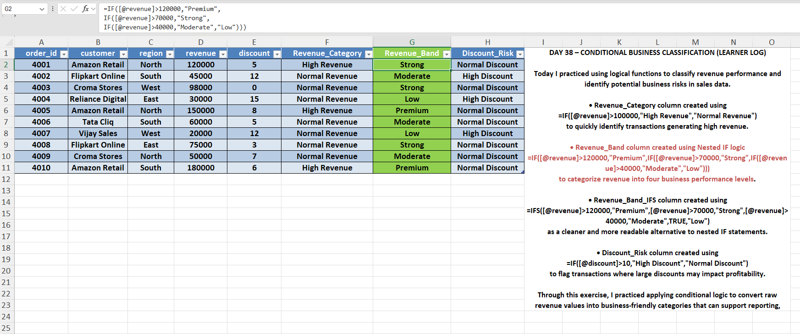
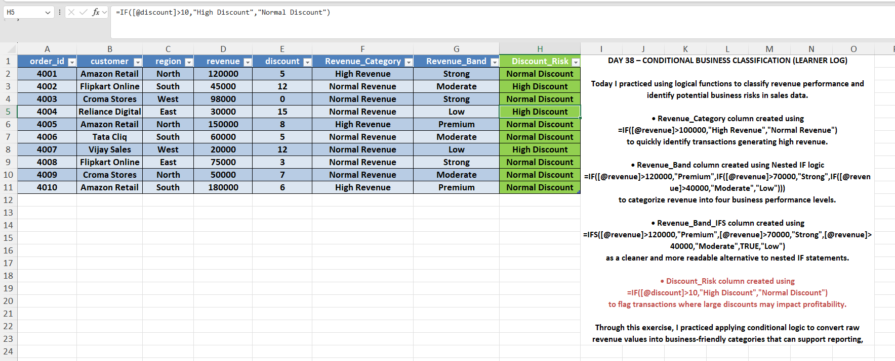

# Day 38 — Conditional Logic Using IF / IFS / Nested IF

## 🎯 What I focused on today
Today I practiced using conditional logic functions in Excel to simulate how analysts apply business rules to datasets.

Using IF, IFS, and nested IF functions, I classified transactions based on revenue performance and discount behavior.

---

## 📚 What I practiced
- Revenue classification using IF
- Multi-level segmentation using nested IF
- Cleaner conditional logic using IFS
- Risk detection based on discount levels

---

## 🧠 What I’m understanding as a learner
Conditional logic is one of the most common techniques analysts use when transforming raw data into meaningful categories.

Instead of manually checking records, formulas allow analysts to automate classification logic directly inside datasets.

---

## 📂 Files included
- Excel file containing conditional logic formulas
- Screenshot showing revenue classification
- Screenshot showing revenue band logic
- Screenshot showing discount risk flag

---

## 📸 Work Snapshots

### Revenue Category

### Revenue Band Logic

### Discount Risk

