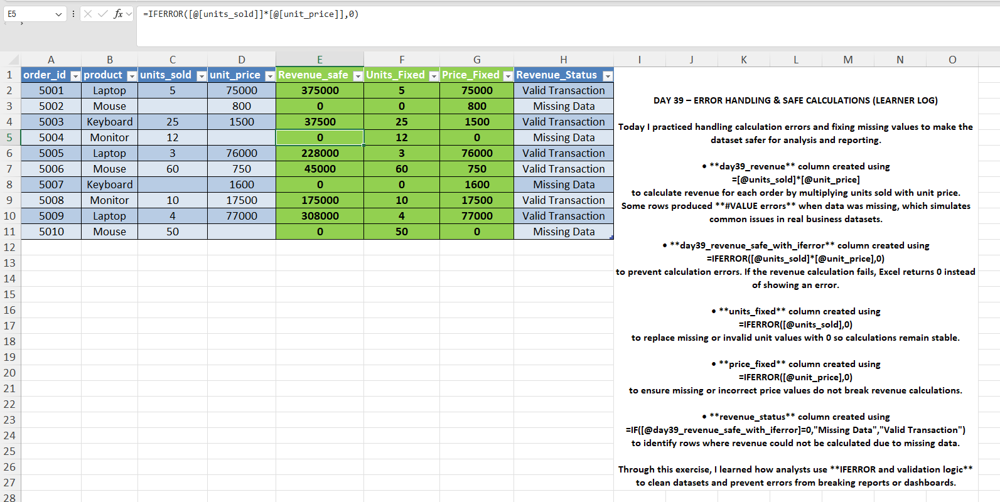
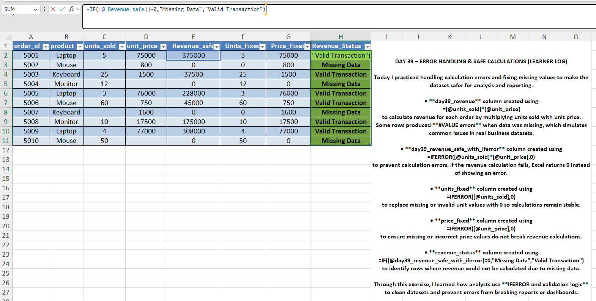

# Day 39 — Handling Missing & Incorrect Data Using IFERROR

## 🎯 What I focused on today
Today I practiced handling missing and incorrect values in Excel datasets using the IFERROR function.

Real-world business data often contains missing values or incorrect entries that can break formulas and reports.

By using IFERROR, I ensured calculations remain stable even when data issues occur.

---

## 📚 What I practiced
- Identifying formula errors caused by missing values
- Using IFERROR to prevent calculation failures
- Creating error-safe revenue calculations
- Detecting missing data transactions

---

## 🧠 What I’m understanding as a learner
Handling data quality issues is a critical skill for analysts.

Instead of letting formulas break, analysts design error-safe logic so reports remain reliable.

This exercise helped me understand how to protect calculations from missing or incorrect data.

---

## 📂 Files included
- Excel dataset with missing values
- Screenshot showing revenue error example
- Screenshot showing IFERROR fix
- Screenshot showing missing data detection

---

## 📸 Work Snapshots

### IFERROR Fix

### Missing Data Flag

