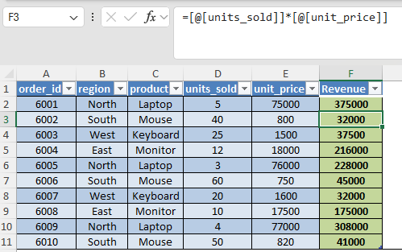
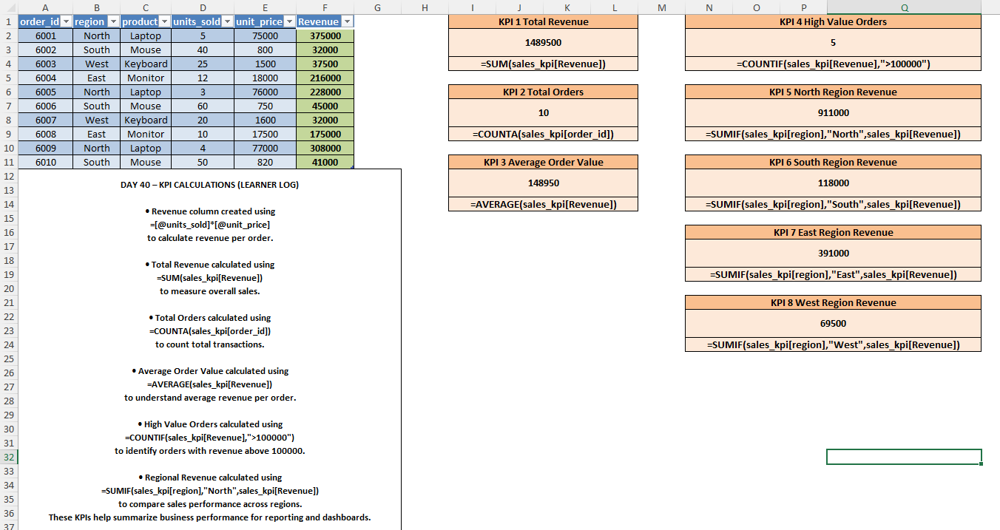
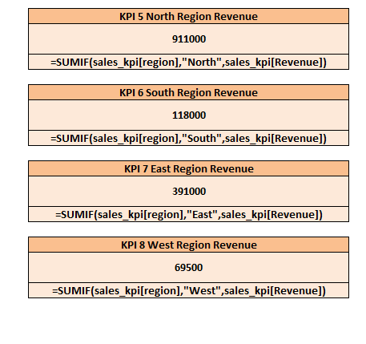

# Day 40 — KPI Calculations Analysts Build for Managers

## 🎯 What I focused on today
Today I practiced building key performance indicators (KPIs) in Excel that analysts commonly prepare for managers.

Using sales transaction data, I calculated revenue metrics and created summary KPIs that help managers quickly evaluate business performance.

---

## 📚 What I practiced
- Revenue calculation from transactional data
- Total revenue KPI
- Total orders KPI
- Average order value
- High value order detection
- Regional revenue analysis

---

## 🧠 What I’m understanding as a learner
Managers often need quick performance metrics rather than raw datasets.

Analysts transform operational data into summary KPIs that help decision makers quickly understand business performance.

This exercise helped me understand how Excel can be used to build simple KPI reporting logic.

---

## 📂 Files included
- Excel dataset used for KPI calculations
- Screenshot showing revenue calculation
- Screenshot showing KPI dashboard
- Screenshot showing regional KPI metrics

---

## 📸 Work Snapshots

### Revenue Calculation

### KPI Dashboard

### Regional KPIs

