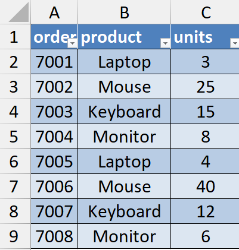
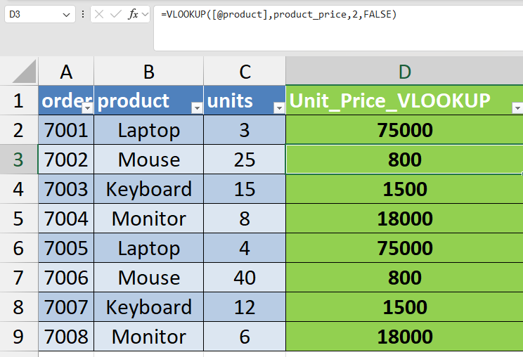
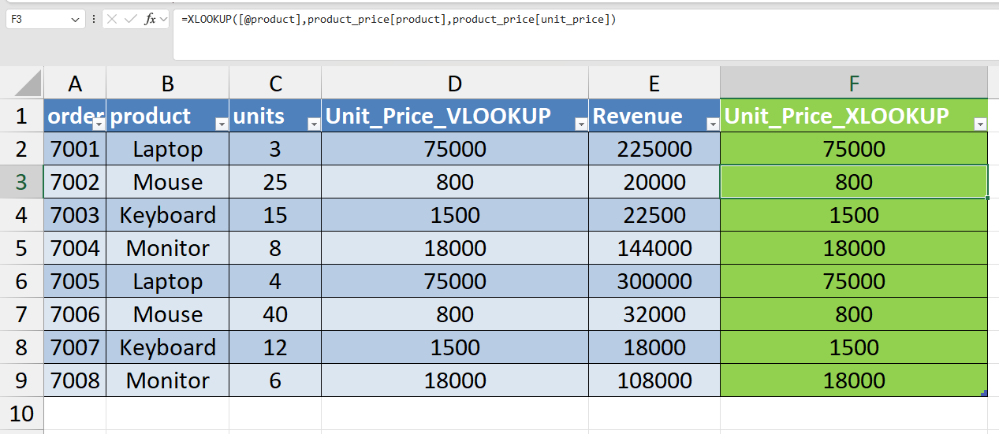
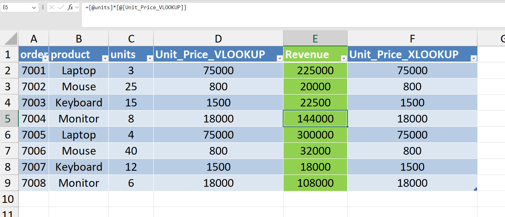

# Day 41 — VLOOKUP vs XLOOKUP for Analyst Tasks

## 🎯 Objective

Today I practiced using Excel lookup functions to combine data from multiple tables.

In real analyst workflows, transactional datasets often do not contain all required information. Analysts frequently retrieve additional data from reference tables using lookup functions.

To simulate this scenario, I connected an **orders dataset** with a **product price table** and retrieved product prices using lookup formulas.

---

## ⚙️ Data Preparation

Both datasets were converted into Excel Tables for easier referencing and safer formulas.

Tables created:

* **orders_table**
* **product_price_table**

Excel tables automatically expand when new rows are added and allow structured references in formulas.

---

## 📚 What I Practiced

### 1️⃣ Retrieve Prices Using VLOOKUP

Created column **Unit_Price_VLOOKUP**

Formula used:

```
=VLOOKUP([@product],product_price_table,2,FALSE)
```

This retrieves the product price from the reference table by matching the product name.

---

### 2️⃣ Calculate Revenue

Created column **Revenue**

Formula used:

```
=[@units]*[@Unit_Price_VLOOKUP]
```

This converts transactional order data into a financial metric by calculating revenue per order.

---

### 3️⃣ Retrieve Prices Using XLOOKUP

Created column **Unit_Price_XLOOKUP**

Formula used:

```
=XLOOKUP([@product],product_price_table[product],product_price_table[unit_price])
```

XLOOKUP provides a cleaner and more flexible approach compared to VLOOKUP.

---

## 🔎 Why Analysts Prefer XLOOKUP

Compared to VLOOKUP, XLOOKUP:

* Does not require column index numbers
* Works left-to-right or right-to-left
* Is easier to read and maintain
* Reduces lookup errors in larger datasets

---

## 🧠 What I’m Understanding as a Learner

Business data is often stored across multiple tables.

To analyze this data effectively, analysts match keys such as **product ID, customer ID, or order ID** to combine datasets.

This exercise helped me understand how Excel lookup functions perform **relational data matching similar to database joins** used in SQL.

---

## 📂 Files Included

* Excel workbook containing **orders and product price tables**
* Screenshot showing **VLOOKUP implementation**
* Screenshot showing **XLOOKUP implementation**
* Screenshot showing **revenue calculation**

---

## 📸 Work Snapshots

### Orders Dataset



### VLOOKUP Result



### XLOOKUP Result



### Revenue Calculation


