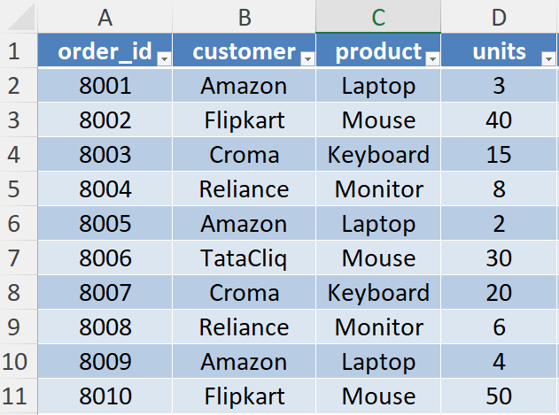
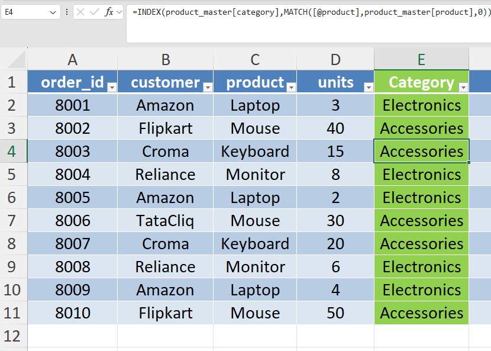
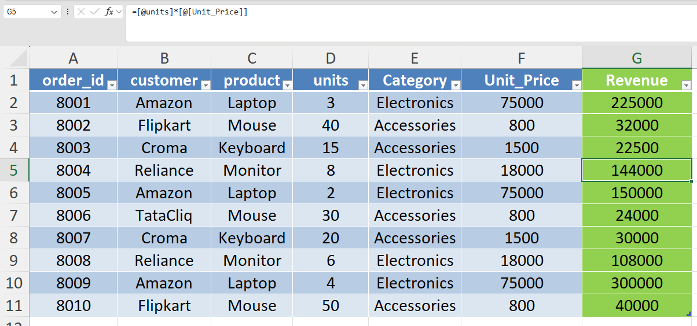

# Day 42 — INDEX + MATCH for Flexible Data Retrieval

## 🎯 Objective

Today I practiced retrieving information from a reference dataset using the **INDEX + MATCH** combination in Excel.

In many business datasets, transactional tables do not contain all required attributes. Analysts often retrieve missing information from **master datasets** such as product catalogs or customer tables.

To simulate this scenario, I connected a **sales orders table** with a **product master table** containing product category and unit price.

---

## ⚙️ Data Preparation

Both sheets were converted into Excel Tables to allow structured references and easier formula management.

Tables created:

* **sales_orders**
* **product_master**

Using tables allows formulas to expand automatically when new rows are added.

---

## 📚 What I Practiced

### 1️⃣ Retrieve Product Category

Created column **Category**

Formula used:

```
=INDEX(product_master[category],MATCH([@product],product_master[product],0))
```

This retrieves the **product category** from the master dataset by matching the product name.

---

### 2️⃣ Retrieve Product Price

Created column **Unit_Price**

Formula used:

```
=INDEX(product_master[unit_price],MATCH([@product],product_master[product],0))
```

This dynamically retrieves the **unit price** from the product master table.

---

### 3️⃣ Calculate Transaction Revenue

Created column **Revenue**

Formula used:

```
=[@units]*[@Unit_Price]
```

This converts transactional order data into **financial metrics** by calculating revenue per order.

---

## 🔎 Why Analysts Use INDEX + MATCH

Compared to VLOOKUP, **INDEX + MATCH** offers several advantages:

* Allows **left or right lookups**
* Works more efficiently with **large datasets**
* Does not break when **columns are rearranged**

This approach closely resembles **database-style joins** used in SQL.

---

## 🧠 What I’m Understanding as a Learner

Business data is often stored in **separate datasets**.

To analyze transactions effectively, analysts combine datasets by matching keys such as **product ID or product name**.

This exercise helped me understand how Excel can simulate **relational joins** when working with structured datasets.

---

## 📂 Files Included

* Excel workbook containing **sales orders and product master datasets**
* Screenshot showing **INDEX + MATCH lookup**
* Screenshot showing **revenue calculation**

---

## 📸 Work Snapshots

### Sales Orders Table



### Category Lookup



### Revenue Calculation


