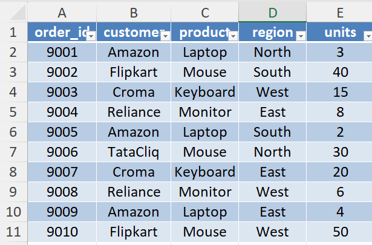
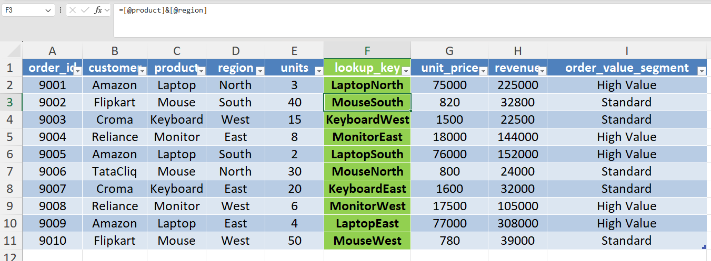
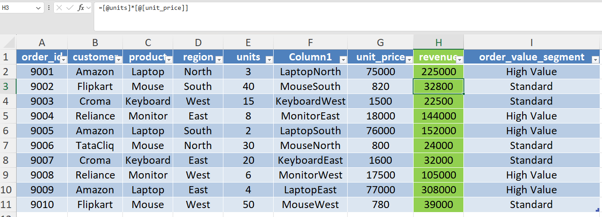

# Day 43 — Multi-Column Business Matching in Excel

## 🎯 What I focused on today

Today I practiced retrieving information from another dataset using **multiple matching conditions**.

In many business scenarios, data cannot be matched using only one column.
For example, product prices may vary by **region, contract type, or customer category**.

To simulate this situation, I matched **sales orders** with **pricing rules** using both **product and region**.

This exercise helped me understand how analysts prepare datasets before performing analysis.

---

## ⚙️ Dataset Preparation

Two datasets were created in Excel.

**Sheet 1 — sales_orders**

Contains transactional order data.

Columns:

* order_id
* customer
* product
* region
* units

**Sheet 2 — pricing_rules**

Contains reference pricing information.

Columns:

* product
* region
* unit_price

Both datasets were converted into Excel Tables.

Table names used:

* `sales_orders`
* `pricing_rules`

Using tables helps formulas remain stable and automatically expand when new rows are added.

---

## 📚 What I Practiced

### 1️⃣ Creating Multi-Column Lookup Key

Since the correct price depends on **product + region**, a helper column was created.

Column name:
`lookup_key`

Formula used:

```
=[@product]&[@region]
```

Example values:

LaptopNorth
MouseSouth
KeyboardWest

This allows Excel to perform **multi-column matching**.

---

### 2️⃣ Retrieving Correct Unit Price

Created column:

`unit_price`

Formula used:

```
=INDEX(pricing_rules[unit_price],
MATCH([@lookup_key],pricing_rules[lookup_key],0))
```

This retrieves the correct price from the pricing rules table using the lookup key.

---

### 3️⃣ Calculating Revenue

Created column:

`revenue`

Formula used:

```
=[@units]*[@unit_price]
```

This converts transactional order data into **financial metrics**.

---

### 4️⃣ Business Segmentation

Created column:

`order_value_segment`

Formula used:

```
=IF([@revenue]>100000,"High Value","Standard")
```

This simulates how managers classify orders based on value.

---

## 🧠 What I’m Understanding as a Learner

Real-world datasets are often **stored across multiple tables**.

Before analysis, analysts must **combine datasets using matching keys**.

This exercise helped me understand:

* multi-column matching logic
* preparing datasets before analysis
* how Excel can simulate **database-style joins**

These are common steps in real data analyst workflows.

---

## 📂 Files Included

* Excel workbook containing sales and pricing datasets
* Screenshot showing multi-column lookup logic
* Screenshot showing revenue calculation

---

## 📸 Work Snapshots

### Sales Orders Dataset



### Multi-Column Lookup Logic



### Revenue Calculation


