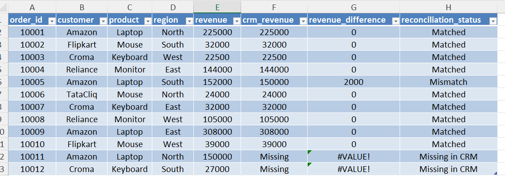
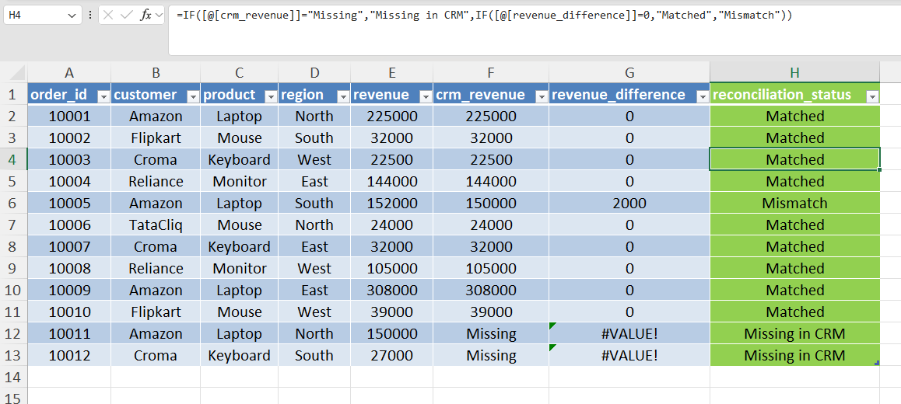
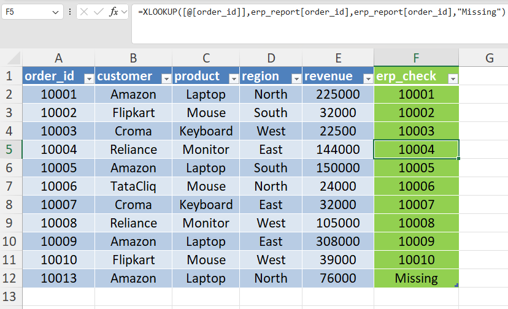

# Day 44 — Reconciling Two Business Reports

## 🎯 What I focused on today

Today I practiced reconciling two sales reports generated from different business systems.

In many companies, finance teams generate reports from **ERP systems**, while sales teams rely on **CRM platforms**. Since these systems operate independently, inconsistencies can sometimes appear in the data.

To simulate this scenario, I compared two datasets:

• ERP sales report
• CRM sales report

My goal was to identify discrepancies between the two reports before the data could be used for analysis or dashboards.

---

## ⚙️ Dataset Setup

Two datasets were created in Excel.

**Sheet 1 — ERP_Report**

Contains sales data exported from an ERP system.

Columns included:

* order_id
* customer
* product
* region
* revenue

**Sheet 2 — CRM_Report**

Contains sales data recorded in a CRM platform.

Columns included:

* order_id
* customer
* product
* region
* revenue

Both datasets were converted into Excel Tables.

Table names used:

* `erp_report`
* `crm_report`

Using tables allows structured formulas and automatic expansion when new data is added.

---

## 📚 What I Practiced

### 1️⃣ Retrieving CRM Revenue in ERP Table

Created column:

`crm_revenue`

Formula used:

```
=XLOOKUP([@order_id],crm_report[order_id],crm_report[revenue],"Missing")
```

This checks whether each ERP order exists in the CRM report and retrieves its revenue.

If the order is not found, Excel returns **"Missing"**.

---

### 2️⃣ Calculating Revenue Difference

Created column:

`revenue_difference`

Formula used:

```
=[@revenue]-[@crm_revenue]
```

This calculates the difference between ERP and CRM revenue values.

If both systems contain the same value, the result will be **0**.

---

### 3️⃣ Identifying Reconciliation Status

Created column:

`reconciliation_status`

Formula used:

```
=IF([@crm_revenue]="Missing","Missing in CRM",
IF([@revenue_difference]=0,"Matched","Mismatch"))
```

This classifies each order into one of three categories:

• Matched
• Mismatch
• Missing in CRM

---

### 4️⃣ Detecting Orders Missing in ERP

In the **CRM_Report** sheet, created column:

`erp_check`

Formula used:

```
=XLOOKUP([@order_id],erp_report[order_id],erp_report[order_id],"Missing")
```

This identifies orders that exist in CRM but not in ERP.

---

## 🧠 What I’m Learning as an Aspiring Analyst

In real companies, analysts often work with **multiple data sources**.

Before building dashboards or performing analysis, it is important to validate the data and ensure that reports from different systems match.

This exercise helped me understand how Excel lookup functions can be used to:

* audit datasets
* identify discrepancies
* detect missing records
* support reliable business reporting

---

## 📂 Files Included

* Excel workbook containing ERP and CRM datasets
* Screenshot showing reconciliation results
* Screenshot highlighting missing orders

---

## 📸 Work Snapshots

### ERP Sales Report



### Reconciliation Output



### Missing Orders Analysis


