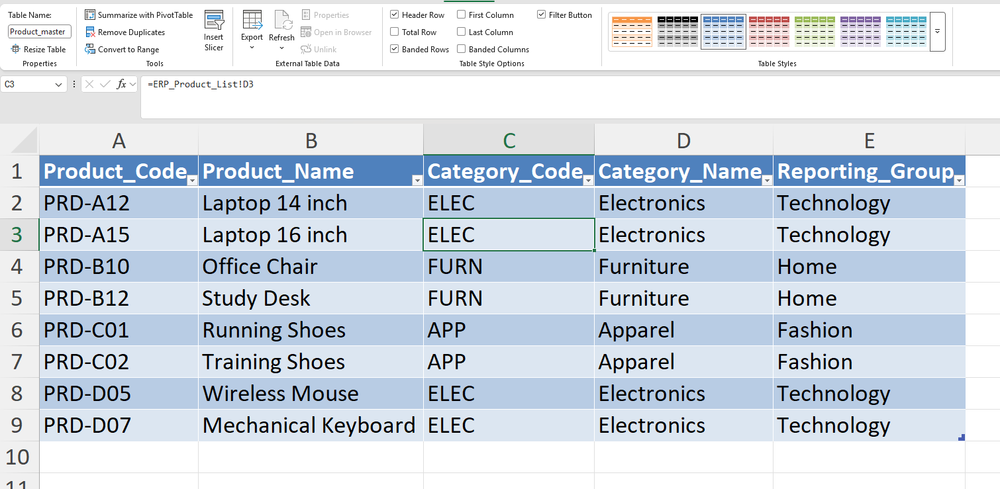
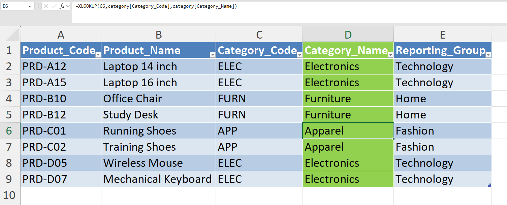
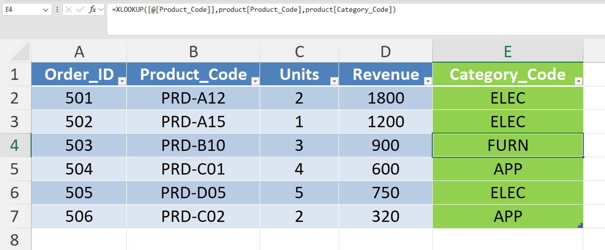

# Day 45 — Building a Data Mapping Layer in Excel

## 🎯 What I focused on today

Today I practiced building a **data mapping layer**, which is a common task performed by analysts when data comes from multiple systems.

In many organizations, product information is stored differently across systems:

• ERP systems store **product codes**
• CRM systems store **product names**
• Finance systems maintain **category mappings**

Before generating reports or dashboards, analysts must standardize this information so that all datasets use consistent identifiers and reporting categories.

To simulate this scenario, I built a **Product Master mapping table** that connects ERP product information with category mapping rules.

---

## ⚙️ Dataset Structure

Three datasets were created in Excel.

### ERP_Product_List

Contains product information exported from the ERP system.

Columns:

* Product_ID
* Product_Code
* Product_Name
* Category_Code

---

### Category_Mapping

Contains mapping rules used for reporting categories.

Columns:

* Category_Code
* Category_Name
* Reporting_Group

---

### Sales_Data

Contains sales transactions recorded in operational systems.

Columns:

* Order_ID
* Product_Code
* Units
* Revenue

---

## 📚 What I Practiced

### 1️⃣ Creating a Product Mapping Layer

A new sheet called **Product_Master** was created to standardize product information.

Columns created:

* Product_Code
* Product_Name
* Category_Code
* Category_Name
* Reporting_Group

Product Name formula:

```
=XLOOKUP(A2,ERP_Product_List!B:B,ERP_Product_List!C:C)
```

Category Code formula:

```
=XLOOKUP(A2,ERP_Product_List!B:B,ERP_Product_List!D:D)
```

---

### 2️⃣ Retrieving Category Information

Category Name formula:

```
=XLOOKUP(C2,Category_Mapping!A:A,Category_Mapping!B:B)
```

Reporting Group formula:

```
=XLOOKUP(C2,Category_Mapping!A:A,Category_Mapping!C:C)
```

This creates a **standardized product master table** used for reporting.

---

### 3️⃣ Enriching the Sales Dataset

To prepare the sales dataset for reporting, category information was retrieved from the mapping layer.

Added column in **Sales_Data**:

Category_Code

Formula used:

```
=XLOOKUP(B2,Product_Master!A:A,Product_Master!D:D)
```

This step enriches transactional data with standardized category information.

---

## 🧠 What I’m Learning as an Aspiring Analyst

In real analytics environments, data often comes from **multiple systems with inconsistent identifiers**.

Before performing analysis, analysts typically create **mapping layers or master tables** to standardize datasets.

This exercise helped me understand:

* how mapping layers are built
* how lookup functions connect datasets
* how analysts prepare data before building reports or dashboards

---

## 📂 Files Included

* Excel workbook containing ERP product list, category mapping, and sales datasets
* Screenshot showing the product master mapping table
* Screenshot showing category lookup formulas
* Screenshot showing the enriched sales dataset

---

## 📸 Work Snapshots

### Product Master Mapping



### Category Lookup



### Sales Dataset with Category


