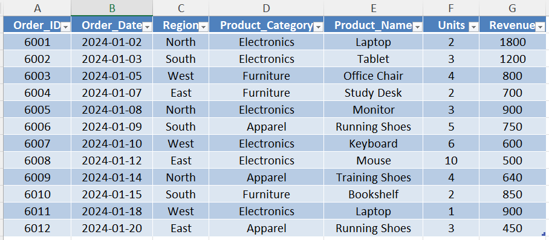
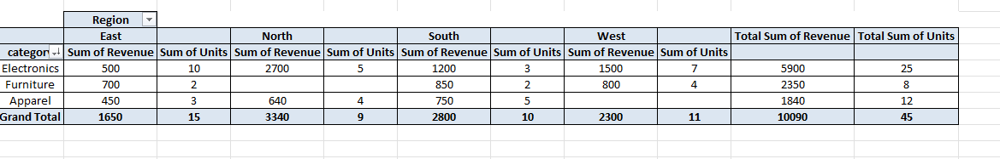
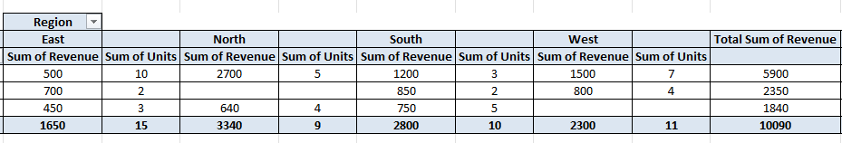

# Day 46 — Pivot Tables for Business Reporting

## 🎯 What I focused on today

Today I practiced using **Pivot Tables in Excel** to summarize sales data for business reporting.

In many companies, analysts work with large transactional datasets. Instead of performing manual calculations, they use pivot tables to quickly summarize data and generate insights for managers.

To simulate this scenario, I created a sales dataset and built a pivot report that answers a common management question:

> Which product categories and regions generate the highest revenue?

---

## ⚙️ Dataset Structure

A sales dataset was created in Excel containing the following columns:

* Order_ID
* Order_Date
* Region
* Product_Category
* Product_Name
* Units
* Revenue

The dataset represents sales transactions across different product categories and regions.

Before building the pivot report, the dataset was converted into an Excel Table.

Table name used:

`sales_data`

Using tables ensures that pivot tables remain stable and update correctly when new data is added.

---

## 📚 What I Practiced

### 1️⃣ Creating a Pivot Table

Inserted a Pivot Table using the **sales_data** table as the source.

Pivot table was placed in a new worksheet named:

`pivot_report`

---

### 2️⃣ Building the Manager Report

Configured pivot fields as follows:

Rows:

* Product_Category

Columns:

* Region

Values:

* Sum of Revenue

This created a revenue matrix that shows how each product category performs across different regions.

---

### 3️⃣ Adding a Business KPI

Added another value field:

* Sum of Units

This allows managers to evaluate both:

* Revenue performance
* Sales volume

for each product category and region.

---

### 4️⃣ Sorting Revenue

Sorted the pivot table by **Revenue (Largest to Smallest)**.

This highlights the top-performing product categories and helps managers quickly identify the most important revenue drivers.

---

## 🧠 What I’m Learning as an Aspiring Analyst

Pivot Tables are one of the most widely used tools in Excel for business reporting.

They allow analysts to quickly transform raw transactional data into meaningful summaries without writing complex formulas.

This exercise helped me understand how pivot tables can be used to:

* summarize large datasets
* compare performance across categories and regions
* support management decision-making

---

## 📂 Files Included

* Excel workbook containing the sales dataset and pivot report
* Screenshot showing the raw sales dataset
* Screenshot showing the pivot table report
* Screenshot highlighting revenue by region

---

## 📸 Work Snapshots

### Sales Dataset

### Pivot Table Report

### Revenue by Region

