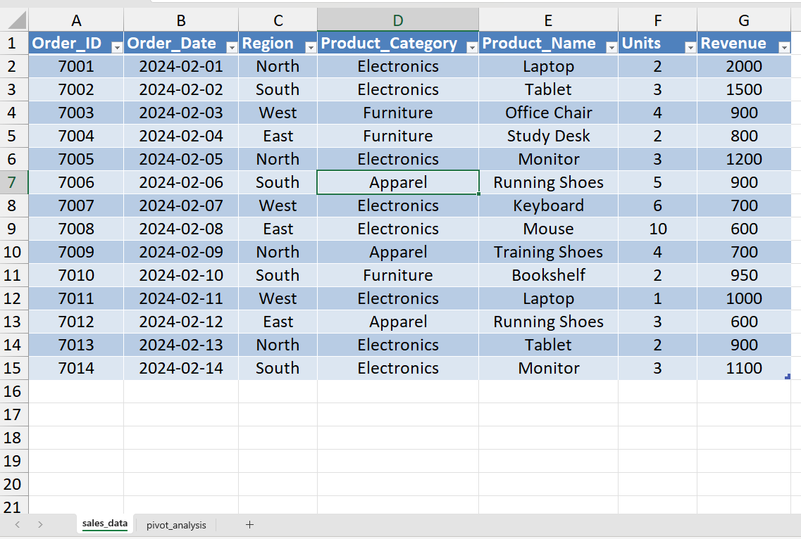
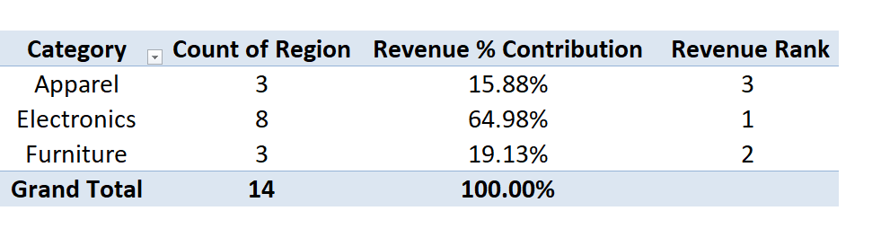
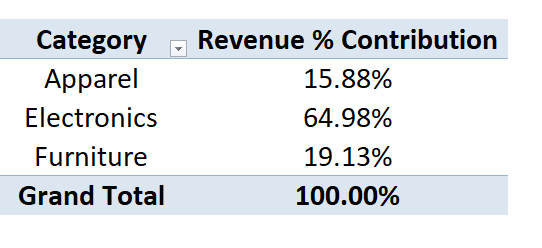
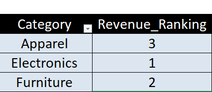

# 📊 Day 47 — Advanced Pivot Calculations Analysts Use

## 🧑‍💻 Business Scenario

In many organizations, analysts do more than just summarize data — they also use **advanced pivot calculations** to understand business performance more deeply.

In this exercise, I simulated a scenario where I am working as a **Sales Analyst reviewing monthly revenue data**.

Management wants answers to questions such as:

• Which **regions contribute the most revenue**?  
• Which **product categories drive business performance**?  
• What **percentage of total revenue** each category contributes?

Instead of using manual Excel formulas, analysts often rely on **Pivot Table calculations** such as **percentage contribution and ranking** to quickly extract insights from transactional datasets.

---

# 📂 Dataset Overview

The dataset represents simplified **e-commerce sales transactions** across different regions and product categories.

### Dataset Columns

| Column | Description |
|------|------|
| Order_ID | Unique order identifier |
| Order_Date | Date when the order was placed |
| Region | Sales region (North, South, East, West) |
| Product_Category | Category of product sold |
| Product_Name | Product name |
| Units | Quantity sold |
| Revenue | Revenue generated from the transaction |

This dataset structure is commonly used in **sales analytics and business reporting tasks**.

---

# 📸 Dataset Preview

Below is the dataset used for this analysis.



---

# 🎯 Analysis Objective

The objective of this exercise is to understand how analysts use **advanced Pivot Table calculations** to generate deeper business insights.

This analysis focuses on:

• Revenue distribution across **product categories and regions**  
• **Percentage contribution** of each category to total revenue  
• **Ranking categories** based on revenue performance

These techniques help analysts convert raw data into **management-friendly summaries**.

---

# ⚙️ Analysis Process

### Step 1 — Prepare Dataset
Created an Excel workbook and imported the transactional sales dataset.

### Step 2 — Convert Dataset to Table
Converted the dataset into an Excel table using:

`CTRL + T`

Table name:

`sales_data`

This ensures the dataset is structured and ready for pivot analysis.

---

### Step 3 — Create Pivot Table

Inserted a Pivot Table using:

`Insert → Pivot Table`

Source table:

`sales_data`

Pivot table placed in a new worksheet called:

`pivot_analysis`

---

### Step 4 — Configure Pivot Fields

Pivot fields were configured as follows:

**Rows**

Product_Category

**Columns**

Region

**Values**

Sum of Revenue

This produced a summary showing **revenue distribution by region and category**.

---

### Step 5 — Add Percentage Contribution

Applied a pivot calculation:

`Show Values As → % of Grand Total`

Renamed column:

**Revenue % Contribution**

This helps identify which product categories contribute the most to total revenue.

---

### Step 6 — Add Revenue Ranking

Added Revenue again in Values.

Then applied:

`Show Values As → Rank Largest to Smallest`

This ranks product categories based on **revenue performance**.

---

# 📊 Analysis Output

### Pivot Revenue Summary



---

### Revenue Percentage Contribution



---

### Category Revenue Ranking



---

# 💡 Business Insights

From this analysis:

• Electronics products generated strong revenue across multiple regions  
• Apparel maintained steady sales performance  
• Furniture showed moderate revenue compared to other categories  

Using **percentage contribution and ranking calculations** helps analysts quickly identify **top-performing categories and revenue drivers**.

---

# 🧠 Skills Practiced

During this exercise I practiced several important data analysis skills:

📊 Excel Pivot Tables  
📈 Percentage Contribution Analysis  
🏆 Revenue Ranking Calculations  
📑 Business Reporting  
🔍 Exploratory Data Analysis

These techniques are commonly used by analysts when preparing **management reports and performance summaries**.

---

# 🛠 Tools Used

• Microsoft Excel  
• Pivot Tables  
• Pivot Calculations (% of Total, Ranking)

---

# 📁 Project Files

```
day47_advanced_pivot_calculations.xlsx
day47_sales_dataset.png
day47_pivot_revenue_summary.png
day47_revenue_percentage_contribution.png
day47_category_revenue_rank.png
```

---

# 📚 Learning Reflection

This exercise helped me understand how analysts go beyond simple summaries by using **advanced Pivot Table calculations**.

Features like **percentage contribution and ranking** make it easier to evaluate product performance and identify which segments drive revenue.

By practicing these techniques, I am learning how analysts convert **raw transactional data into meaningful business insights**.

---

# 🔎 SEO Keywords

Excel Pivot Table Analysis  
Advanced Pivot Calculations  
Sales Data Analysis  
Revenue Contribution Analysis  
Excel for Data Analysts  
Business Reporting with Excel  
Data Analyst Portfolio Project  
Data Analytics Learning Journey
