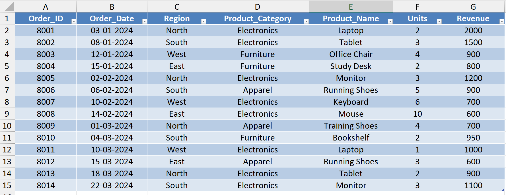
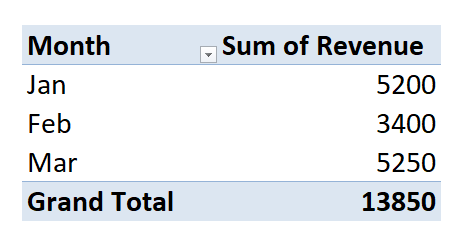
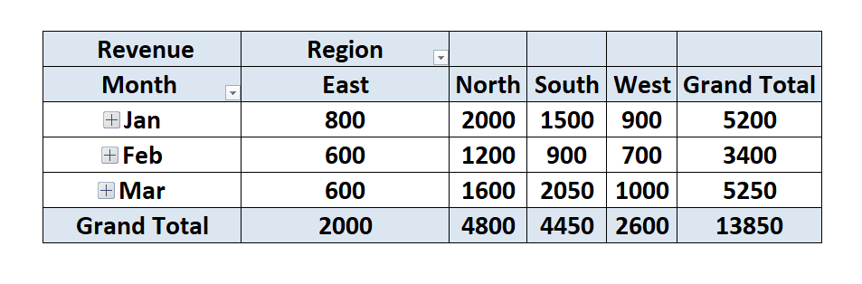

# 📊 Day 48 — Grouping Dates, Products, Regions in Pivot Tables

## 🧑‍💻 Business Scenario

In many organizations, analysts need to transform raw transactional data into **monthly performance reports** that help managers track trends and make decisions.

In this exercise, I simulated a scenario where I am working as a **Sales Analyst preparing a monthly sales performance report**.

Management wants to understand:

• Monthly sales performance  
• Which product categories drive revenue  
• Revenue contribution by region  

Instead of creating multiple manual formulas, analysts commonly use **Pivot Table grouping** to quickly summarize trends and organize data by **months, product categories, and regions**.

---

# 📂 Dataset Overview

The dataset used in this project represents simplified **e-commerce sales transactions** recorded across multiple regions and product categories over several months.

### Dataset Columns

| Column | Description |
|------|------|
| Order_ID | Unique identifier for each order |
| Order_Date | Date when the order was placed |
| Region | Sales region (North, South, East, West) |
| Product_Category | Category of the product sold |
| Product_Name | Name of the product |
| Units | Quantity sold |
| Revenue | Revenue generated from the order |

This dataset structure is commonly seen in **sales analytics and reporting environments**.

---

# 📸 Dataset Preview

Below is a preview of the dataset used for this analysis.



---

# 🎯 Analysis Objective

The goal of this exercise was to practice **Pivot Table grouping techniques** used in business reporting.

Specifically, the analysis focuses on:

• Grouping sales data by **month**  
• Evaluating **revenue performance by product category**  
• Comparing **regional sales contributions**

These techniques help analysts transform raw transactional data into **structured monthly reports for management**.

---

# ⚙️ Analysis Process

### Step 1 — Prepare Dataset
Created a new Excel workbook and imported the transactional sales dataset.

### Step 2 — Convert Dataset to Table
Converted the dataset into a structured Excel table using:

`CTRL + T`

Table name:

`sales_data`

Using tables helps make pivot analysis more reliable and dynamic.

---

### Step 3 — Create Pivot Table

Inserted a Pivot Table using:

`Insert → Pivot Table`

Source table:

`sales_data`

The pivot table was placed in a new worksheet named:

`pivot_report`

---

### Step 4 — Configure Pivot Layout

Pivot fields were configured as follows:

**Rows**

Order_Date

**Columns**

Region

**Values**

Sum of Revenue

This created a summary showing **revenue distribution by date and region**.

---

### Step 5 — Group Dates by Month

Inside the Pivot Table:

Right-click any date → **Group**

Selected:

`Months`

This grouped the order dates into **monthly sales summaries**, which is commonly used in business performance reporting.

---

### Step 6 — Add Product Category Analysis

Added **Product_Category** to the Rows field.

This allowed the pivot table to show:

• Revenue by month  
• Revenue by product category  
• Revenue by region  

This layout closely resembles the type of **multi-dimensional reporting managers often request**.

---

### Step 7 — Sort Revenue Performance

Sorted pivot table values:

`Largest to Smallest`

This helps highlight **top-performing product categories**.

---

# 📊 Analysis Output

### Monthly Pivot Grouping



---

### Category and Region Analysis



---

# 💡 Business Insights

From this pivot table analysis:

• Electronics products generated strong revenue across several regions  
• Apparel sales appeared consistently across months  
• Furniture contributed moderate but steady revenue  

Grouping the dataset by month helped reveal **sales trends over time and category performance across regions**.

---

# 🧠 Skills Practiced

During this exercise I practiced several core analytics skills:

📊 Excel Pivot Tables  
📅 Grouping Dates by Month  
📈 Sales Trend Analysis  
📑 Business Reporting  
🔍 Exploratory Data Analysis

These techniques are frequently used in **monthly reporting and sales performance analysis**.

---

# 🛠 Tools Used

• Microsoft Excel  
• Pivot Tables  
• Pivot Table Grouping (Date Grouping)

---

# 📁 Project Files

```
day48_pivot_grouping_analysis.xlsx
day48_sales_dataset.png
day48_pivot_grouped_months.png
day48_category_region_analysis.png
```

---

# 📚 Learning Reflection

This exercise helped me understand how analysts use **Pivot Table grouping** to simplify complex datasets and generate meaningful business summaries.

By grouping dates into months and combining category and regional analysis, analysts can quickly identify trends that support **monthly performance reporting and strategic decision-making**.

I am continuing to document my learning journey by practicing **daily data analysis projects using Excel**.

---

# 🔎 SEO Keywords

Excel Pivot Table Analysis  
Pivot Table Grouping  
Monthly Sales Analysis  
Excel Data Analysis Project  
Sales Data Analysis in Excel  
Business Reporting with Excel  
Data Analyst Portfolio Project  
Excel for Data Analysts  
