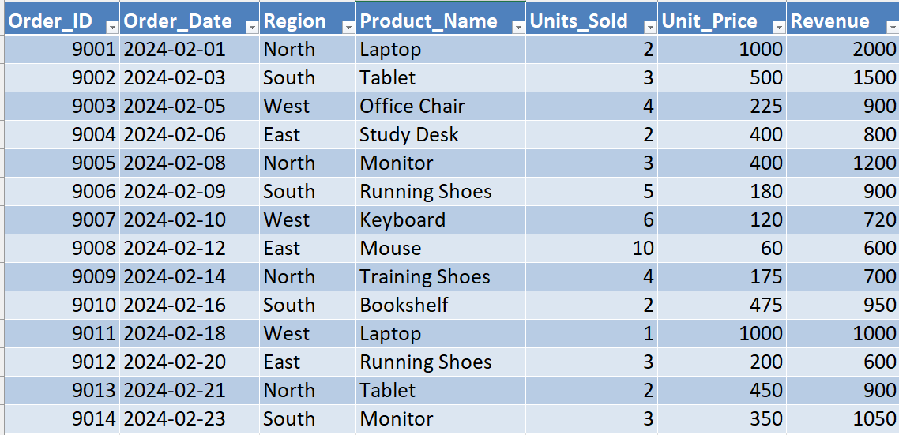
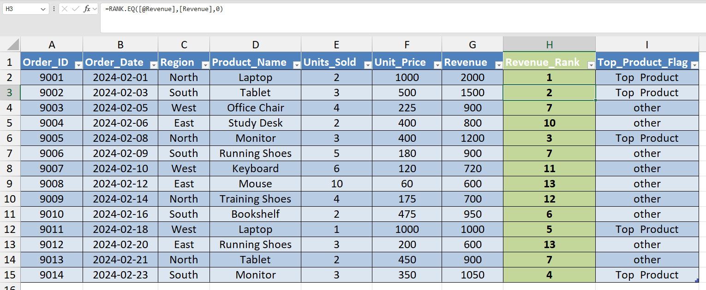
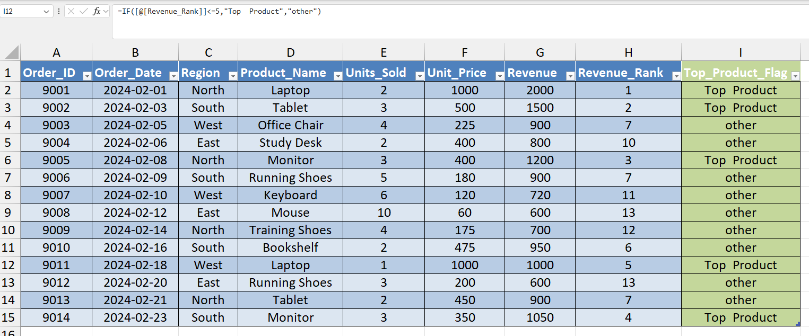
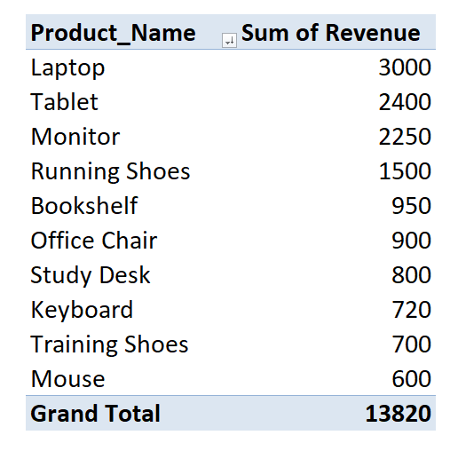

# 📊 Day 49 — Ranking & Top-N Analysis for Decision Making

## 🧑‍💻 Business Scenario

In many organizations, analysts need to identify which products drive the most revenue so that management can focus on high-impact areas.

In this exercise, I simulated a scenario where I am working as a **Sales Analyst reviewing product performance**.

Management wants to understand:

• Which **products generate the highest revenue**  
• What are the **Top 5 products driving overall sales**  
• Which products are **underperforming**

Instead of manually sorting data, analysts commonly apply **ranking formulas and Top-N analysis** to quickly highlight the most important business drivers.

---

# 📂 Dataset Overview

The dataset represents simplified **sales transactions** containing product orders across multiple regions.

### Dataset Columns

| Column | Description |
|------|------|
| Order_ID | Unique identifier for each order |
| Order_Date | Date when the order occurred |
| Region | Sales region (North, South, East, West) |
| Product_Name | Name of the product sold |
| Units_Sold | Number of units sold |
| Unit_Price | Price per unit |
| Revenue | Total revenue generated |

This type of dataset structure is commonly used in **sales performance analysis and product evaluation tasks**.

---

# 📸 Dataset Preview

Below is a preview of the dataset used in this analysis.



---

# 🎯 Analysis Objective

The goal of this exercise was to practice **Ranking and Top-N analysis techniques** used in business reporting.

Specifically, the analysis focuses on:

• Ranking products based on **revenue performance**  
• Identifying the **Top 5 revenue-generating products**  
• Creating a pivot summary to visualize **top product performance**

These techniques help analysts highlight **high-impact products that drive business performance**.

---

# ⚙️ Analysis Process

### Step 1 — Prepare Dataset
Created a new Excel workbook and imported the sales dataset.

### Step 2 — Convert Dataset to Table
Converted the dataset into an Excel table using:

`CTRL + T`

Table name:

`sales_data`

Using tables helps keep the dataset structured and easier to analyze.

---

### Step 3 — Create Revenue Ranking

Inserted a new column:

`Revenue_Rank`

Used the formula:

```
=RANK.EQ(G2,$G$2:$G$15,0)
```

This formula ranks products by revenue where:

• Rank **1** represents the highest revenue  
• Lower revenue values receive lower rankings

---

### Step 4 — Identify Top Products

Created a new column:

`Top_Product_Flag`

Formula used:

```
=IF(H2<=5,"Top 5 Product","Other")
```

This logic identifies the **Top-5 products generating the highest revenue**.

This approach is often used in **sales performance analysis and management reporting**.

---

### Step 5 — Create Pivot Summary

Inserted a Pivot Table to summarize product performance.

**Rows**

Product_Name

**Values**

Sum of Revenue

Sorted values:

`Largest to Smallest`

This pivot table highlights the **highest revenue generating products**.

---

# 📊 Analysis Output

### Revenue Ranking Formula



---

### Top Product Identification



---

### Pivot Table — Top Revenue Products



---

# 💡 Business Insights

From this analysis:

• Laptop and Tablet products generated the highest revenue  
• A small number of products contributed a large portion of total sales  
• Some products generated significantly lower revenue compared to top performers

Using **ranking and Top-N analysis** allows analysts to quickly identify **high-impact products that deserve strategic focus**.

---

# 🧠 Skills Practiced

During this exercise I practiced several key analytics techniques:

📊 Excel Ranking Functions  
📈 Top-N Analysis  
📑 Business Reporting with Pivot Tables  
🔍 Product Performance Analysis  
📊 Data-Driven Decision Support

These skills are frequently used in **sales analytics, performance reporting, and dashboard preparation**.

---

# 🛠 Tools Used

• Microsoft Excel  
• Excel Formulas (RANK.EQ, IF)  
• Pivot Tables

---

# 📁 Project Files

```
day49_top_products_analysis.xlsx
day49_sales_dataset.png
day49_revenue_ranking_formula.png
day49_top_products_flag.png
day49_top_products_pivot.png
```

---

# 📚 Learning Reflection

This exercise helped me understand how analysts use **ranking formulas and Top-N analysis** to evaluate product performance.

Instead of manually scanning large datasets, these techniques allow analysts to quickly identify **which products drive the most revenue and where the business should focus attention**.

Practicing these techniques helps build stronger **data-driven decision-making skills**.

---

# 🔎 SEO Keywords

Excel Ranking Analysis  
Top-N Product Analysis  
Sales Data Analysis in Excel  
Excel Data Analysis Project  
Product Performance Analysis  
Business Reporting with Excel  
Data Analyst Portfolio Project  
Excel for Data Analysts
