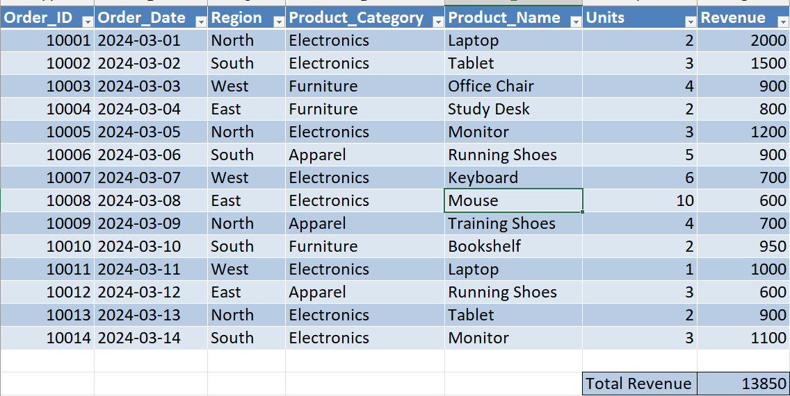
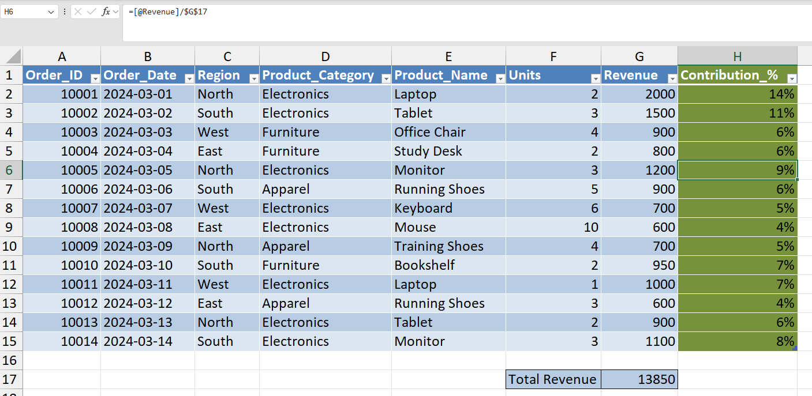
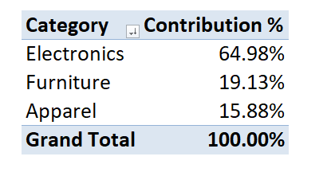
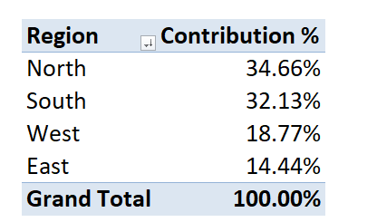

# 📊 Day 50 — Contribution & Percentage Analysis (Business Impact View)

## 🧑‍💻 Business Scenario

In many organizations, analysts are not just asked for total revenue — they are expected to explain **what is driving that revenue**.

In this exercise, I simulated a scenario where I am working as a **Business Analyst analyzing sales performance**.

Management wants to understand:

• Which **products contribute the most revenue**  
• Which **regions dominate sales performance**  
• What **percentage of total revenue each category contributes**

To answer these questions, analysts use **contribution and percentage analysis**, which is commonly used in dashboards and business reports.

---

# 📂 Dataset Overview

The dataset represents simplified **sales transactions** across different regions and product categories.

### Dataset Columns

| Column | Description |
|------|------|
| Order_ID | Unique identifier for each order |
| Order_Date | Date of the transaction |
| Region | Sales region (North, South, East, West) |
| Product_Category | Category of the product |
| Product_Name | Name of the product |
| Units | Quantity sold |
| Revenue | Total revenue generated |

This type of dataset is commonly used in **sales analysis and business reporting workflows**.

---

# 📸 Dataset Preview

Below is the dataset used for this analysis.



---

# 🎯 Analysis Objective

The goal of this exercise was to understand how analysts calculate **revenue contribution percentages** and identify key business drivers.

This analysis focuses on:

• Calculating **contribution % for each transaction**  
• Analyzing **category-level contribution**  
• Comparing **region-wise revenue contribution**

These techniques help convert raw data into **decision-making insights**.

---

# ⚙️ Analysis Process

### Step 1 — Prepare Dataset
Created a new Excel workbook and imported the sales dataset.

### Step 2 — Convert Dataset to Table
Converted the dataset into a structured table using:

`CTRL + T`

Table name:

`sales_data`

---

### Step 3 — Calculate Total Revenue

Calculated total revenue using:

```
=SUM(G2:G15)
```

This value is used as the base for contribution calculations.

---

### Step 4 — Contribution % Calculation

Added a new column:

`Contribution_%`

Formula used:

```
=G2/$G$16
```

Formatted as percentage (%)

This calculates how much each transaction contributes to total revenue.

---

### Step 5 — Category Contribution Analysis

Created a Pivot Table:

**Rows**

Product_Category  

**Values**

Sum of Revenue  

Then applied:

`Show Values As → % of Grand Total`

Renamed as:

**Category Contribution %**

---

### Step 6 — Region Contribution Analysis

Created another Pivot Table:

**Rows**

Region  

**Values**

Sum of Revenue  

Applied:

`Show Values As → % of Grand Total`

This helps compare how different regions contribute to overall sales.

---

### Step 7 — Sort for Decision Making

Sorted revenue:

`Largest to Smallest`

This makes the analysis **decision-ready by highlighting top contributors**.

---

# 📊 Analysis Output

### Contribution Formula



---

### Category Contribution Analysis



---

### Region Contribution Analysis



---

# 💡 Business Insights

From this analysis:

• A few product categories contribute a large portion of total revenue  
• Some regions dominate overall sales performance  
• Contribution % helps identify **high-impact revenue drivers**

This type of analysis is commonly used in **business dashboards and performance reports**.

---

# 🧠 Skills Practiced

📊 Excel Contribution Analysis  
📈 Percentage Calculations  
📑 Pivot Table Reporting  
📊 Category & Region Analysis  
🔍 Business Performance Evaluation  

These skills are widely used in **data analyst and business analyst roles**.

---

# 🛠 Tools Used

• Microsoft Excel  
• Excel Formulas (SUM, Percentage Calculation)  
• Pivot Tables  

---

# 📁 Project Files

```
day50_contribution_analysis.xlsx
day50_dataset.png
day50_contribution_formula.png
day50_category_contribution.png
day50_region_contribution.png
```

---

# 📚 Learning Reflection

This exercise helped me understand that **total revenue alone is not enough** to evaluate performance.

By calculating contribution percentages, I can identify:

• Which products and categories drive the business  
• Which regions contribute the most  
• Where the company should focus its strategy  

This is helping me move from **basic Excel usage to analytical thinking**.

---

# 🔎 SEO Keywords

Excel Contribution Analysis  
Percentage Analysis in Excel  
Sales Data Analysis  
Revenue Contribution Analysis  
Business Reporting in Excel  
Excel for Data Analysts  
Data Analyst Portfolio Project  
Business Analytics Practice
