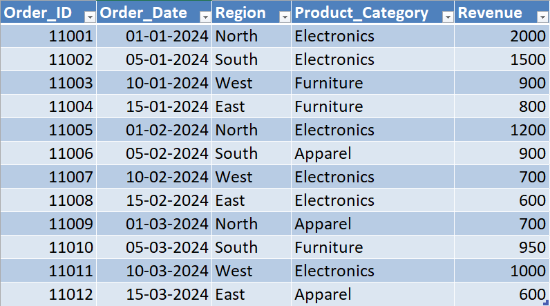
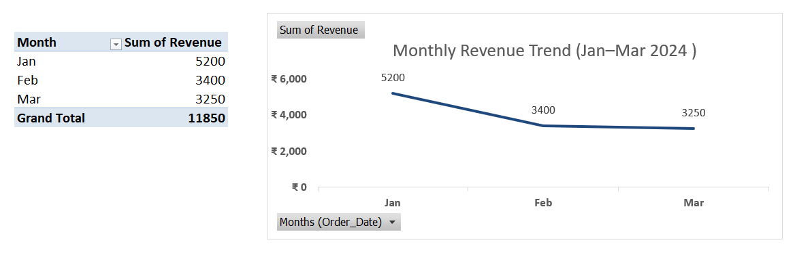
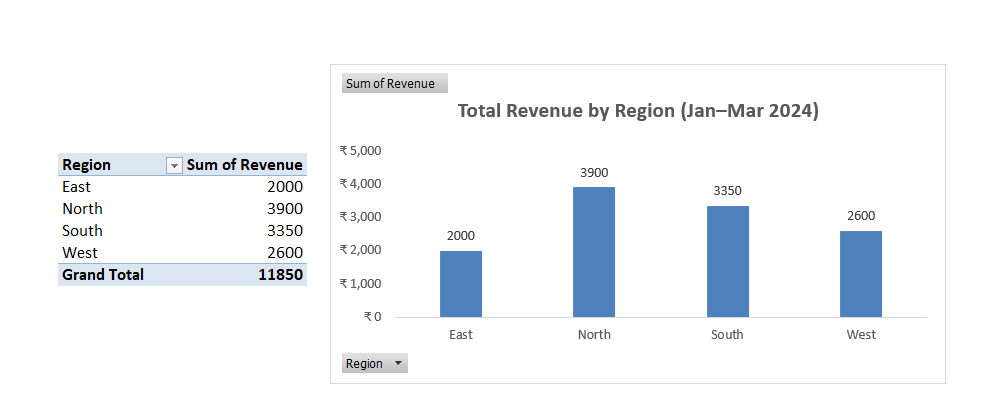
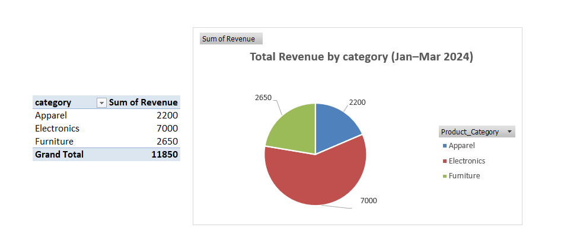

# 📊 Day 51 — Choosing Correct Charts for Business Questions

## 🧑‍💻 Business Scenario

In real business environments, analysts are expected not just to analyze data but also to **present insights clearly to stakeholders**.

In this exercise, I simulated a scenario where I am working as a **Business Analyst preparing a report for management**.

Management wants to understand:

• Revenue trend over time  
• Category-wise contribution  
• Region performance comparison  

Choosing the wrong chart can lead to **misinterpretation**, while choosing the right chart helps communicate insights clearly and supports faster decision-making.

---

# 📂 Dataset Overview

The dataset represents simplified **sales transactions** across different regions and product categories over time.

### Dataset Columns

| Column | Description |
|------|------|
| Order_ID | Unique identifier for each order |
| Order_Date | Date of the transaction |
| Region | Sales region (North, South, East, West) |
| Product_Category | Category of the product |
| Revenue | Revenue generated |

This dataset structure is commonly used in **business reporting and visualization tasks**.

---

# 📸 Dataset Preview

Below is the dataset used for this analysis.



---

# 🎯 Analysis Objective

The goal of this exercise was to understand how to **choose the correct chart type based on business questions**.

This analysis focuses on:

• Visualizing **revenue trends over time**  
• Comparing **performance across regions**  
• Understanding **category-level contribution**

These are common reporting requirements in **business dashboards and stakeholder presentations**.

---

# ⚙️ Analysis Process

### Step 1 — Prepare Dataset
Created an Excel workbook and imported the sales dataset.

### Step 2 — Convert to Table
Converted the dataset into a structured table using:

`CTRL + T`

Table name:

`sales_data`

---

### Step 3 — Create Pivot Table (Base for Charts)

Inserted a Pivot Table:

**Rows**

Order_Date  

**Values**

Sum of Revenue  

Grouped dates into:

`Months`

This creates the base for time-based trend analysis.

---

### Step 4 — Create Trend Chart (Line Chart)

Created a **Line Chart** from the pivot table.

Chart name:

**Monthly Revenue Trend**

Used for:

✔ Visualizing trends over time  

---

### Step 5 — Create Comparison Chart (Column Chart)

Created another pivot:

**Rows**

Region  

**Values**

Sum of Revenue  

Inserted:

**Column Chart**

Chart name:

**Revenue by Region**

Used for:

✔ Comparing values across categories  

---

### Step 6 — Create Contribution Chart (Pie Chart)

Created another pivot:

**Rows**

Product_Category  

**Values**

Sum of Revenue  

Inserted:

**Pie Chart**

Chart name:

**Category Contribution**

Used for:

✔ Showing percentage contribution  

---

# 📊 Analysis Output

### Monthly Revenue Trend (Line Chart)



---

### Region Performance Comparison (Column Chart)



---

### Category Contribution (Pie Chart)



---

# 💡 Business Insights

From this analysis:

• Revenue trends can be clearly observed month-by-month using line charts  
• Regional performance differences are easy to compare using column charts  
• Category contribution becomes more understandable using pie charts  

Choosing the correct chart type helps transform data into **clear and actionable insights**.

---

# 🧠 Skills Practiced

📊 Data Visualization in Excel  
📈 Chart Selection Based on Business Questions  
📑 Pivot Table-Based Chart Creation  
📊 Trend Analysis  
🔍 Comparative Analysis  

These are essential skills for **data analysts working on reports and dashboards**.

---

# 🛠 Tools Used

• Microsoft Excel  
• Pivot Tables  
• Excel Charts (Line, Column, Pie)  

---

# 📁 Project Files

```
day51_business_charts_analysis.xlsx
day51_dataset.png
day51_line_chart_trend.png
day51_region_comparison.png
day51_category_contribution.png
```

---

# 📚 Learning Reflection

This exercise helped me understand that charts are not just visuals — they are **communication tools**.

Choosing the right chart makes insights easier to understand:

• Line charts help show trends  
• Column charts help compare categories  
• Pie charts help show the contribution  

This is helping me move towards thinking like an analyst who **communicates insights effectively**, not just builds reports.

---

# 🔎 SEO Keywords

Excel Data Visualization  
Choosing Charts in Excel  
Business Charts Analysis  
Sales Data Visualization  
Excel Dashboard Skills  
Data Analyst Portfolio Project  
Excel for Data Analysts  
Business Reporting with Charts
