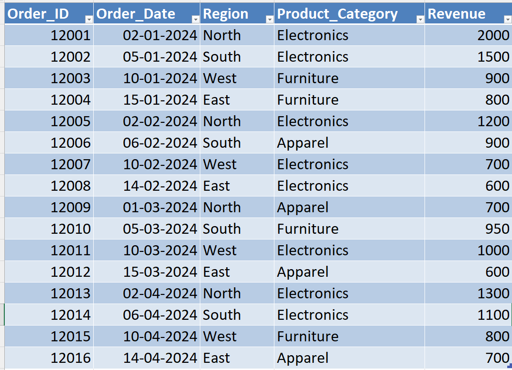
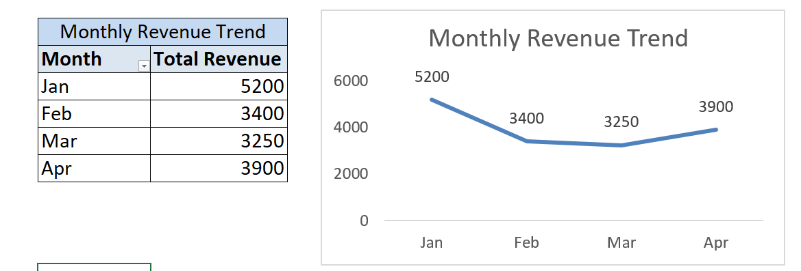
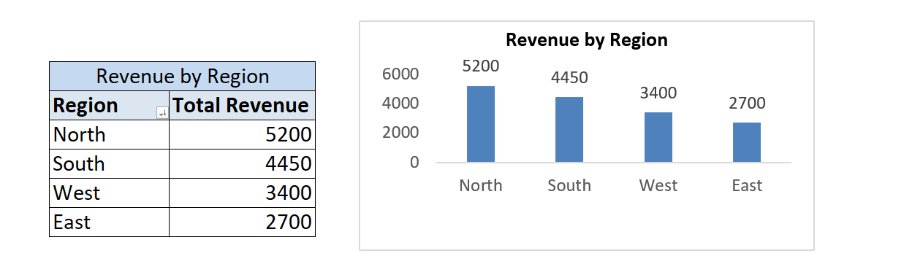
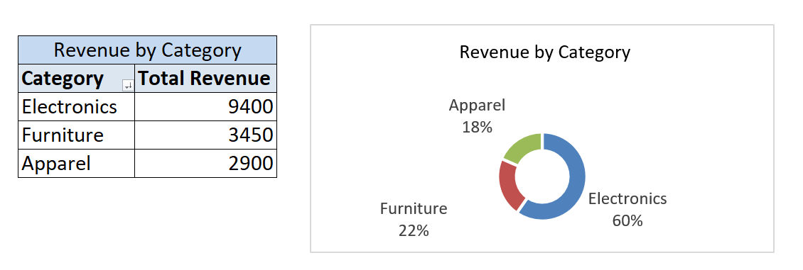
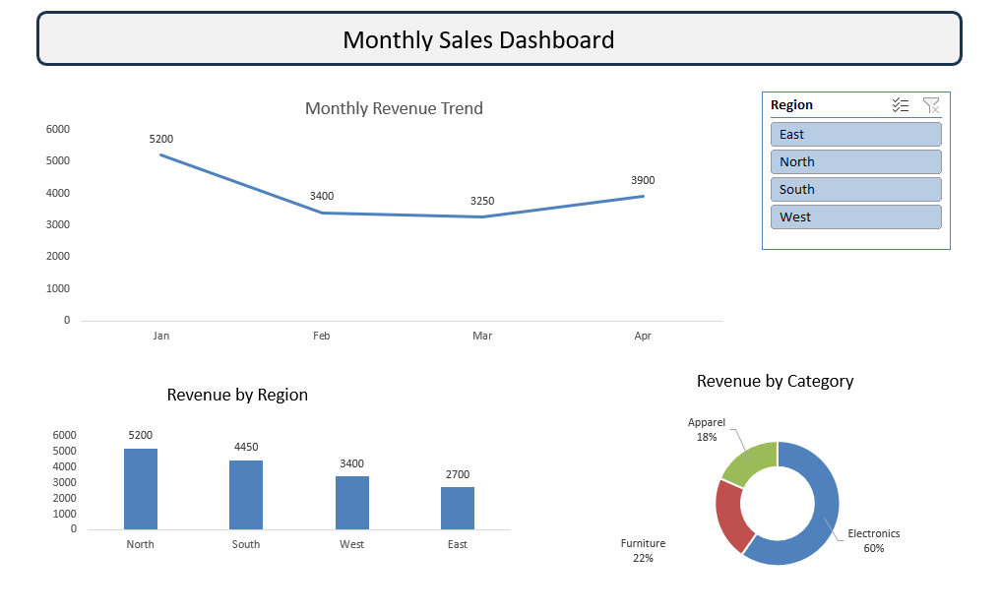

# 📊 Day 52 — Building Monthly Trend Dashboard in Excel

## 🧑‍💻 Business Scenario

In many organizations, analysts are expected to present insights in a **dashboard format**, not just raw tables.

In this exercise, I simulated a scenario where I am working as a **Business Analyst preparing a monthly performance dashboard**.

Management wants to understand:

• Monthly revenue trend 📈  
• Region-wise performance 🌍  
• Category contribution 🧩  

Instead of showing raw data, I built a **clean and interactive dashboard** to communicate insights effectively.

---

# 📂 Dataset Overview

The dataset represents simplified **sales transactions across multiple months**, regions, and product categories.

### Dataset Columns

| Column | Description |
|------|------|
| Order_ID | Unique identifier for each order |
| Order_Date | Date of the transaction |
| Region | Sales region (North, South, East, West) |
| Product_Category | Category of the product |
| Revenue | Revenue generated |

This structure is commonly used in **dashboard reporting and business analysis workflows**.

---

# 📸 Dataset Preview

Below is the dataset used in this analysis.



---

# 🎯 Analysis Objective

The goal of this exercise was to build a **monthly dashboard** that helps answer key business questions.

This includes:

• Visualizing **monthly revenue trends**  
• Comparing **regional performance**  
• Understanding **category-level contribution**  
• Making the dashboard **interactive using slicers**

This type of dashboard is commonly used in **business reporting and decision-making**.

---

# ⚙️ Analysis Process

### Step 1 — Prepare Dataset
Created an Excel workbook and added the sales dataset.

### Step 2 — Convert to Table
Converted the dataset into a structured table using:

`CTRL + T`

Table name:

`sales_data`

---

### Step 3 — Create Monthly Trend Pivot

Inserted Pivot Table:

**Rows**

Order_Date  

**Values**

Sum of Revenue  

Grouped dates:

`Months`

---

### Step 4 — Create Region Analysis Pivot

Created Pivot:

**Rows**

Region  

**Values**

Sum of Revenue  

---

### Step 5 — Create Category Contribution Pivot

Created Pivot:

**Rows**

Product_Category  

**Values**

Sum of Revenue  

Applied:

`Show Values As → % of Grand Total`

---

### Step 6 — Create Charts

✔ **Line Chart** → Monthly Revenue Trend  
✔ **Column Chart** → Revenue by Region  
✔ **Donut Chart** → Category Contribution %

These charts help represent data visually based on the business question.

---

### Step 7 — Build Dashboard Layout

Created a new sheet:

`dashboard`

Arranged:

• Line chart at top (trend)  
• Region chart (left side)  
• Category chart (right side)  

---

### Step 8 — Add Interactivity (Slicer)

Inserted:

`Slicer → Region`

This allows filtering the dashboard dynamically and makes it **interactive**.

---

# 📊 Analysis Output

### Monthly Revenue Trend



---

### Region Performance



---

### Category Contribution



---

### Final Dashboard View



---

# 💡 Business Insights

From this dashboard:

• Revenue trends can be tracked clearly month-by-month  
• Regional performance differences are easy to compare  
• Category contribution helps identify key revenue drivers  
• Slicers allow quick filtering for deeper analysis  

This type of dashboard supports **fast and informed business decisions**.

---

# 🧠 Skills Practiced

📊 Excel Dashboard Building  
📈 Data Visualization  
📑 Pivot Table Analysis  
🎛 Interactive Reporting (Slicers)  
📊 Business Data Interpretation  

These are core skills required for **data analyst and business analyst roles**.

---

# 🛠 Tools Used

• Microsoft Excel  
• Pivot Tables  
• Excel Charts (Line, Column, Donut)  
• Slicers  

---

# 📁 Project Files

```
day52_monthly_dashboard.xlsx
day52_dataset.png
day52_monthly_trend.png
day52_region_chart.png
day52_category_chart.png
day52_dashboard_view.png
```

---

# 📚 Learning Reflection

This exercise helped me understand that analysis is not complete until it is **presented in a clear and interactive way**.

By building a dashboard:

• I can quickly communicate trends  
• I can highlight key business areas  
• I can allow users to explore data using filters  

This is helping me move from **data analysis to real business reporting skills**.

---

# 🔎 SEO Keywords

Excel Dashboard Project  
Monthly Sales Dashboard  
Excel Data Visualization  
Business Dashboard in Excel  
Sales Trend Analysis  
Data Analyst Portfolio Project  
Excel for Data Analysts  
Interactive Dashboard with Slicers  
