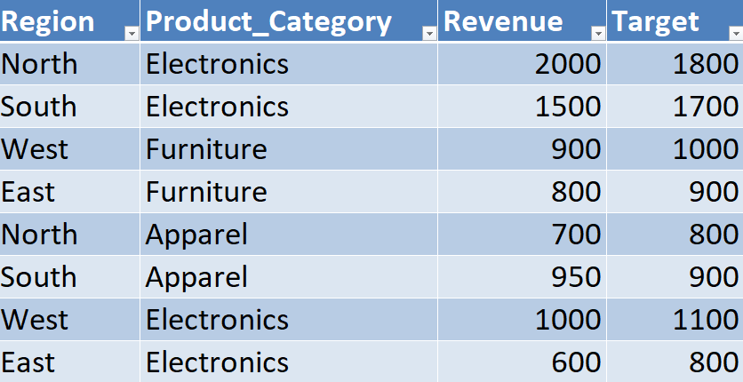
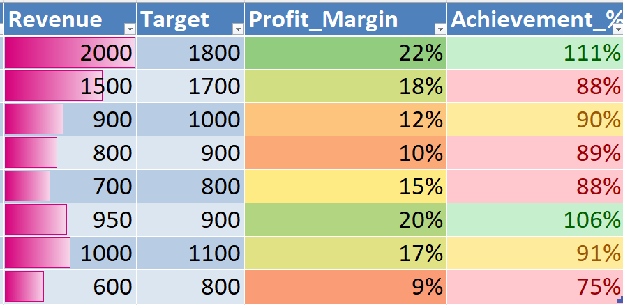
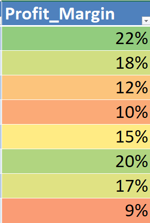
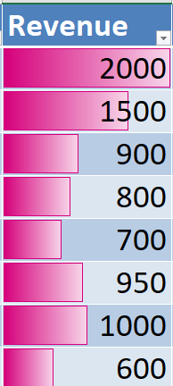

# 📊 Day 53 — Highlighting KPIs with Conditional Formatting

## 🧑‍💻 Business Scenario

In real business environments, managers often review KPI reports to understand performance quickly.

In this exercise, I simulated a scenario where I am working as a **Business Analyst preparing a KPI sheet for managers**.

Management wants to quickly identify:

• Which regions are **over-performing**  
• Which categories are **under-performing**  
• Where immediate attention is required  

Instead of scanning numbers manually, analysts use **Conditional Formatting** to visually highlight performance metrics.

---

# 📂 Dataset Overview

The dataset represents a simplified **business KPI dataset** containing revenue, targets, and profit margins across regions and product categories.

### Dataset Columns

| Column | Description |
|------|------|
| Region | Sales region |
| Product_Category | Category of product |
| Revenue | Actual revenue generated |
| Target | Expected revenue |
| Profit_Margin | Profit percentage |

This structure is commonly used in **KPI tracking and performance reporting dashboards**.

---

# 📸 Dataset Preview

Below is the dataset used in this analysis.



---

# 🎯 Analysis Objective

The goal of this exercise was to understand how analysts use **Conditional Formatting** to highlight KPIs visually.

This includes:

• Identifying **high performance vs low performance**  
• Highlighting **target achievement levels**  
• Visualizing **profit margins and revenue intensity**

This type of analysis helps convert raw data into **quick decision-making insights**.

---

# ⚙️ Analysis Process

### Step 1 — Prepare Dataset
Created an Excel workbook and added KPI data.

### Step 2 — Convert to Table
Converted the dataset into a structured table using:

`CTRL + T`

Table name:

`kpi_data`

---

### Step 3 — Calculate Achievement %

Added a new column:

`Achievement_%`

Formula used:

```
=[@Revenue]/[@Target]
```

Formatted as percentage (%)

---

### Step 4 — Apply Conditional Formatting Rules

Applied rules on Achievement %:

✔ **> 100% → Green (High Performance)**  
✔ **90%–100% → Yellow (Near Target)**  
✔ **< 90% → Red (Underperformance)**  

This helps quickly identify performance levels.

---

### Step 5 — Profit Margin Visualization

Applied:

`Color Scale (Green → Red)`

on Profit_Margin

This visually represents **profit quality across categories**.

---

### Step 6 — Add Data Bars (Revenue)

Applied:

`Data Bars` on Revenue column

This helps compare revenue visually across regions.

---

# 📊 Analysis Output

### KPI Highlighting



---

### Profit Margin Visualization



---

### Revenue Data Bars



---

# 💡 Business Insights

From this KPI analysis:

• High-performing regions are immediately visible using green highlights  
• Underperforming areas are clearly marked in red for quick attention  
• Profit margins show variation across categories using color gradients  
• Data bars make revenue comparison intuitive  

This approach helps managers **quickly understand performance without analyzing raw numbers**.

---

# 🧠 Skills Practiced

📊 KPI Analysis  
📈 Conditional Formatting in Excel  
📑 Performance Highlighting  
📊 Data Visualization Techniques  
🔍 Business Performance Evaluation  

These are critical skills for **data analysts working on KPI dashboards and reporting**.

---

# 🛠 Tools Used

• Microsoft Excel  
• Conditional Formatting  
• Excel Tables  
• Data Bars & Color Scales  

---

# 📁 Project Files

```
day53_kpi_conditional_formatting.xlsx
day53_dataset.png
day53_kpi_highlight.png
day53_profit_margin_colors.png
day53_data_bars.png
```

---

# 📚 Learning Reflection

This exercise helped me understand that analysis is not just about calculating numbers — it’s about making insights **visually clear and actionable**.

By using conditional formatting:

• Important trends become instantly visible  
• Underperformance is easy to detect  
• Decision making becomes faster  

This is helping me think more like an analyst who **communicates insights effectively**, not just calculates data.

---

# 🔎 SEO Keywords

Excel KPI Analysis  
Conditional Formatting in Excel  
KPI Dashboard Excel  
Business Performance Analysis  
Excel Data Visualization  
Data Analyst Portfolio Project  
Excel for Data Analysts  
Performance Reporting in Excel  
