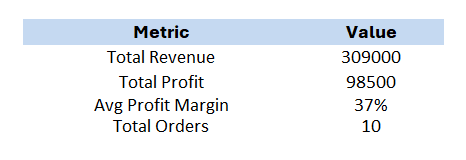
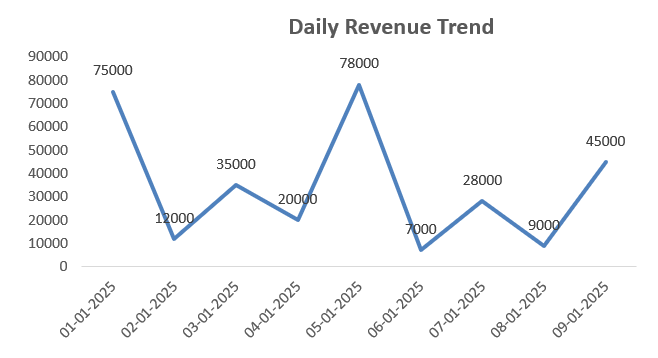
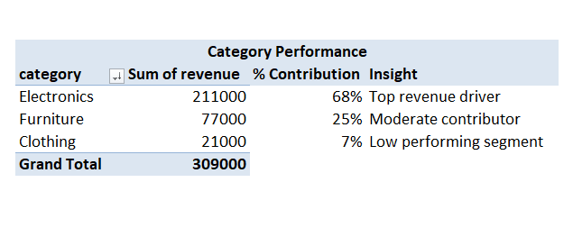
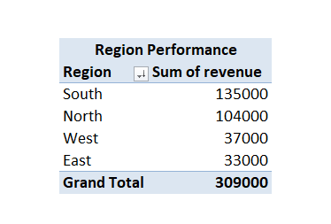
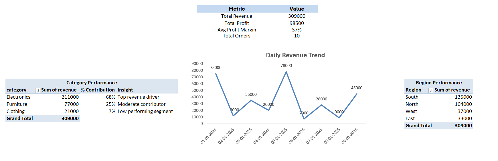

# 📊 Day 54 — Creating Executive-Friendly Summary Sheets in Excel

## 🧑‍💻 Business Scenario

In real companies, executives don’t analyze raw data — they expect a **clear, one-page summary** to make quick decisions.

In this exercise, I simulated a scenario where I am working as a **Business Analyst in an e-commerce company**.

Management wants:

• Total revenue and profit overview  
• Profitability insights  
• Category and region performance  
• Trend visibility over time  

Instead of showing raw tables, I built an **executive-friendly summary dashboard**.

---

# 📂 Dataset Overview

The dataset represents **transaction-level sales data** including revenue and cost across regions, categories, and customer types.

### Dataset Columns

| Column | Description |
|------|------|
| order_id | Unique order identifier |
| order_date | Date of the order |
| region | Sales region |
| category | Product category |
| product | Product name |
| customer_type | New or returning customer |
| revenue | Sales revenue |
| cost | Cost of goods |

Additional calculated columns:

• Profit = Revenue - Cost  
• Profit Margin % = Profit / Revenue  

This dataset structure is commonly used in **business performance analysis and executive reporting**. :contentReference[oaicite:0]{index=0}

---

# 📸 Dataset Preview

Below is the dataset used in this analysis.


---

# 🎯 Analysis Objective

The goal of this exercise was to convert raw transactional data into a **decision-ready executive summary sheet**.

This includes:

• Creating **KPI metrics** for quick overview  
• Building **category and region performance summaries**  
• Visualizing **revenue trends**  
• Designing a **clean one-page dashboard layout**

---

# ⚙️ Analysis Process

### Step 1 — Prepare Dataset
Imported dataset into Excel and structured it as a table.

### Step 2 — Add Calculated Columns

Created:

• Profit  
```
=[@revenue] - [@cost]
```

• Profit Margin %  
```
=[@Profit] / [@revenue]
```

---

### Step 3 — Build KPI Section

Created KPI cards for:

• Total Revenue  
• Total Profit  
• Average Profit Margin  
• Total Orders  

These KPIs provide a quick business overview.

---

### Step 4 — Category Performance

Created Pivot Table:

Rows → Category  
Values → Sum of Revenue, Sum of Profit  

Added business insights manually to interpret performance.

---

### Step 5 — Region Performance

Created Pivot Table:

Rows → Region  
Values → Revenue, Profit  

Sorted by highest revenue to identify top-performing regions.

---

### Step 6 — Trend Analysis

Created Pivot Table:

Rows → Order Date  
Values → Revenue  

Inserted:

📈 Line Chart → Revenue Trend  

---

### Step 7 — Dashboard Layout

Created a new sheet:

`executive_summary`

Arranged:

• KPI section (top)  
• Trend chart  
• Category analysis  
• Region analysis  

Designed as a **clean one-page dashboard**.

---

# 📊 Analysis Output

### KPI Section



---

### Revenue Trend



---

### Category Analysis



---

### Region Analysis



---

### Final Dashboard



---

# 💡 Business Insights

From this executive summary:

• Electronics category contributes the highest revenue  
• Some categories show lower profit margins  
• Certain regions dominate overall sales performance  
• Revenue trend helps identify growth patterns over time  

This dashboard helps management quickly understand **where to focus for better business outcomes**.

---

# 🧠 Skills Practiced

📊 KPI Design for Business Reporting  
📈 Pivot Table Analysis  
📑 Dashboard Layout Design  
📊 Trend Visualization  
🔍 Business Insight Interpretation  

These are critical skills for **data analyst roles focused on business reporting**.

---

# 🛠 Tools Used

• Microsoft Excel  
• Pivot Tables  
• Excel Formulas (SUM, AVERAGE)  
• Data Visualization (Line Chart)  

---

# 📁 Project Files

```
day54_executive_summary_sheet.xlsx
day54_kpi_section.png
day54_trend_chart.png
day54_category_analysis.png
day54_region_analysis.png
day54_final_dashboard.png
```

---

# 📚 Learning Reflection

This exercise helped me understand that **analysis alone is not enough — presentation matters**.

Instead of showing raw data:

• I focused on KPIs  
• I highlighted key insights  
• I structured everything into a clean dashboard  

This is helping me think like an analyst who **supports decision-making**, not just performs analysis.

---

# 🔎 SEO Keywords

Excel Dashboard Project  
Executive Summary Dashboard Excel  
KPI Dashboard in Excel  
Sales Performance Analysis  
Business Reporting Excel  
Data Analyst Portfolio Project  
Excel for Data Analysts  
Executive Dashboard Design  
