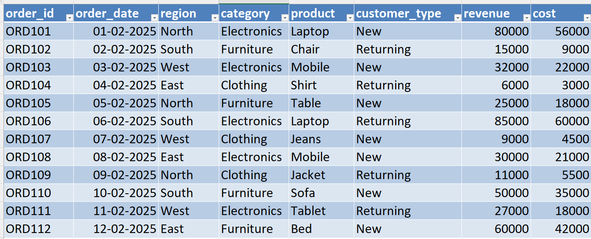
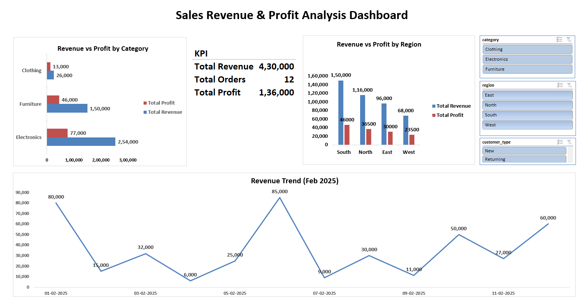
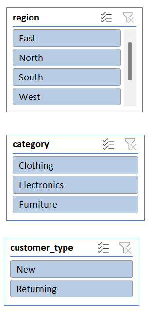
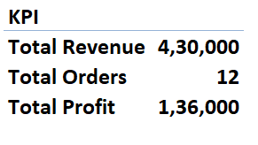
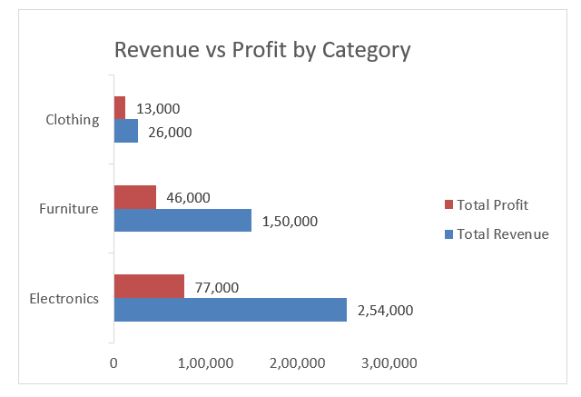
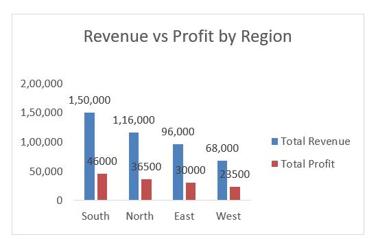

# 📊 Day 55 — Designing Analyst-Level Excel Dashboards

## 🧑‍💻 Business Scenario

In real companies, managers don’t want static reports — they want **interactive dashboards** where they can filter and explore data on their own.

In this exercise, I simulated a scenario where I am working as a **Sales Analyst in a retail company**.

Management wants:

• Revenue insights by region, category, and customer type  
• Profitability understanding across segments  
• Trend visibility over time  
• Ability to filter data without touching raw tables  

To solve this, I built an **interactive Excel dashboard using slicers and pivot tables**.

---

# 📂 Dataset Overview

The dataset represents **transaction-level sales data** including revenue, cost, and customer segmentation.

### Dataset Columns

| Column | Description |
|------|------|
| order_id | Unique order identifier |
| order_date | Date of transaction |
| region | Sales region |
| category | Product category |
| product | Product name |
| customer_type | New or returning customer |
| revenue | Total sales revenue |
| cost | Cost of goods |

Additional calculated columns:

• Profit = Revenue - Cost  
• Profit Margin % = Profit / Revenue  

This dataset is commonly used in **sales performance dashboards and business reporting systems**. :contentReference[oaicite:0]{index=0}

---

# 📸 Dataset Preview

Below is the dataset used for this analysis.



---

# 🎯 Analysis Objective

The goal of this exercise was to build an **interactive, analyst-level dashboard** that supports business decision-making.

This includes:

• Creating **KPI cards** for quick insights  
• Building **category and region performance views**  
• Visualizing **revenue trends over time**  
• Adding **slicers for user-controlled filtering**

---

# ⚙️ Analysis Process

### Step 1 — Data Preparation
Imported dataset into Excel and converted it into a table:

`CTRL + T → sales_data`

---

### Step 2 — Add Calculated Columns

Created:

• Profit  
```
=[@revenue] - [@cost]
```

• Profit Margin %  
```
=[@Profit] / [@revenue]
```

---

### Step 3 — Create Pivot Tables

Created separate pivot tables for structured analysis:

✔ KPI Summary → Revenue, Profit, Orders  
✔ Category Performance → Revenue & Profit  
✔ Region Performance → Revenue & Profit  
✔ Trend Analysis → Revenue by Date  

---

### Step 4 — Add Slicers (Interactivity)

Inserted slicers for:

• Region  
• Category  
• Customer Type  

Connected slicers to all pivot tables using:

`Report Connections`

---

### Step 5 — Build Dashboard Layout

Created a new sheet:

`dashboard`

Arranged:

• Slicers (top)  
• KPI cards  
• Revenue trend chart  
• Category and region charts  

---

### Step 6 — Create Charts

📈 Line Chart → Revenue Trend  
📊 Bar Chart → Category Performance  
📊 Column Chart → Region Performance  

---

# 📊 Analysis Output

### Full Dashboard View



---

### Slicer Interaction



---

### KPI Cards



---

### Category Performance



---

### Region Performance



---

# 💡 Business Insights

From this dashboard:

• Revenue and profit can be tracked instantly using KPI cards  
• Category-level analysis shows high-performing segments  
• Region-wise comparison highlights top-performing locations  
• Slicers allow dynamic filtering for deeper insights  

This dashboard helps managers **analyze performance without accessing raw data**.

---

# 🧠 Skills Practiced

📊 Interactive Dashboard Design  
📈 Pivot Table Analysis  
🎛 Slicer Integration  
📑 KPI Development  
📊 Data Visualization  

These are key skills required for **Excel-based data analyst roles**.

---

# 🛠 Tools Used

• Microsoft Excel  
• Pivot Tables  
• Excel Charts (Line, Bar, Column)  
• Slicers  

---

# 📁 Project Files

```
day55_analyst_excel_dashboard.xlsx
day55_dashboard_full.png
day55_slicers_interaction.png
day55_kpi_cards.png
day55_category_chart.png
day55_region_chart.png
```

---

# 📚 Learning Reflection

This exercise helped me understand that dashboards are not just visuals — they are **tools for decision-making**.

By adding slicers and structuring KPIs:

• Users can filter data easily  
• Insights become faster to access  
• Reports become more interactive and useful  

This is helping me move from **report creation to building analytical tools**.

---

# 🔎 SEO Keywords

Excel Dashboard Project  
Interactive Excel Dashboard  
Sales Dashboard Excel  
Data Analyst Portfolio Project  
Excel KPI Dashboard  
Business Dashboard Excel  
Slicer Dashboard Excel  
Excel for Data Analysts  
