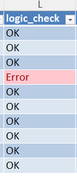
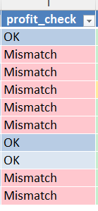
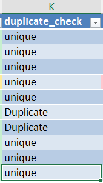
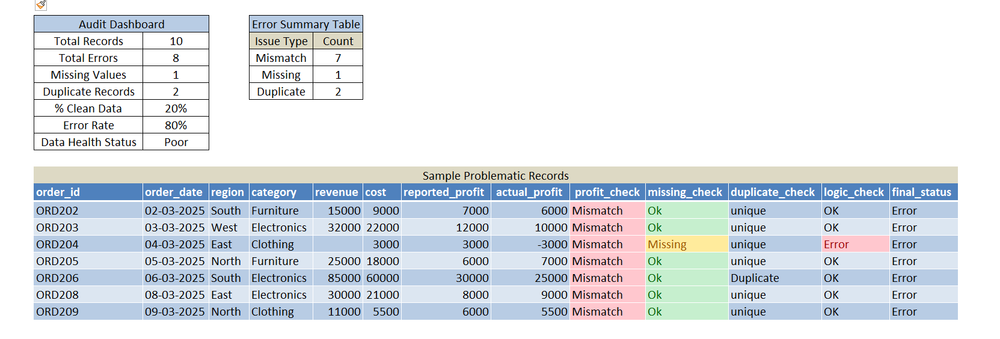
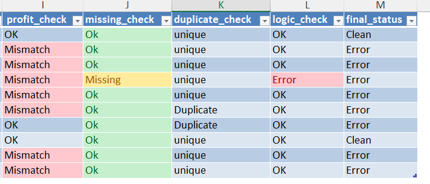

# 📊 Day 56 — Excel Data Audit & Error Detection Report

Today I worked on validating data instead of directly analyzing it.

I realized that even the best dashboards fail if the underlying data is incorrect, so I focused on building a simple audit system in Excel.

---

## 🧾 Business Scenario

I assumed the role of a Finance Analyst in an E-commerce company.

Problem:
Revenue and profit numbers in reports were not matching finance records.

So before doing any analysis, I focused on:
- Auditing the dataset  
- Identifying errors  
- Highlighting inconsistencies  
- Making the data reliable  

---

## 📂 Dataset Overview

The dataset contains sales transaction details:
- Order ID  
- Order Date  
- Region  
- Category  
- Revenue  
- Cost  
- Reported Profit  

---

## 📸 Dataset Preview

---

## 🎯 Analysis Objective

To build an Excel audit layer that detects:
- Missing values  
- Incorrect profit calculations  
- Duplicate entries  
- Business rule violations  

---

## ⚙️ Analysis Process

### Step 1 — Convert to Table
- Used Ctrl + T  
- Named table: audit_data  

---

### Step 2 — Recalculate Actual Profit
Formula used:
=[@revenue] - [@cost]

---

### Step 3 — Profit Mismatch Check
Formula used:
=IF([@reported_profit]=[@actual_profit],"OK","Mismatch")

---

### Step 4 — Missing Values Detection
Formula used:
=IF(OR([@revenue]="",[@cost]=""),"Missing","OK")

---

### Step 5 — Duplicate Detection
Formula used:
=IF(COUNTIF(audit_data[order_id],[@order_id])>1,"Duplicate","Unique")

---

### Step 6 — Business Rule Validation
Rule: Profit should not exceed revenue  

Formula used:
=IF([@reported_profit]>[@revenue],"Error","OK")

---

### Step 7 — Audit Summary Table
Used COUNTIF to calculate:
- Mismatch count  
- Missing count  
- Duplicate count  

---

### Step 8 — Conditional Formatting
- Red → Errors  
- Yellow → Missing  
- Green → OK  

---

### Step 9 — Audit Dashboard
Calculated clean data percentage using:
=COUNTIF(profit_check,"OK")/COUNTA(audit_data[order_id])

---

## 📊 Analysis Output

The audit system successfully identified:
- Incorrect profit values  
- Missing revenue entries  
- Duplicate records  
- Logical errors  

---

## 💡 Business Insights

- Incorrect profit reporting can mislead financial decisions  
- Duplicate entries can inflate revenue numbers  
- Missing values can break analysis  
- Data validation is mandatory before reporting  

---

## 🧠 Skills Practiced

- Excel Data Auditing  
- IF & COUNTIF functions  
- Data Validation Techniques  
- Error Detection  
- Conditional Formatting  
- Business Rule Checks  

---

## 🛠️ Tools Used

- Microsoft Excel  

---

## 📁 Project Files

- day56_data_audit_report.xlsx  
- day56_raw_data_errors.png  
- day56_profit_mismatch.png  
- day56_duplicate_check.png  
- day56_audit_summary.png  
- day56_conditional_formatting.png  

---

## 🔍 Learning Reflection

Today I understood that data accuracy is more important than analysis.

If data is wrong:
- Insights become misleading  
- Decisions become risky  

This task helped me think like a real analyst who validates data before using it.

---

## 🔑 SEO Keywords

Excel data audit project, data validation Excel, Excel error detection, duplicate detection Excel, missing data analysis Excel, audit dashboard Excel, beginner data analyst project, data quality Excel, finance data audit, Excel COUNTIF IF practice
