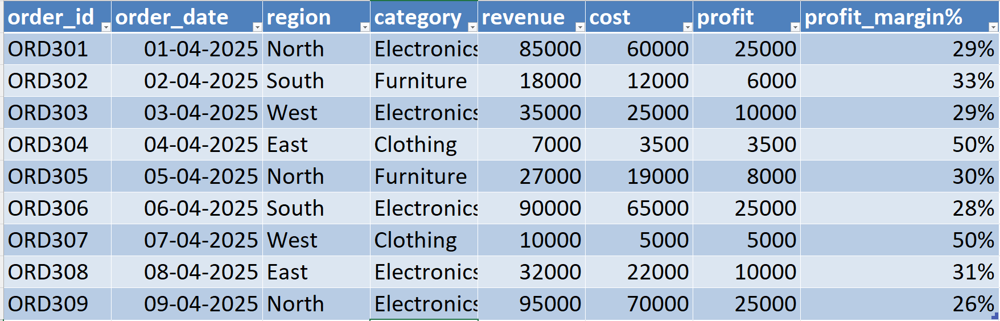
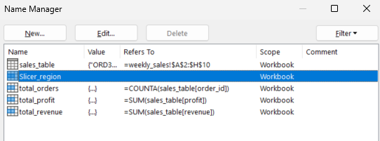
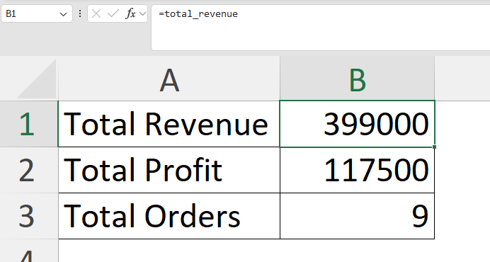
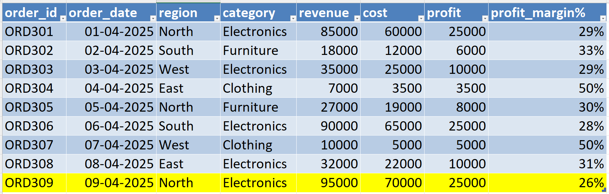
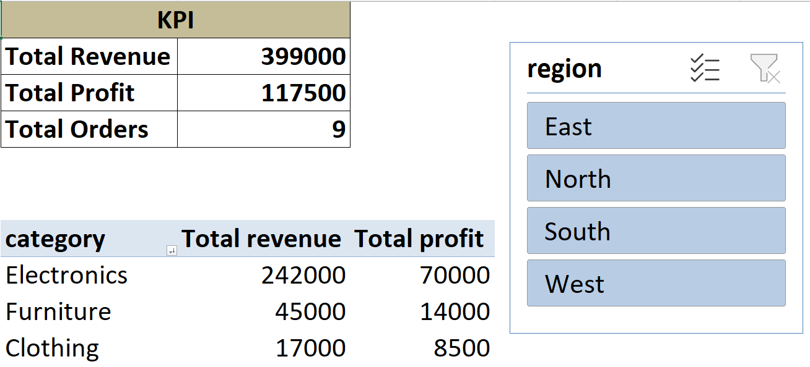

# 📊 Day 57 — Automating Analyst Tasks with Named Ranges & Tables

## 🧑‍💻 Business Scenario

In real-world reporting, analysts often face issues where Excel reports break when new data is added.

In this exercise, I simulated a scenario where I am working as a **Sales Analyst in a retail company**.

The problem:

• Reports require manual updates  
• Formulas break when new rows are added  
• Analysis is not scalable  

To solve this, I built a **self-updating Excel reporting system**.

---

# 📂 Dataset Overview

The dataset represents **weekly sales transactions** including revenue and cost across regions and categories.

### Dataset Columns

| Column | Description |
|------|------|
| order_id | Unique order identifier |
| order_date | Date of transaction |
| region | Sales region |
| category | Product category |
| revenue | Sales revenue |
| cost | Cost of goods |

Additional calculated columns:

• Profit = Revenue - Cost  
• Profit Margin % = Profit / Revenue  

This dataset is commonly used in **automated reporting and performance tracking systems**. :contentReference[oaicite:0]{index=0}

---

# 📸 Dataset Preview



---

# 🎯 Analysis Objective

The goal of this exercise was to build a **self-updating Excel model** using:

• Excel Tables  
• Named Ranges  

This allows reports to update automatically when new data is added.

---

# ⚙️ Analysis Process

### Step 1 — Convert Data into Table

Converted dataset into Excel Table using:

`CTRL + T`

Table name:

`sales_table`

✔ Enables auto-expansion  
✔ Prevents formula breakage  

---

### Step 2 — Add Calculated Columns

Created:

• Profit  
```
=[@revenue] - [@cost]
```

• Profit Margin %  
```
=[@Profit] / [@revenue]
```

These formulas automatically apply to new rows.

---

### Step 3 — Create Named Ranges

Used Name Manager to define:

• total_revenue  
```
=SUM(sales_table[revenue])
```

• total_profit  
```
=SUM(sales_table[Profit])
```

• total_orders  
```
=COUNTA(sales_table[order_id])
```



---

### Step 4 — Build KPI Dashboard

Created KPI cards using named ranges:

• Total Revenue  
• Total Profit  
• Total Orders  

These update automatically when data changes.



---

### Step 5 — Create Category Summary

Built Pivot Table:

Rows → Category  
Values → Revenue, Profit  

Used table as source for dynamic updates.

---

### Step 6 — Test Automation

Added new data row to verify:

• Table auto-expands  
• KPIs update automatically  
• Pivot reflects new data (after refresh)  



---

# 📊 Analysis Output

### Final Dashboard View



---

# 💡 Business Insights

From this automation setup:

• Reports update automatically with new data  
• Manual formula corrections are eliminated  
• Named ranges improve readability and structure  
• Tables ensure scalability for growing datasets  

This approach makes Excel models **reliable and production-ready**.

---

# 🧠 Skills Practiced

📊 Excel Automation  
📈 Named Ranges  
📑 Structured References  
📊 KPI Dashboard Creation  
🔍 Data Model Design  

These are essential skills for **analyst roles working with Excel-based reporting systems**.

---

# 🛠 Tools Used

• Microsoft Excel  
• Excel Tables  
• Name Manager  
• Pivot Tables  

---

# 📁 Project Files

```
day57_excel_automation_named_ranges.xlsx
day57_table_structure.png
day57_named_ranges.png
day57_kpi_auto_update.png
day57_new_data_added.png
day57_final_dashboard.png
```

---

# 📚 Learning Reflection

This exercise helped me understand that building reports is not enough — they need to be **scalable and reliable**.

By using tables and named ranges:

• I reduced manual work  
• I prevented formula errors  
• I created a reusable reporting structure  

This is helping me move towards building **automation-focused data solutions**.

---

# 🔎 SEO Keywords

Excel Automation Project  
Named Ranges in Excel  
Excel Tables for Data Analysis  
Automated Excel Dashboard  
Data Analyst Portfolio Project  
Excel Reporting Automation  
Structured References Excel  
Excel for Data Analysts  
