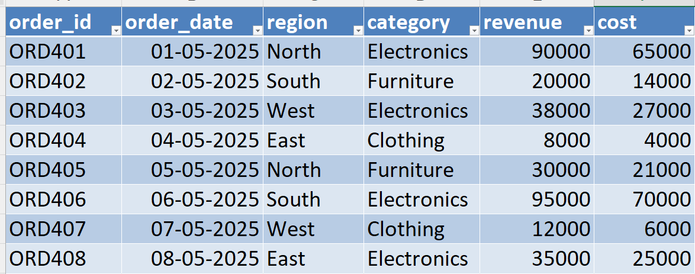
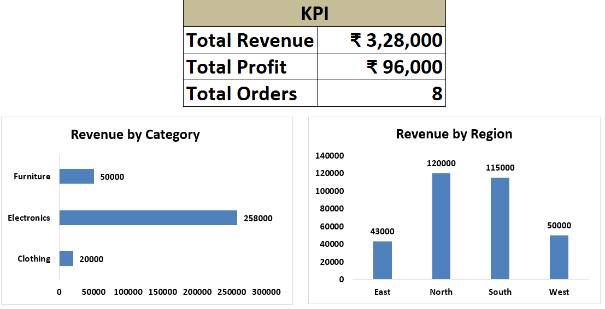
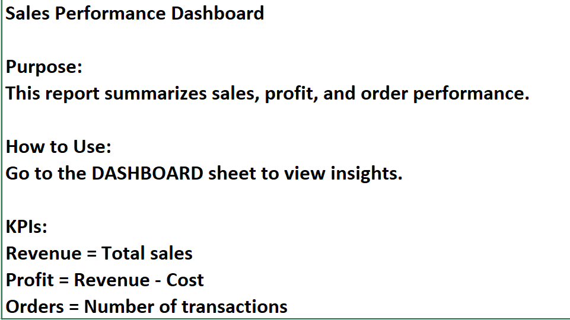
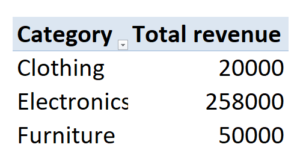
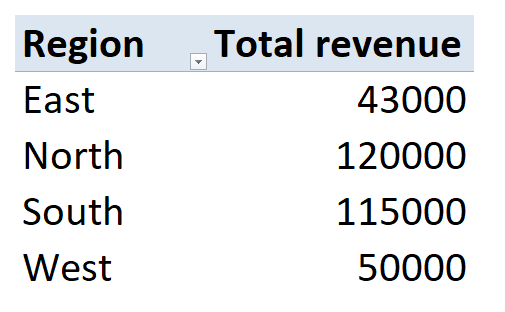
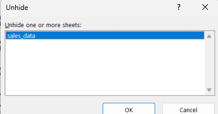

# 📊 Day 58 — Preparing Excel Files for Stakeholder Delivery

## 🧑‍💻 Business Scenario

In this task, I worked on preparing an Excel file for **stakeholder delivery** instead of just doing analysis.

I simulated a real scenario where I am working as a **Business Analyst in a retail company**, and the requirement was:

• Make the Excel report clean and easy to understand  
• Hide technical complexity  
• Ensure non-technical users can use it without confusion  

This is closer to real-world reporting than just building dashboards.

---

# 📂 Dataset Overview

The dataset represents **sales transactions** including revenue and cost across different regions and categories.

### Dataset Columns

| Column | Description |
|------|------|
| order_id | Unique order ID |
| order_date | Date of transaction |
| region | Sales region |
| category | Product category |
| revenue | Total sales revenue |
| cost | Cost of goods |

Additional column created:

• Profit = Revenue - Cost  

---

# 📸 Dataset Preview



---

# 🎯 Analysis Objective

The goal of this exercise was to convert a working Excel file into a **stakeholder-ready deliverable**.

Focus areas:

• Clean structure  
• Clear instructions  
• Professional layout  
• Controlled visibility  

---

# ⚙️ Analysis Process

### Step 1 — Structured Sheets

Created separate sheets:

• README (instructions)  
• dashboard (final output)  
• data (raw dataset)  

---

### Step 2 — Data Preparation

Converted dataset into table:

`CTRL + T → sales_table`

Added:

```
=[@revenue] - [@cost]
```

Created Profit column.

---

### Step 3 — Dashboard Creation

Built a clean dashboard with:

• KPI Cards:
  - Total Revenue  
  - Total Profit  
  - Total Orders  

• Category performance (Pivot Table)  
• Region performance (Pivot Table)  

---

### Step 4 — README Sheet

Created an instruction sheet for stakeholders including:

• Purpose of the report  
• How to use the dashboard  
• KPI definitions  

---

### Step 5 — Formatting

Applied professional formatting:

• Removed gridlines  
• Consistent font and spacing  
• Clear titles and alignment  

---

### Step 6 — Hide Data

• Hidden raw data sheet  
• Ensured users only see dashboard + README  

---

# 📊 Analysis Output

### Dashboard View



---

### README Instructions



---

### Category Performance



---

### Region Performance



---

### Hidden Data Sheet



---

# 💡 Business Insights

From this setup:

• Stakeholders can view insights without seeing raw data  
• Dashboard is easy to navigate and understand  
• Instructions reduce confusion and dependency on analyst  
• Clean layout improves decision-making experience  

---

# 🧠 Skills Practiced

📊 Stakeholder Reporting  
📑 Excel File Structuring  
📊 Dashboard Presentation  
🔐 Data Hiding & Control  
🧾 Documentation (README sheet)  

---

# 🛠 Tools Used

• Microsoft Excel  
• Pivot Tables  
• Excel Tables  
• Basic Formulas  

---

# 📁 Project Files

```
day58_stakeholder_ready_excel.xlsx
day58_raw_data_sheet.png
day58_dashboard_view.png  
day58_readme_sheet.png
day58_hidden_data.png  
day58_category_performance.png
day58_region_performance.png
```

---

# 📚 Learning Reflection

This task helped me understand that analysis is only part of the job.

What matters is:

• how clean the report is  
• how easy it is to use  
• how clearly insights are communicated  

This is helping me move from **doing analysis → delivering business-ready solutions**.

---

# 🔎 SEO Keywords

Excel stakeholder reporting  
Excel dashboard delivery project  
Business reporting Excel  
Excel file formatting best practices  
Data analyst portfolio Excel project  
Excel dashboard for management  
Stakeholder ready Excel report  
