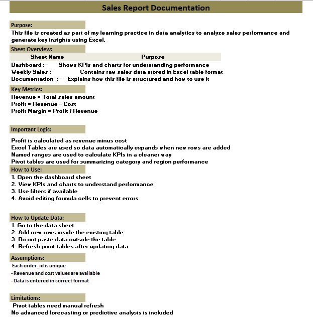
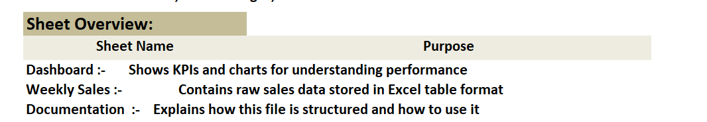
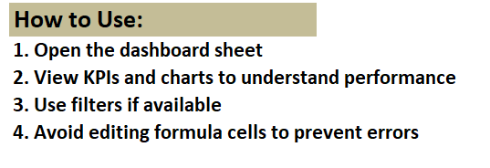

# 📊 Day 59 — Excel Sales Report Documentation (Handover Ready)

---

## 🧑‍💻 Business Scenario

As part of my daily data analytics practice, I worked on documenting an Excel sales report so that it can be easily understood and used by another analyst.

In real companies, analysts often switch projects or teams. Proper documentation ensures:

• smooth handover  
• reduced dependency  
• better collaboration  

This task focuses on **making analysis usable for others**, not just building it.

---

# 📂 Dataset Overview

This project uses a **sales performance dataset** structured inside Excel.

The file includes:

• Sales data stored in Excel Tables  
• KPI calculations using Named Ranges  
• Pivot-based summaries for category and region analysis  

This reflects a **real-world reporting workflow in Excel**.

---

# 📸 Documentation Preview



---

# 🎯 Analysis Objective

The goal of this task was to create a **clear, structured documentation sheet** that explains:

• purpose of the file  
• sheet structure  
• key metrics and calculations  
• how to use the dashboard  
• how to update the data safely  

---

# ⚙️ Documentation Process

### 1. Created Documentation Sheet

• Added a new sheet named `documentation`  
• Placed it as the first sheet for visibility  

---

### 2. Explained Sheet Structure

• Listed all sheets and their purpose  
• Improved navigation clarity  



---

### 3. Defined Key Metrics

• Revenue = Total sales amount  
• Profit = Revenue - Cost  
• Profit Margin = Profit / Revenue  

---

### 4. Explained Logic Used

• Profit calculated using formula (Revenue - Cost)  
• Excel Tables used for dynamic data expansion  
• Named Ranges used for KPI calculations  
• Pivot Tables used for summarizing category and region performance  

---

### 5. Added Usage Instructions

• How to use dashboard  
• What not to edit  
• How to avoid errors  



---

### 6. Added Data Update Guidelines

• Add new data inside table only  
• Do not paste outside table  
• Refresh pivot tables after updates  

---

# 📊 Analysis Output

• Fully documented Excel file  
• Clear instructions for any user  
• Easy navigation across sheets  
• Reduced dependency on creator  

---

# 💡 Business Insights

• Documentation improves team efficiency  
• Clear instructions reduce user errors  
• Structured files improve usability  
• Analysts must think beyond just analysis  

---

# 🧠 Skills Practiced

📄 Excel Documentation  
🧠 Analytical Communication  
📊 Workflow Explanation  
👥 Stakeholder Thinking  

---

# 🛠 Tools Used

• Microsoft Excel  

---

# 📁 Project Files

```
day59_excel_handover_documentation.xlsx
day59_documentation_full.png
day59_sheet_overview.png
day59_usage_instructions.png
```

---

# 📚 Learning Reflection

Today I understood that building dashboards is not enough.

An analyst must also ensure:

• others can understand the work  
• The file is easy to use  
• logic is clearly explained  

This task helped me think like someone working in a real team environment.

---

# 🔎 SEO Keywords

Excel Documentation Project  
Data Analyst Handover Excel  
Excel Workflow Documentation  
Excel Dashboard Documentation  
Business Reporting Excel  
Data Analyst Portfolio Project  
Excel Reporting Process  
