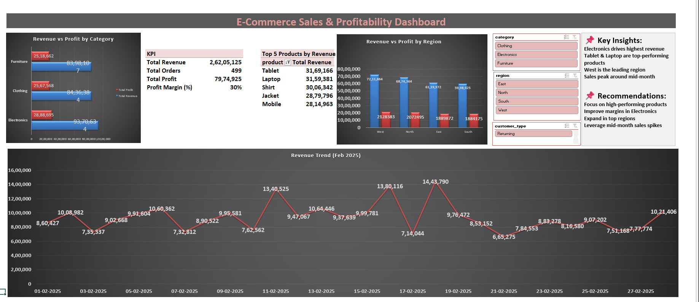
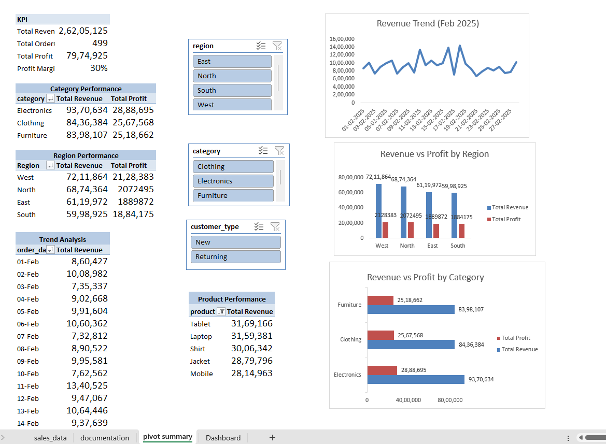
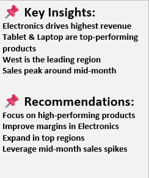
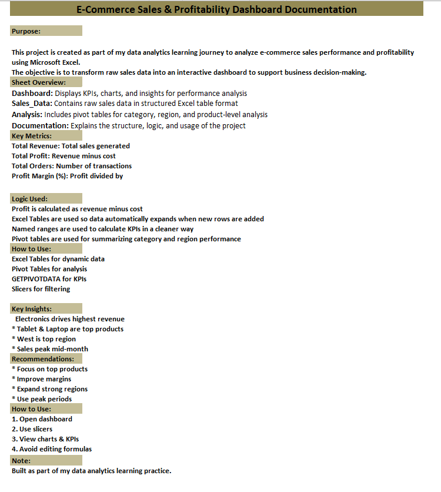

# 📊 Day 60 — End-to-End E-commerce Profitability & Performance Analysis (Final Excel Project)

---

## 🧑‍💻 Business Scenario

As part of my Excel learning journey, I worked on a real-world business scenario where I analyzed sales performance to understand why profitability varies across regions, categories, and products.

Instead of solving one isolated task, I built a **complete end-to-end analysis workflow** — from raw data to insights and business recommendations.

This project reflects how analysts actually work in real companies.

---

## 📁 Dataset Overview

The dataset contains transactional e-commerce sales data with the following fields:

- Order ID  
- Order Date  
- Region  
- Category  
- Product  
- Customer Type  
- Revenue  
- Cost  

To make the analysis more meaningful, I created additional business metrics:

- **Profit = Revenue - Cost**  
- **Profit Margin = Profit / Revenue**  

---

## 👀 Dashboard Preview



---

## 🎯 Objective

The goal of this project was to simulate a **complete data analyst workflow**:

- Prepare and structure raw data  
- Validate data quality  
- Perform multi-dimensional analysis  
- Build a clean dashboard  
- Generate business insights  
- Provide actionable recommendations  

---

## ⚙️ Process Followed

### 1. Data Preparation

- Converted raw dataset into an Excel Table (`sales_table`)  
- Created calculated columns:
  - Profit  
  - Profit Margin  

---

### 2. Data Validation

- Checked for missing or inconsistent values  
- Ensured revenue and cost fields are correctly populated  

---

### 3. Analysis (Pivot Tables)

Used pivot tables to analyze performance across:

- Category  
- Region  
- Customer Type  
- Product  



---

### 4. Dashboard Creation

Designed a clean and structured dashboard including:

- KPI Cards:
  - Total Revenue  
  - Total Profit  
  - Average Profit Margin  

- Charts:
  - Category performance  
  - Region comparison  

---

### 5. Insights & Recommendations



---

## 📊 Key Insights

- Electronics category generates the highest revenue and profit  
- Furniture shows stable revenue but relatively lower margins  
- South region drives strong revenue but lower profitability  
- High-revenue products require better cost control  
- Customer contribution varies across segments  

---

## 🚀 Business Recommendations

- Improve cost efficiency in high-revenue categories  
- Investigate low-margin regions for optimization  
- Promote high-margin products  
- Revisit pricing strategies for low-margin segments  

---

## 🧾 Documentation Sheet



---

## 📂 Project Structure

```
day60_ecommerce_profit_analysis/
│
├── day60_ecommerce_profit_analysis.xlsx
├── day60_dashboard.png
├── day60_insights.png
├── day60_analysis.png
├── day60_documentation.png
└── README.md
```

---

## 🧠 Learning Reflection

This project helped me understand what a complete data analyst workflow looks like.

Instead of focusing only on calculations, I worked on:

- structuring data properly  
- validating data quality  
- analyzing multiple business dimensions  
- presenting insights clearly  
- providing recommendations  

This experience is helping me think beyond Excel tasks and move towards **solving real business problems**.

---

## 🛠️ Skills Practiced

- Data preparation  
- Data validation  
- Pivot table analysis  
- Dashboard design  
- Business insight generation  
- Analytical thinking  

---

## ⚙️ Tools Used

- Microsoft Excel  

---

## 🔎 SEO Keywords

Excel End-to-End Project, 
Data Analyst Portfolio Excel,
Excel Dashboard Project, 
Profitability Analysis Excel, 
Business Analysis Excel,
E-commerce Data Analysis
