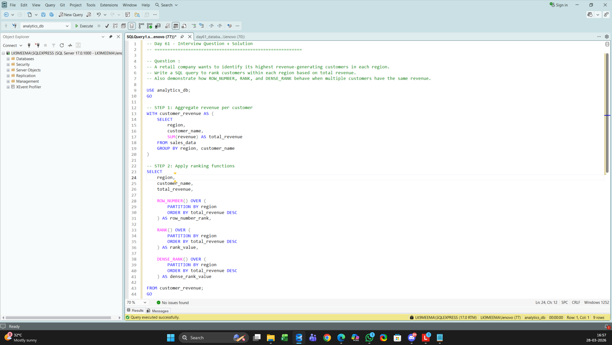
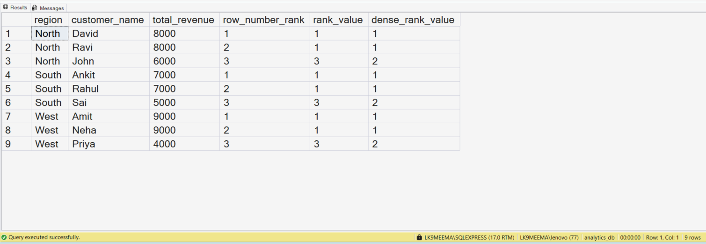

# 📊 SQL Window Functions for Customer Ranking by Region (Top N per Group Analysis)

---

## 🚀 Business Scenario

In this project, I am learning how a retail company can identify its highest revenue-generating customers across different regions.

I tried to understand how businesses compare customers within categories (like region) instead of globally.

This type of analysis is important when companies want:
- Top customers per region
- Regional performance insights
- Fair comparison within segments

---

## 📂 Dataset Overview

In this project, I worked with a simple sales dataset.

I created and used the following columns:

- order_id → Unique ID for each order  
- region → Location where the order was placed  
- customer_name → Name of the customer  
- revenue → Revenue generated from the order  

This helped me simulate a real business dataset in a simple way.

---

## 💻 Query & Setup Preview

---

## 🎯 Analysis Objective

In this project, I am trying to:

- Rank customers within each region based on revenue  
- Understand how ranking changes when multiple customers have the same revenue  
- Compare behavior of:
  - ROW_NUMBER()
  - RANK()
  - DENSE_RANK()  

---

## 🔍 Step-by-Step Analysis Process

1. I first created the database and table  
2. I inserted sample sales data  
3. I grouped data by region and customer  
4. I calculated total revenue using SUM()  
5. I used a CTE to organize the aggregated data  
6. I applied window functions to rank customers within each region  

---

## 🧠 SQL Concepts I Practiced

In this project, I practiced:

- Common Table Expressions (CTE)  
- GROUP BY and aggregation  
- Window functions  
- PARTITION BY  
- ORDER BY inside window functions  

---

## 🧩 Query Logic Explanation

I tried to break the problem into two parts:

### Step 1: Aggregate Revenue
I calculated total revenue for each customer within each region.

### Step 2: Apply Ranking

Then I used:

- ROW_NUMBER() → Gives unique ranking (no duplicates)  
- RANK() → Same rank for ties but skips next numbers  
- DENSE_RANK() → Same rank for ties without skipping numbers  

This helped me clearly see how each function behaves.

---

## 📊 Analysis Output

---

## 🔍 What I Observed

- Customers with same revenue get:
  - Different ranks in ROW_NUMBER  
  - Same ranks in RANK and DENSE_RANK  

- RANK skips numbers after ties  
- DENSE_RANK keeps ranking continuous  

This helped me clearly understand when to use each function.

---

## 🏢 Where This Is Used in Real Companies

I observed that this pattern is used in:

- Identifying top customers per region  
- Sales performance dashboards  
- Leaderboards (top sellers, top users)  
- Marketing segmentation  

This is a very common **Top N per group SQL problem**.

---

## 🛠 Skills I Practiced

- Writing structured SQL queries  
- Breaking business problems into steps  
- Using window functions for ranking  
- Understanding real-world use cases  

---

## ⚙️ Tools Used

- Microsoft SQL Server  
- SQL Server Management Studio (SSMS)  

---

## 📁 Project Files

- day61_database_table_setup.sql  
- day61_question_solution_window_ranking.sql  
- day61_query_execution.png  
- day61_output_result.png  

---

## 🧠 My Learning Reflection

In this project, I am learning how to think like a data analyst instead of just writing queries.

I tried to understand:
- Why ranking is needed in business  
- How different SQL functions behave  
- How small logic changes affect output  

This helped me realize that SQL is not just syntax — it is about decision-making.

---

## 🔍 SEO Keywords

SQL interview questions  
SQL portfolio project  
SQL window functions  
Top N per group SQL  
Data analyst SQL project  
ROW_NUMBER vs RANK vs DENSE_RANK  
SQL ranking customers by region  
