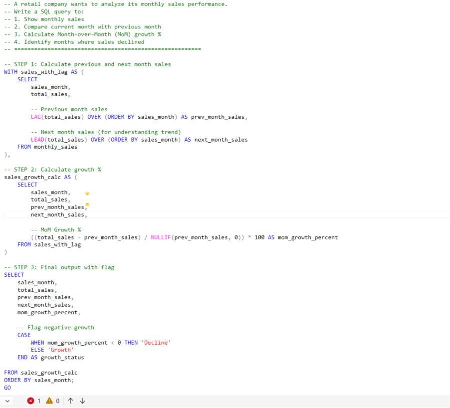
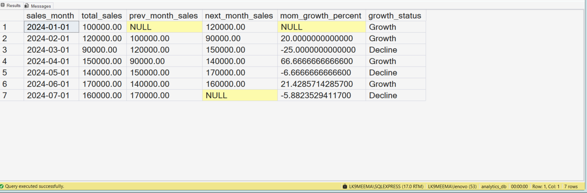

# SQL Month-over-Month (MoM) Sales Growth Analysis using LAG and LEAD | SQL Window Functions Project

---

## 🏢 Business Scenario  

In this project, I am working on a retail business scenario where the company wants to track its monthly sales performance.  

I am trying to understand how sales are changing month by month and how to identify growth or decline periods using SQL.  

---

## 📊 Dataset Overview  

In this project, I created a simple monthly sales dataset with the following columns:

- sales_month → represents each month  
- total_sales → total revenue generated in that month  

This dataset is helping me practice time-based analysis.

---

## 📸 Query & Setup Preview  

---

## 🎯 Analysis Objective  

In this project, I am trying to:

- Compare current month sales with previous month  
- Calculate Month-over-Month (MoM) growth percentage  
- Identify months where sales decreased  
- Understand sales trends using SQL window functions  

---

## 🔍 Step-by-Step Analysis Process  

1. I first created a monthly sales table with sample business data  
2. I used LAG to get previous month sales  
3. I used LEAD to see next month trend (for understanding flow)  
4. I calculated MoM growth percentage  
5. I used NULLIF to avoid division errors  
6. I added a flag to identify growth vs decline  

---

## 🧠 SQL Concepts I Practiced  

- SQL Window Functions  
- LAG() function  
- LEAD() function  
- Common Table Expressions (CTE)  
- CASE WHEN conditions  
- NULLIF for safe division  

---

## ⚙️ Query Logic Explanation  

In this project, I tried to break the problem step-by-step instead of writing one complex query.

- First, I used LAG to get previous month sales  
- Then I calculated the difference between current and previous sales  
- After that, I converted it into percentage growth  
- Finally, I added a condition to flag decline months  

This helped me understand how to build logic gradually.

---

## 📊 Analysis Output  

---

## 📈 What I Observed  

- Sales are not consistent every month  
- Some months show clear decline  
- Growth percentage gives better clarity than raw numbers  
- Trend analysis helps in understanding business performance  

---

## 🏢 Where This Is Used in Real Companies  

From this project, I understood that:

- Companies track monthly revenue growth  
- Product teams analyze user growth trends  
- Finance teams monitor performance changes  
- Business decisions are often based on MoM growth  

---

## 🛠️ Skills I Practiced  

- Writing clean SQL queries  
- Breaking business problems into steps  
- Using window functions for analysis  
- Thinking in terms of business metrics  

---

## 💻 Tools Used  

- SQL Server (SSMS)  
- T-SQL  

---

## 📂 Project Files  

- day62_database_table_setup.sql  
- day62_question_solution_lag_lead_growth.sql  
- day62_query_execution.png  
- day62_output_result.png  

---

## 🧠 My Learning Reflection  

In this project, I am learning how real companies analyze performance trends.  

I practiced using LAG and LEAD functions for the first time in a business scenario.  

This helped me realize that SQL is not just about queries, but about understanding business patterns and trends.  

I am gaining confidence in solving interview-level SQL problems step-by-step.

---

## 🔍 SEO Keywords  

SQL interview questions  
SQL portfolio project  
SQL window functions  
LAG and LEAD SQL example  
Month-over-Month growth SQL  
Data analyst SQL project  
SQL MoM growth analysis  
