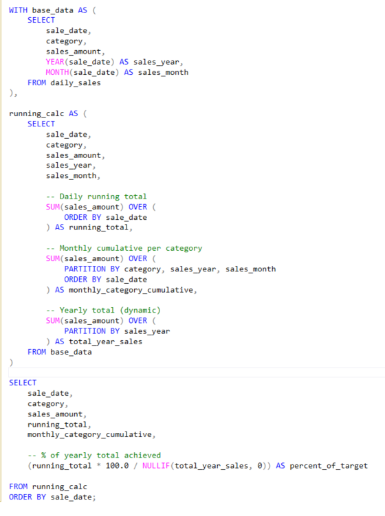
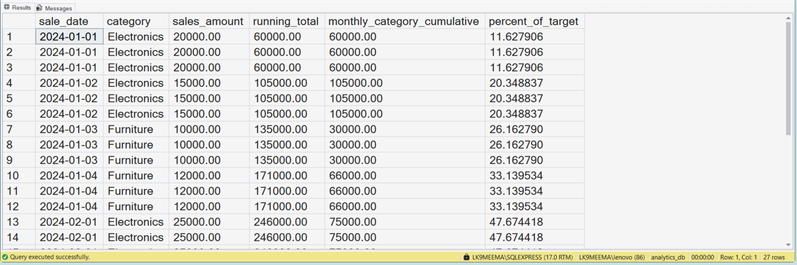

# How Do Companies Track Sales Growth Over Time? | SQL Running Totals & Cumulative Analysis

---

## 🏢 Business Scenario  

In this project, I am working on a sales analytics scenario where a company wants to track how its revenue is growing over time.  

I am trying to understand how businesses measure progress instead of just looking at daily numbers.  

This type of analysis is commonly used in revenue dashboards to monitor business growth and performance.

---

## 📊 Dataset Overview  

In this project, I created a simple daily sales dataset with the following columns:

- **sale_id** → unique identifier for each sale  
- **sale_date** → date of transaction  
- **category** → product category (Electronics, Furniture)  
- **sales_amount** → revenue generated  

This dataset is helping me practice time-based and category-based analysis.

---

## 📸 Query & Setup Preview  

---

## 🎯 Analysis Objective  

In this project, I am trying to:

- Track **daily running total of sales**  
- Analyze **monthly cumulative sales per category**  
- Calculate **percentage of annual target achieved**  

---

## ⚙️ Step-by-Step Analysis Process  

- I created a database and sales table  
- I inserted multi-category sales data  
- I extracted year and month from sale_date  
- I applied window functions to track cumulative growth  
- I calculated:
  - Running total (overall growth)
  - Monthly category cumulative
  - Target achievement percentage  

---

## 🧠 SQL Concepts I Practiced  

- Window Functions  
- `SUM() OVER (ORDER BY)`  
- `PARTITION BY`  
- CTE (Common Table Expressions)  
- Running totals  
- Cumulative analysis  
- Safe division using `NULLIF`  

---

## 🔍 Query Logic Explanation  

While working on this, I tried to understand:

- Running total keeps adding previous sales → shows growth trend  
- Partitioning helps track category-wise performance separately  
- Window functions allow multiple calculations without grouping data  

This helped me connect SQL logic with business reporting.

---

## 📊 Analysis Output  

---

## 📈 What I Observed  

- Sales growth becomes clearer with running totals  
- Different categories grow differently across months  
- Monthly cumulative helps compare performance  
- Target percentage shows progress toward business goals  

---

## ❌ Mistakes I Made  

- Initially I forgot to use `PARTITION BY` and got incorrect cumulative results  
- I confused running total with `GROUP BY` aggregation  
- I didn’t handle division safely before using `NULLIF`  

---

## 🏢 Where This Is Used in Real Companies  

I observed that this type of analysis is used in:

- Sales dashboards  
- KPI tracking systems  
- Monthly business reviews  
- Business intelligence tools like Power BI  

---

## 🛠️ Skills I Practiced  

- Writing business-focused SQL queries  
- Solving SQL interview questions  
- Applying window functions in real scenarios  
- Understanding cumulative business metrics  

---

## ⚙️ Tools Used  

- SQL Server (SSMS)  
- T-SQL  
- GitHub  

---

## 📁 Project Files  

- `day63_database_table_setup.sql`  
- `day63_question_solution_running_totals.sql`  
- `day63_query_execution.png`  
- `day63_output_result.png`  

---

## 🧠 My Learning Reflection  

In this project, I am learning how to move from basic SQL queries to business-focused analysis.  

I tried to understand how companies track performance over time instead of looking at isolated numbers.  

This helped me realize that cumulative metrics are important for dashboards and decision-making.

---

## 🔍 SEO Keywords  

SQL portfolio project  
SQL window functions  
Running totals SQL  
Cumulative analysis SQL  
SQL interview questions  
Data analyst SQL project  
