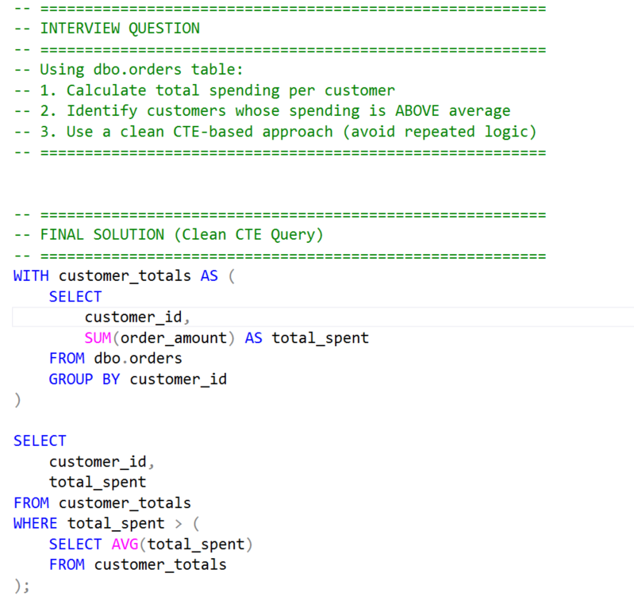
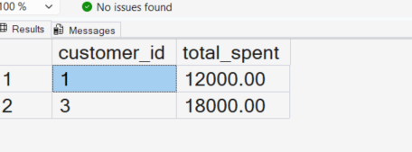

# SQL CTE vs Nested Subqueries | Clean SQL for Data Analysts (SQL Server Project)

---

## 🚀 Project Overview

In this project, I am learning how to write clean and structured SQL queries using Common Table Expressions (CTEs).

As a beginner in data analytics, I noticed that my queries were becoming messy when I used nested subqueries.
So, I practiced rewriting the same logic using CTEs to improve readability and structure.

---

## 🧩 SQL Interview Problem

A business wants to identify high-value customers based on their total spending.

Tasks:

* Calculate total spending per customer
* Find customers spending above average
* Write clean SQL using CTE instead of nested queries

---

## 💻 Tech Stack

* SQL Server (SSMS)
* T-SQL

---

## ⚙️ Setup Instructions

1. Run the database setup script (`day64_database_table_setup.sql`)
2. Run the solution query (`day64_question_solution_ctes_clean_code.sql`)
3. Compare nested vs CTE output

---

## 📸 Query Execution

---

## 📊 Output Result

---

## 🧠 Key Learnings

* Learned how to use `WITH` clause (CTE) step-by-step
* Understood how to avoid repeated aggregation logic
* Practiced breaking one complex query into multiple steps
* Compared nested subqueries vs clean SQL approach

---

## 📊 Insights

* Nested subqueries quickly become hard to read
* CTEs make SQL more structured and readable
* Clean SQL is easier to debug and modify
* Step-by-step queries match real business thinking

---

## 🚀 Recommendations

* Use CTEs when query logic has multiple steps
* Avoid deeply nested subqueries
* Write SQL like business logic (step-by-step)

---

## 🎯 Interview Relevance

In SQL interviews, writing correct queries is not enough.
Interviewers also check:

* Code readability
* Logical structuring
* Maintainability

Using CTEs shows better SQL thinking and problem-solving approach.

---

## 🧠 Learning Reflection

In this project, I am improving how I structure SQL queries.

Earlier, I used to write everything in one query.
Now, I am learning to break problems into steps using CTEs.

This is helping me think more like a data analyst.

---

## 🔎 SEO Keywords

SQL CTE example, SQL Server CTE tutorial, CTE vs subquery SQL,
clean SQL queries, SQL for data analyst, SQL interview questions,
Common Table Expression SQL Server, SQL practice project

---
