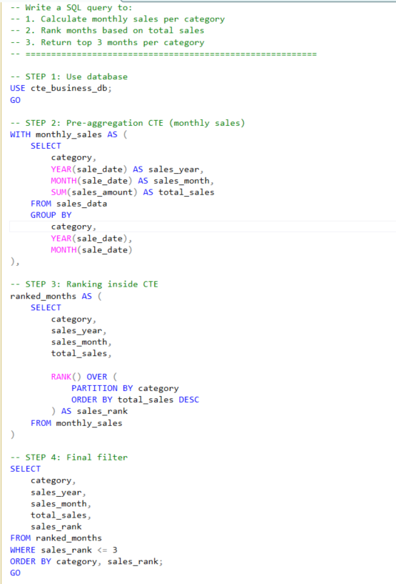
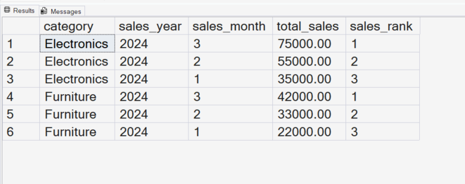

# SQL Project: Finding Top 3 Months per Category using CTEs & Ranking (Learning Journey)

---

## 🚀 Project Overview

In this project, I am learning how to solve real-world business problems using SQL.
Instead of writing one long query, I am practicing how to break problems into multiple logical steps using **Common Table Expressions (CTEs)**.

My focus here is to understand how analysts approach **multi-step data problems in real companies**.

---

## 🧩 Business Problem

A company wants to identify **top-performing months for each product category** based on sales.

To solve this, I need to:

* Aggregate sales at a monthly level
* Rank months within each category
* Extract the **top 3 months per category**

---

## 💻 Tools & Environment

* SQL Server (SSMS)
* T-SQL

---

## ⚙️ Approach (Step-by-Step Thinking)

Instead of jumping directly to the final answer, I structured my solution into clear steps:

### 1️⃣ Pre-Aggregation (Monthly Sales)

First, I calculated total sales for each category per month.
This step simplifies raw transactional data into a business-friendly format.

### 2️⃣ Ranking within Category

Next, I applied ranking to identify high-performing months inside each category.

### 3️⃣ Final Filtering

Finally, I filtered only the **Top 3 months per category**.

This step-by-step approach helped me understand how to think like an analyst instead of just writing queries.

---

## 📸 Query Execution

---

## 📊 Output Result

---

## 🧠 What I Learned

* How to use **CTEs to structure complex SQL queries**
* Why **pre-aggregation is important** before applying logic
* How **ranking functions (ROW_NUMBER / RANK / DENSE_RANK)** work in real scenarios
* How to convert a business question into SQL steps

---

## 📊 Key Insights

* Aggregating data first makes analysis much easier
* Ranking helps identify top-performing segments quickly
* Breaking queries into steps improves readability and debugging

---

## 🚀 What I Would Do Next

* Try the same problem using **window functions without CTEs**
* Compare the performance of different approaches
* Extend this analysis to **Top N customers or products**

---

## 🎯 Why This Matters for Interviews

From what I am learning, this type of problem is very common in SQL interviews.

It tests:

* Aggregation skills
* Window functions
* Structured thinking
* Ability to solve business problems step-by-step

---

## 🧠 My Learning Reflection

While working on this project, I realized that writing SQL is not just about syntax.
It’s more about **thinking in steps and structuring the problem clearly**.

I am still learning, but this project helped me get closer to how real analysts approach data problems.

---

## 🔍 SEO Keywords (for discoverability)

SQL CTE tutorial, SQL ranking functions example, SQL top N per group, SQL interview questions practice, SQL Server CTE example, business analysis SQL project, SQL portfolio project for data analyst

---
