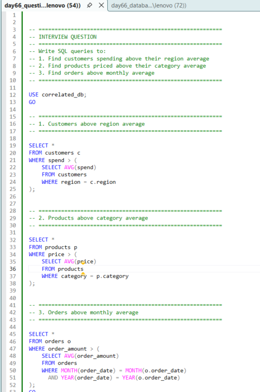
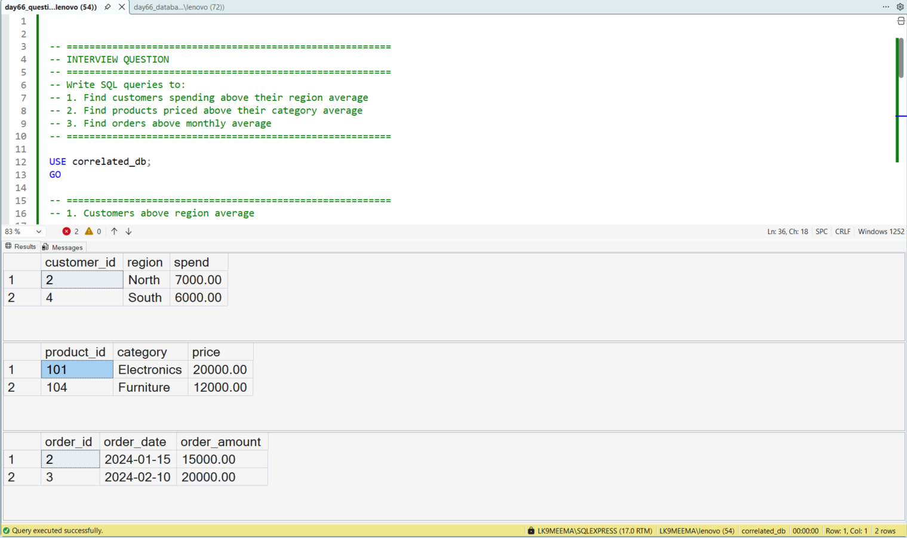

---

# SQL Correlated Subqueries (Beginner to Advanced) | Real Business Use Case Practice

---

## 🚀 Project Overview

In this project, I am learning and practicing **correlated subqueries in SQL Server** by solving real-world business problems.

My focus is to understand:

* How correlated subqueries execute **row by row**
* How they differ from normal subqueries
* How they are used in **business decision-making scenarios**

This is part of my journey to become a **job-ready Data Analyst** by building practical SQL skills.

---

## 🧩 Business Problem I Tried to Solve

In real companies, we don’t just look at raw numbers — we compare performance against benchmarks.

So I worked on these scenarios:

* Identifying **customers spending above their regional average**
* Finding **products priced higher than category average**
* Detecting **orders that exceed monthly average sales**

These are common patterns used in **analytics dashboards and reports**.

---

## 💻 Tech Stack

* SQL Server (SSMS)
* T-SQL

---

## ⚙️ How I Practiced This

1. Created a sample database and tables
2. Inserted structured data (customers, products, orders)
3. Wrote correlated subqueries for each business case
4. Executed queries and validated outputs

---

## 📸 Query Execution

---

## 📊 Output Result

---

## 🧠 What I Learned (Key Takeaways)

* Correlated subqueries run **once for every row**, not once overall
* They help in **row-level comparisons** (very important in real analysis)
* Writing them improved my understanding of **query execution logic**
* I started thinking more like an analyst instead of just writing queries

---

## 📊 Business Insights I Observed

* Comparing customers within regions gives **more meaningful insights**
* Category-based product comparison helps identify **premium vs average products**
* Monthly comparison helps track **performance trends over time**

---

## 🚀 When to Use Correlated Subqueries

From my learning:

* Use them when comparison depends on **each row’s context**
* Avoid them if performance is critical and dataset is huge (can be slow)
* Consider alternatives like **window functions (next step in my learning)**

---

## 🎯 Why This Project Matters for Interviews

From what I observed while preparing:

* Correlated subqueries are a **frequently asked SQL interview topic**
* Interviewers check if you understand **execution behavior**, not just syntax
* These patterns are directly used in **real business analytics problems**

---

## 🧠 My Learning Reflection

While working on this project, I realized:

* Writing SQL is not just about syntax — it's about **thinking in comparisons**
* Understanding “how SQL runs internally” is more important than memorizing queries
* I still need more practice with performance optimization and alternatives

This project helped me move one step closer to **industry-level SQL thinking**.

---

## 📁 Project Files

* Database setup script
* Correlated subquery solutions
* Query execution screenshot
* Output result screenshot

---

## 💬 Feedback

I am currently learning SQL by building real-world projects.
If you have suggestions to improve this approach or query logic, I’d really appreciate your feedback.

---

## 🔍 Keywords

SQL Correlated Subqueries, 
Correlated Subquery SQL Example,
SQL Interview Questions Advanced, 
SQL Server Business Analysis Queries,
Row Level Comparison SQL, 
SQL Real World Projects, 
Data Analyst SQL Portfolio Project,
SQL Practice for Interviews,
Advanced SQL Concepts, 
SQL Subqueries vs Correlated Subqueries, 
T-SQL Practice Project,
SQL GitHub Portfolio Data 

