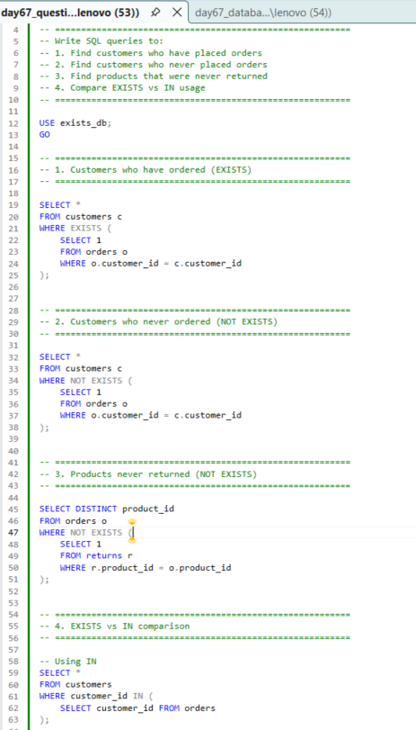
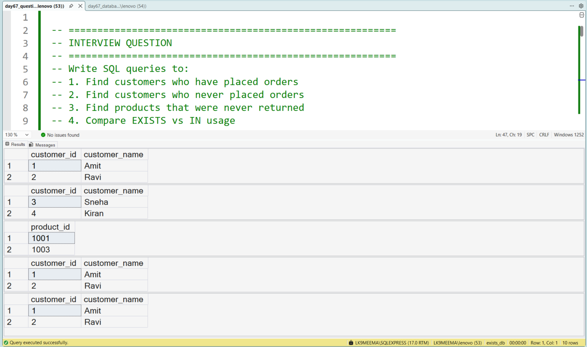

# SQL EXISTS vs NOT EXISTS – Beginner SQL Project for Data Analysis (Day 67)

---

## 🚀 What I Am Learning

In this project, I am learning how to use **EXISTS** and **NOT EXISTS in SQL** to solve real data analysis problems.

As a learner, I am focusing on:

* Understanding how SQL checks **whether data exists or not**
* Finding **missing records (data gaps)**
* Writing queries that are used in **real-world analytics and interviews**

This project is part of my journey to become a **Data Analyst**.

---

## 🧩 Problem Statement (Real-World Scenario)

I worked on a simple business problem:

A company wants to understand customer and product activity.

I tried to answer:

* Which customers have placed orders
* Which customers have never placed orders
* Which products were never returned

These are common problems in **business analytics and reporting**.

---

## 🛠️ Tools Used

* SQL Server (SSMS)
* T-SQL

---

## ⚙️ How I Solved This

### Step 1: Created Tables

I created 3 tables:

* customers
* orders
* returns

Then I inserted sample data to simulate a real dataset.

---

### Step 2: Wrote SQL Queries

#### 1. Customers who placed orders

I used **EXISTS** to check matching records.

#### 2. Customers who never placed orders

I used **NOT EXISTS** to find missing records.

#### 3. Products never returned

I used **NOT EXISTS** to detect data gaps.

#### 4. EXISTS vs IN comparison

I compared both to understand how SQL behaves.

---

## 📸 Query Execution



---

## 📊 Output Result



---

## 🧠 Key Learnings

* I learned that **EXISTS stops when it finds the first match**
* I understood how **NOT EXISTS helps find missing data**
* I practiced writing queries using **real business logic**
* I started thinking in terms of **data analysis instead of just SQL syntax**

---

## 📊 Business Understanding

From this project, I realized:

In real companies, analysts don’t just look at available data —
they also look for **missing data**.

Examples:

* Customers who didn’t buy anything
* Products that were never returned
* Missing transactions

This is called **data gap analysis**, and it is important in analytics.

---

## ⚡ Performance Learning

* EXISTS is generally better for large datasets
* IN may be slower in some scenarios
* Query performance depends on how we write SQL

---

## 🎯 Interview Importance

This topic is commonly asked in **SQL interviews for data analysts**.

It helps interviewers check:

* Logical thinking
* Understanding of subqueries
* Real-world problem-solving ability

---

## 📁 Project Structure

```
day67_exists_not_exists/
│
├── day67_database_table_setup.sql
├── day67_question_solution_exists.sql
├── day67_query_execution.png
├── day67_output_result.png
└── README.md
```

---

## 🧠 My Learning Reflection

In this project, I moved from:

* Writing basic queries
  ➡️ To understanding **how SQL solves business problems**

I am still learning, but I am improving step by step by building projects like this.

---

## 🔍 SEO Keywords

SQL EXISTS example
SQL NOT EXISTS tutorial
EXISTS vs NOT EXISTS SQL
SQL data gap analysis
SQL interview questions EXISTS
SQL beginner project
SQL projects for data analyst
T-SQL EXISTS example
SQL subquery EXISTS
SQL practice project GitHub

---

## 📌 Next Step

Next, I will continue learning:

* More SQL interview problems
* Query optimization
* Real-world datasets

---

⭐ I am currently learning and building in public.
If you have suggestions, feel free to share feedback!
