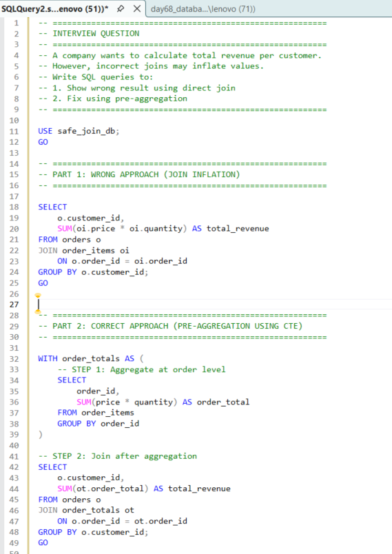
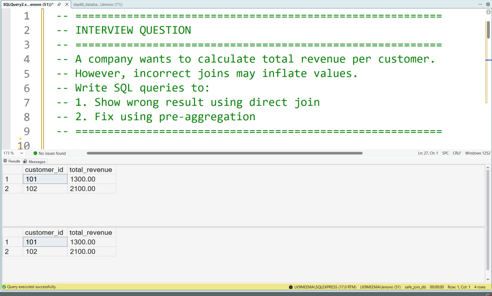

# SQL JOIN Aggregation Problem in SQL Server | How I Learned to Fix Data Inflation Using CTE

---

## 🏢 Business Scenario

In this project, I tried to solve a simple problem:
**calculate total revenue per customer.**

At first, I thought writing a JOIN with SUM would give the correct result.

But while practicing, I noticed something unexpected —
the revenue numbers were getting **inflated (higher than expected).**

So I used this project to understand:

* why this happens
* where I went wrong
* how to fix it step by step

---

## 📊 Dataset Overview

To practice this, I created two tables:

* **orders** → contains customer and order details
* **order_items** → contains product-level details

While working on this, I understood:

> One order can have multiple rows in order_items
> This creates a 1-to-many relationship

This is where aggregation issues can start.

---

## 📸 Query Execution Preview

---

## 🎯 What I Was Trying to Learn

In this project, my goal was:

* To understand how JOIN affects aggregation
* To identify why SUM gives wrong values
* To compare wrong vs correct approach
* To learn how to fix it using CTE

---

## 🔍 My Step-by-Step Learning Process

Here’s how I worked through the problem:

1. First, I joined both tables directly
2. Then I calculated revenue using `SUM(price * quantity)`
3. The query ran successfully, so I assumed it was correct
4. But when I checked carefully, totals were **not matching expectations**
5. I realized rows were getting duplicated because of JOIN
6. Then I changed my approach
7. I first aggregated data at order level
8. Then I joined the aggregated result

This gave me the correct output.

---

## 🧠 SQL Concepts I Practiced

* JOIN (1-to-many relationship)
* SUM aggregation
* CTE (Common Table Expression)
* Pre-aggregation before JOIN

---

## ⚙️ What I Changed in My Approach

Initially, I wrote a direct JOIN query.

Later, I learned this important concept:

> Don’t aggregate after JOIN when data is at different levels
> Instead → aggregate first, then JOIN

This small change fixed the entire problem.

---

## 📊 Output Comparison

---

## 📈 What I Observed

* Direct JOIN can duplicate rows
* SUM after JOIN can inflate values
* Pre-aggregation avoids duplication
* Query logic matters more than syntax

---

## 🏢 Where This Is Used in Real Work

From this project, I understood:

* Revenue calculations depend on correct SQL logic
* Mistakes in JOIN can affect business reports
* Analysts need to verify results, not just write queries

---

## 🛠️ Skills I Practiced

* Writing safer SQL queries
* Debugging wrong outputs
* Understanding table relationships
* Thinking step by step before writing queries

---

## 💻 Tools Used

* SQL Server
* SQL Server Management Studio (SSMS)

---

## 📂 Project Files

* day68_database_table_setup.sql
* day68_question_solution_safe_join.sql
* day68_query_execution.png
* day68_output_result.png

---

## 🧠 My Learning Reflection

In this project, I realized something important:

Even if a query runs without errors,
it does not mean the result is correct.

I understood that:

* I need to think about data structure
* I should validate results carefully
* Small mistakes in JOIN can lead to big errors

I’m still learning, but this helped me become more careful while writing SQL.

---

## 🔍 SEO Keywords

SQL JOIN aggregation problem
SQL data inflation issue
SQL CTE aggregation example
SQL Server JOIN mistake
How to fix duplicate rows in SQL
SQL portfolio project for a data analyst
Common SQL interview mistakes JOIN
SQL SUM incorrect result fix

---

