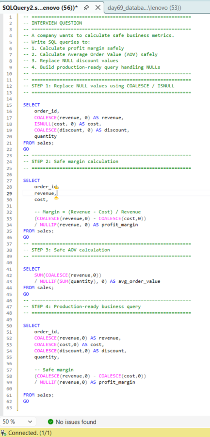
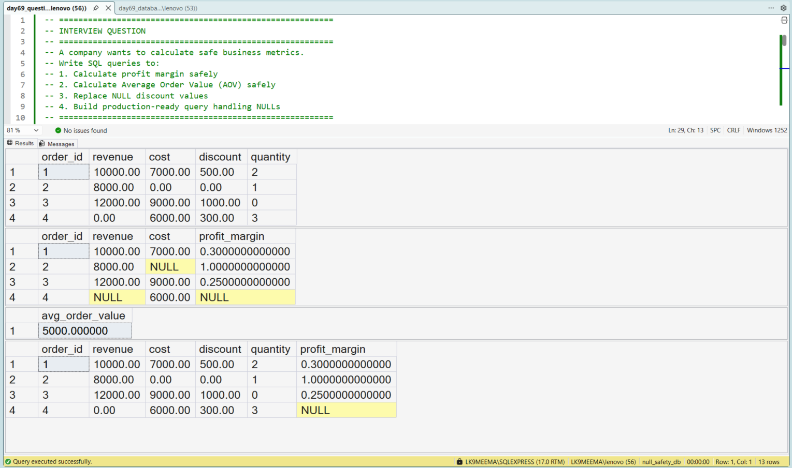

---

# SQL NULL Handling and Safe Calculation | COALESCE, ISNULL, NULLIF in SQL Server

---

## 🏢 Business Scenario

In this project, I am learning how to handle **NULL values in SQL**, which is a very common problem in real business datasets.

While practicing SQL, I realized that data is not always clean. Some values can be **missing (NULL)** or **zero**, and this can break calculations like profit margin or average order value.

So in this project, I tried to understand how to write **safe SQL queries** that work even with imperfect data.

---

## 📊 Dataset Overview

To practice this, I created a simple **sales table** with:

* revenue → total sales
* cost → product cost
* discount → discount applied
* quantity → number of items

I intentionally added **NULL values and zero values** to simulate real-world data issues.

---

## 📸 Query Execution Preview

This screenshot shows how I executed the SQL queries in SQL Server:

---

## 🎯 What I Am Trying to Learn

In this project, I am focusing on:

* How to handle NULL values in SQL
* Difference between **COALESCE and ISNULL**
* How to avoid **division by zero errors using NULLIF**
* How to write **safe and reliable SQL queries**

---

## 🔍 Step-by-Step Learning Process

1. First, I replaced NULL values using **COALESCE and ISNULL**
2. Then, I learned how **NULLIF helps avoid division errors**
3. After that, I calculated **profit margin safely**
4. Then I calculated **average order value (AOV)**
5. Finally, I combined everything into one **clean query**

---

## 🧠 SQL Concepts I Practiced

* COALESCE in SQL Server
* ISNULL function in SQL
* NULLIF function in SQL
* Handling NULL values in aggregation
* Writing safe calculations in SQL

---

## ⚙️ My Understanding (Learner Perspective)

While doing this project, I understood that:

* NULL values are very common in real datasets
* If we don’t handle them, calculations can go wrong
* Division by zero is a serious issue in SQL
* Writing safe queries is more important than writing complex queries

I am still learning, but this project helped me think more like a **data analyst**.

---

## 📊 Output Result

This screenshot shows the final output after handling NULL values safely:

---

## 📈 Key Learnings

* NULL values must always be handled
* SQL errors can break dashboards
* Safe SQL = better data analysis
* Small mistakes in SQL can lead to wrong business decisions

---

## 🏢 Where This Is Used

From this project, I learned that this logic is used in:

* Business dashboards (Power BI / Tableau)
* KPI calculations (Revenue, Margin, AOV)
* Analyst queries in companies
* Data cleaning before reporting

---

## 🛠️ Skills I Am Practicing

* Writing clean SQL queries
* Handling NULL values
* Avoiding calculation errors
* Thinking about edge cases

---

## 💻 Tools Used

* Microsoft SQL Server (SSMS)
* T-SQL

---

## 📂 Project Files

* day69_database_table_setup.sql
* day69_question_solution_null_safety.sql
* day69_query_execution.png
* day69_output_result.png

---

## 🧠 My Learning Reflection

In this project, I am learning that writing SQL is not just about syntax.

It is also about thinking:

* What if data is missing?
* What if values are zero?
* Will this query break in real use?

This made me more careful while writing SQL queries.

---

## 🔍 SEO Keywords

SQL NULL handling example
COALESCE vs ISNULL SQL Server
NULLIF function in SQL example
How to handle NULL values in SQL
SQL project for data analyst beginners
SQL safe calculations example
SQL interview questions: NULL handling
Production-ready SQL queries for beginners

---
