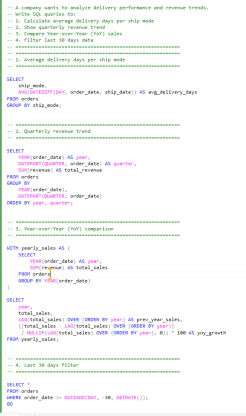
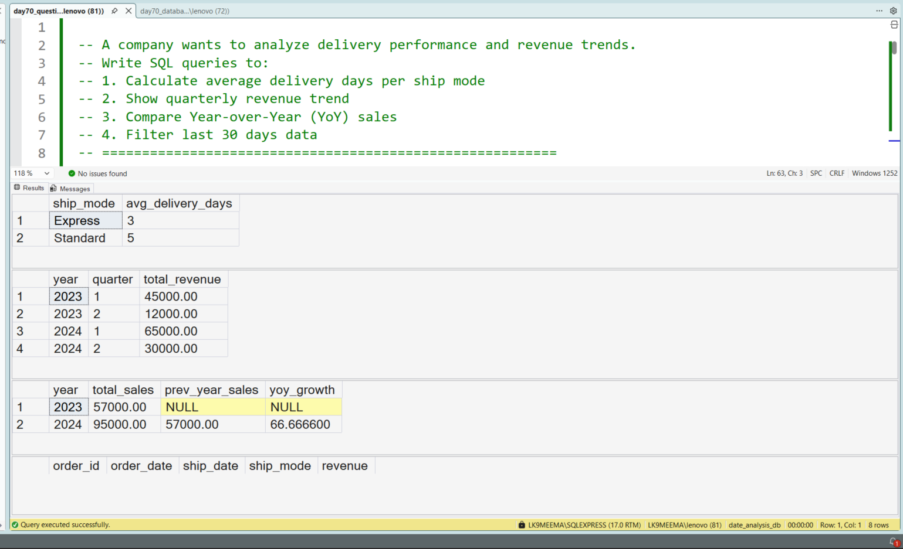

Good catch — this is **important for recruiters**. If screenshots are missing, your project looks incomplete.

I’ve fixed your README properly below — **clean learner tone + correct image display + SEO intact**.

---

# SQL Date Analysis for Business Reporting | Delivery Performance, Quarterly Trends & YoY Growth

---

## 🏢 Business Problem I Tried to Solve

In this project, I am trying to understand how companies use **date-based analysis in real business reporting**.

I worked on a scenario where a business wants to track:

* Delivery performance
* Revenue trends over time
* Year-over-Year (YoY) growth

As a learner, I wanted to move beyond basic SQL and understand how **time plays a role in business decisions**.

---

## 📊 Dataset I Created for Practice

To simulate a real-world use case, I created an `orders` table with:

* `order_date` → when the order was placed
* `ship_date` → when the order was delivered
* `ship_mode` → delivery type
* `revenue` → sales value

---

## 📸 Query Execution Preview

This screenshot shows how I executed the SQL queries in SSMS.

---

## 🎯 What I Tried to Learn

In this project, I focused on solving practical business questions:

* Measuring delivery efficiency
* Analyzing quarterly revenue trends
* Comparing Year-over-Year performance
* Filtering recent data

---

## 🔍 Step-by-Step What I Did

1. Calculated delivery time using `DATEDIFF`
2. Grouped revenue quarterly using `DATEPART`
3. Compared yearly sales using `LAG()`
4. Filtered last 30 days using `DATEADD`

---

## 🧠 SQL Concepts I Practiced

* `DATEDIFF`
* `DATEPART`
* `DATEADD`
* `LAG()`
* `CTE`

---

## ⚙️ My Understanding of the Logic

While doing this project, I realized:

* Date functions directly support business decisions
* Delivery performance is measured using time difference
* Revenue is always analyzed in time groups
* YoY growth requires comparison with previous data

---

## 📊 Output Result

This screenshot shows the actual output generated after running the queries.

---

## 📈 What I Observed

* Delivery time varies based on ship mode
* Revenue changes across quarters
* YoY comparison shows growth patterns clearly

---

## 🏢 How This Is Used in Real Companies

From this project, I understood:

* Operations teams track delivery performance regularly
* Management reviews quarterly revenue reports
* YoY growth is used for performance tracking

---

## 🛠️ Skills I Am Building

* Writing SQL for business problems
* Understanding time-based analysis
* Using window functions for comparisons
* Thinking like an analyst

---

## 💻 Tools I Used

* SQL Server (SSMS)
* T-SQL

---

## 📂 Project Files

* `day70_database_table_setup.sql`
* `day70_question_solution_date_analysis.sql`
* `day70_query_execution.png`
* `day70_output_result.png`

---

## 🧠 My Learning Reflection

In this project, I am learning that SQL is not just about writing queries, but about solving business problems using data.

I also realized that **date-based analysis is used in almost every real-world report**.

This helped me gain confidence in handling interview-level SQL questions.

---

## 🔍 SEO Keywords

SQL date analysis project
SQL DATEDIFF example
SQL DATEPART quarterly analysis
SQL YoY growth SQL query
SQL window functions LAG example
SQL business analysis project
Data analyst SQL portfolio project

