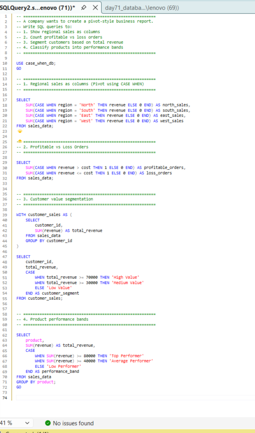
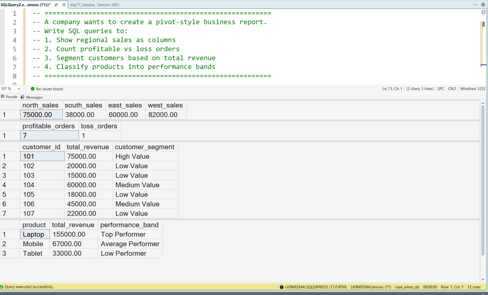

# 🚀 SQL CASE WHEN Pivot Example | My Data Analyst Learning Project (Beginner Practice)

---

## 🧠 Why I Am Doing This Project (My Learning Goal)

I am currently learning SQL to become a Data Analyst.

In this project, I am trying to understand how real companies:

* Convert raw data into reports
* Use SQL for business analysis
* Build pivot-style insights without Excel

👉 I am still learning, so this project is my practice to think like an analyst.

---

## 🏢 Business Problem I Tried to Solve

I created a simple scenario:

A company wants to analyze sales data to understand:

* Which region is performing better
* How many orders are profitable vs loss
* Which customers are valuable
* Which products are performing well

👉 I tried solving this using only SQL (not Excel), like real analysts do.

---

## 📊 Dataset I Used (Created for Practice)

To practice, I created a sample dataset with:

* `region` → sales location
* `product` → product type
* `revenue` → money earned
* `cost` → expense

This is not real company data, but it helped me simulate a real use case.

---

## 📸 SQL Query Execution (My Work Proof)

👉 In this screenshot:

* I executed all queries in SQL Server
* Used CASE WHEN logic
* Practiced real interview-style questions

---

## 🎯 What I Tried to Learn in This Project

In this project, I focused on learning:

* SQL CASE WHEN pivot logic
* SQL conditional aggregation
* Customer segmentation using SQL
* Business-style reporting queries

---

## 🔍 Step-by-Step What I Did (My Approach)

### 1️⃣ SQL Pivot Using CASE WHEN

I learned how to convert rows into columns using:

* `CASE WHEN` inside `SUM()`

👉 This is similar to pivot tables in Excel.

---

### 2️⃣ Profit vs Loss Orders

I counted:

* Profitable orders
* Loss orders

👉 This helped me understand basic business metrics.

---

### 3️⃣ Customer Segmentation in SQL

I used a CTE to calculate total revenue per customer.

Then I grouped them into:

* High value
* Medium value
* Low value

👉 This is used in marketing and customer analysis.

---

### 4️⃣ Product Performance Analysis

I grouped products and classified them based on revenue.

👉 This helps understand which products are doing well.

---

## 📊 SQL Output Result (Final Result)

👉 From this output, I can see:

* Region-wise sales comparison
* Profit vs loss count
* Customer segmentation
* Product performance

---

## 🧠 What I Learned (My Key Takeaways)

While doing this project, I understood:

* SQL is not just for data → it helps in business decisions
* CASE WHEN is very important for analysts
* We can build reports directly in SQL

👉 I am still learning, but this gave me good confidence.

---

## 🏢 Where This Is Used (My Understanding)

From what I learned:

* Companies use this in dashboards
* Analysts use this for reporting
* Teams use this for decision making

---

## 🛠️ Skills I Practiced

* Writing SQL queries
* Using CASE WHEN conditions
* Aggregation and grouping
* Thinking step-by-step

---

## 💻 Tools I Used

* SQL Server Management Studio (SSMS)
* T-SQL

---

## 📂 Project Files

* day71_database_table_setup.sql
* day71_question_solution_case_when_pivot.sql
* day71_query_execution.png
* day71_output_result.png

---

## 🧠 My Honest Learning Reflection

I am still a beginner, but this project helped me:

* Understand real business questions
* Practice SQL in a structured way
* Improve my thinking as a data analyst

👉 I will keep improving with more projects.

---

## 🔍 SEO Keywords (For Better Google Ranking)

SQL CASE WHEN pivot example
SQL conditional aggregation example
SQL beginner project GitHub
Data analyst SQL project beginner
SQL segmentation example
SQL interview practice project
SQL real world project for beginners

---

