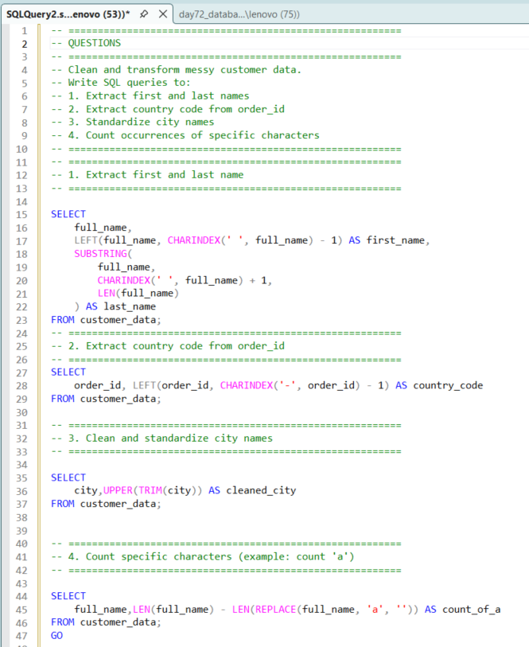
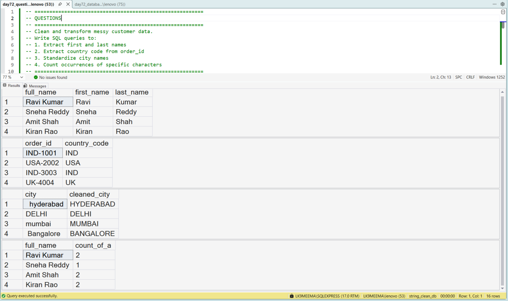

# SQL Data Cleaning Project for Beginners | String Functions in SQL Server | CHARINDEX, TRIM, SUBSTRING Example

---

## 🚀 About This Project

I am currently learning SQL for Data Analyst roles, and in this project, I practiced **how to clean messy text data using SQL Server**.

Instead of using clean datasets, I created messy data on purpose because I wanted to understand how real-world data looks before analysis.

This project helped me learn **SQL string functions, text cleaning, and data transformation**, which are commonly asked in interviews.

---

## 🏢 Problem I Tried to Solve

While learning, I noticed that most datasets in tutorials are already clean.

But in real companies:

* Names are not separated properly
* Cities have extra spaces and different formats
* IDs contain multiple pieces of information

So I tried to solve this by writing SQL queries to clean and structure the data.

---

## 📊 Dataset I Created

To practice realistically, I created a small dataset with:

* `full_name` → first name + last name in one column
* `order_id` → contains country code + order number
* `city` → inconsistent text (spaces, lowercase, uppercase)

This helped me simulate a real data cleaning scenario.

---

## 🎯 What I Practiced in This SQL Project

In this beginner SQL data cleaning project, I focused on:

* Splitting text into meaningful parts
* Cleaning inconsistent string values
* Standardizing text format
* Preparing data for analysis

---

## 📸 SQL Query Screenshot

---

## 🔍 Step-by-Step What I Did

### 1. Extract First and Last Name

I used `CHARINDEX`, `LEFT`, and `SUBSTRING`

👉 I learned how to split one column into multiple columns

---

### 2. Extract Country Code from Order ID

I used `LEFT` and `CHARINDEX`

👉 I understood how IDs can store multiple values

---

### 3. Clean City Names

I used `TRIM` and `UPPER`

👉 This helped me standardize inconsistent text

---

### 4. Count Characters in Text

I used `LEN` and `REPLACE`

👉 I learned how to analyze text data inside columns

---

## 🧠 SQL Concepts I Learned

While doing this project, I practiced:

* SQL String Functions
* CHARINDEX in SQL Server
* SUBSTRING and LEFT
* TRIM and UPPER
* LEN and REPLACE
* Basic Data Cleaning Techniques

---

## 📊 Output Screenshot

---

## 📈 What I Understood From This Project

As a learner, these are my takeaways:

* Real-world data is messy
* Cleaning data is the first step in analysis
* Small SQL functions are very powerful
* Breaking problems step-by-step makes SQL easier

---

## 🏢 Why This Matters for Data Analyst Roles

From this practice, I realized:

* Data Analysts spend a lot of time cleaning data
* Clean data directly impacts business decisions
* SQL string functions are used in real projects and interviews

---

## 🛠️ Skills I Practiced

* SQL Data Cleaning
* Text Transformation in SQL
* Handling messy datasets
* Thinking like a Data Analyst

---

## 💻 Tools Used

* Microsoft SQL Server
* SQL Server Management Studio (SSMS)

---

## 📂 Files in This Project

* day72_database_table_setup.sql
* day72_question_solution_string_cleaning.sql
* day72_query_execution.png
* day72_output_result.png

---

## 🧠 My Learning Reflection

I am still learning SQL, and this project helped me understand something important:

👉 Writing queries is one thing, but cleaning real data is different

This project gave me confidence that I can start handling messy datasets step by step.

---

## 🔍 SEO Keywords (Used Naturally in This Project)

SQL data cleaning project for beginners
SQL string functions examples
CHARINDEX SQL Server example
SQL TRIM UPPER SUBSTRING usage
SQL text transformation project
Data analyst portfolio SQL project
Beginner SQL project GitHub
SQL interview practice questions

---

## 📌 Project Goal

I am building projects like this to improve my SQL skills and prepare for Data Analyst roles.

I am focusing on **learning by doing real-world problems**, not just theory.

---

