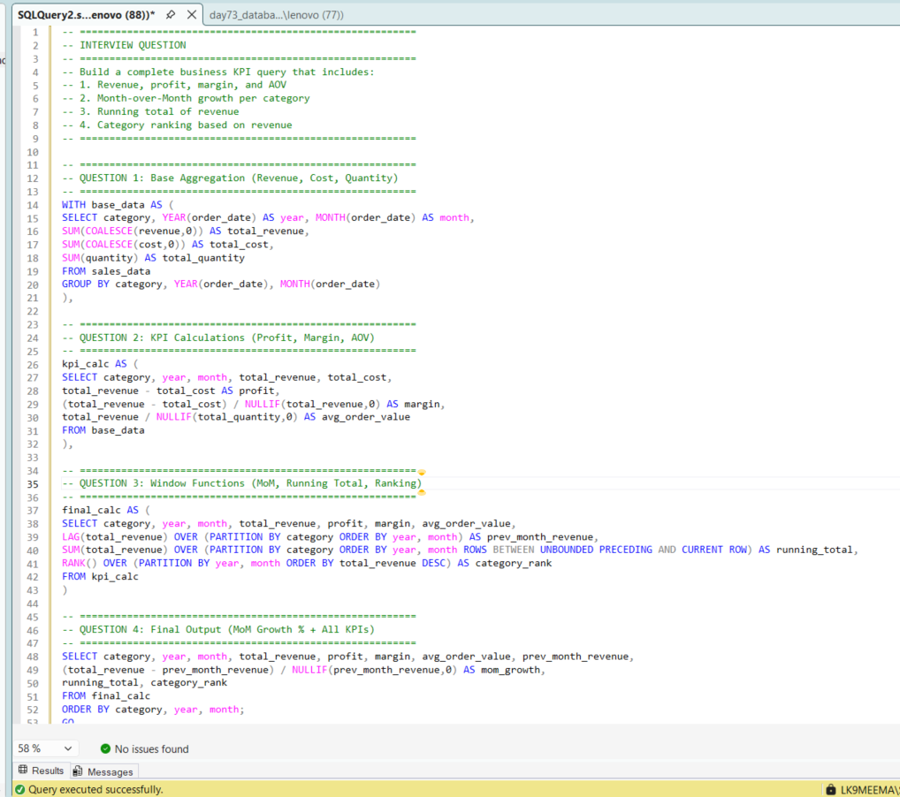
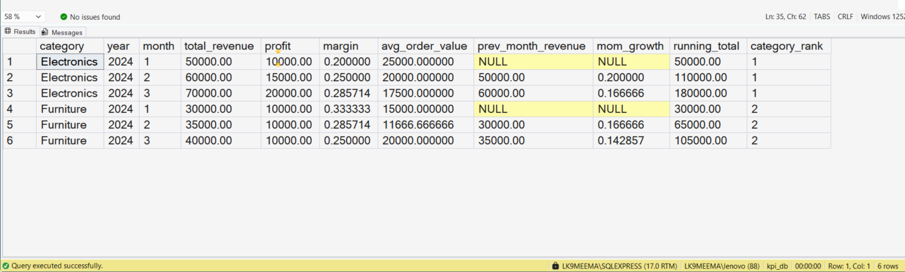

# 🚀 SQL Business KPI Project (Learner) | Revenue, Profit, MoM Growth, Running Total & Ranking in SQL Server

---

## 👨‍💻 About This Project (My Learning Journey)

In this project, I am trying to learn how to solve a **real-world SQL business problem** step by step.

Instead of practicing only small queries, I wanted to understand how a **Data Analyst builds a complete KPI report using SQL**.

This project is part of my journey to become a **job-ready Data Analyst**.

---

## 🏢 Business Problem I Tried to Solve

In many companies, analysts are asked to build a **single report query** that shows multiple KPIs together.

In this project, I am trying to build a SQL query that includes:

* Revenue
* Profit
* Profit Margin
* Average Order Value (AOV)
* Month-over-Month (MoM) Growth
* Running Total of Revenue
* Category Ranking

---

## 📊 Dataset I Created for Practice

To understand this problem better, I created a sample dataset with:

* `category` → Product category
* `order_date` → Date of order
* `revenue` → Sales amount
* `cost` → Product cost
* `quantity` → Units sold

This helped me simulate a **real business scenario using SQL**.

---

## 📸 SQL Query Execution (Step-by-Step Work)

Below is the screenshot where I executed the full SQL query in SQL Server:

---

## 📸 Final Output (KPI Results)

Below is the output showing all calculated KPIs:

---

## 🎯 What I Am Trying to Learn From This Project

In this project, I focused on:

* Writing one complete SQL query for multiple KPIs
* Understanding how business metrics are calculated
* Learning window functions for trend analysis
* Improving my SQL thinking step by step

---

## 🔍 How I Approached This Problem

To make this easier, I broke the query into steps:

### 1️⃣ Aggregating Data

I grouped data by category and month

### 2️⃣ Calculating KPIs

* Revenue
* Profit
* Margin
* Average Order Value

### 3️⃣ Using Window Functions

* Previous month revenue using `LAG()`
* Running total using `SUM() OVER()`
* Ranking using `RANK()`

### 4️⃣ Final Output

* Calculated MoM growth
* Generated clean business output

---

## 🧠 SQL Concepts I Practiced

* Common Table Expressions (CTEs)
* Window Functions (`LAG`, `SUM OVER`, `RANK`)
* Aggregation (`SUM`)
* NULL Handling (`COALESCE`, `NULLIF`)
* Date Functions (`YEAR`, `MONTH`)

---

## ⚙️ What I Understood While Learning

While building this project, I started understanding that:

* SQL is not just about writing queries, it is about solving business problems
* Breaking logic into steps makes complex queries easier
* Window functions are very useful for real-world analysis
* One query can answer multiple business questions

---

## 📈 What I Observed From Results

* MoM growth helps track performance change
* Running total shows cumulative business growth
* Ranking helps identify top categories
* Profit and margin give deeper business understanding

---

## 🏢 Where This Is Used in Real Life

From this project, I am starting to understand that:

* Analysts build KPI queries for dashboards
* Business teams use these reports for decision-making
* SQL is used heavily in reporting and analytics

---

## 🛠️ Skills I Am Practicing

* Writing structured SQL queries
* Solving business problems using data
* Using window functions
* Thinking step by step like an analyst

---

## 💻 Tools Used

* SQL Server (SSMS)
* T-SQL

---

## 📂 Project Files

* day73_database_table_setup.sql
* day73_question_solution_kpi_query.sql
* day73_query_execution.png
* day73_output_result.png

---

## 🧠 My Learning Reflection

This project helped me move from writing small queries to building a **complete business KPI query**.

I am still learning, but this gave me confidence that I can start solving **interview-level SQL problems**.

---

## 🔍 SEO Keywords (Important for Google Ranking)

SQL business KPI project
SQL MoM growth query
SQL window functions example
SQL running total query
SQL ranking query example
SQL portfolio project for a data analyst
SQL real-world business problem
SQL Server KPI dashboard query
Data analyst SQL GitHub project
SQL interview project example

---

## 📌 Final Note

I am currently learning SQL and building projects step by step.

I am actively improving my skills in SQL, Excel, and Data Analytics.

I would really appreciate any feedback or suggestions to improve.

---

