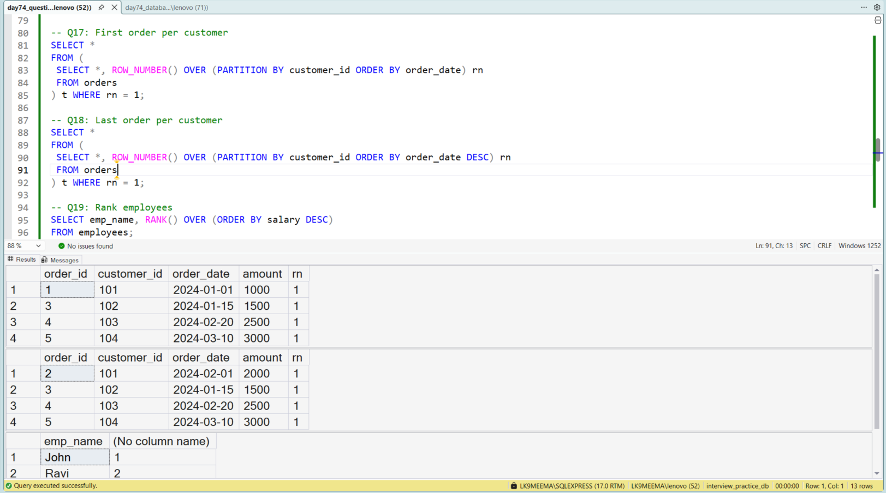

# 🚀 SQL Interview Questions Practice (25 Problems) | Beginner Data Analyst SQL Portfolio Project

> I am currently learning SQL for Data Analyst roles, and in this project I practiced **25 real SQL interview questions** to improve my problem-solving skills step by step.

---

## 🧠 Why I Created This Project

While learning SQL, I realized something important:

* Just watching tutorials is not enough
* I was struggling to solve questions on my own
* Interview questions follow patterns, not theory

So I started practicing **real SQL interview problems instead of just learning syntax**.

This project is part of my learning journey to become a **job-ready Data Analyst**.

---

## 🏢 Simple Business Scenario

To practice like real-world situations, I worked with:

* Employee salary data
* Customer order transactions

Even though the dataset is small, I tried to think like an analyst solving real business problems.

---

## 📊 Dataset Used

### Employees Table

* emp_id
* emp_name
* salary
* department

### Orders Table

* order_id
* customer_id
* order_date
* amount

---

## 📸 SQL Query Execution + Output (Proof of Work)

This screenshot shows:

* Queries I executed
* Output results I got
* Multiple interview questions tested together



---

## 🎯 What I Tried to Achieve

In this project, I focused on:

* Practicing **25 SQL interview questions**
* Improving **how I approach problems**
* Understanding **how queries actually work**

---

## 🧩 SQL Interview Questions I Practiced

Some types of problems I solved:

* Find 2nd and 3rd highest salary
* Detect duplicate records
* Running total of orders
* Month-over-month growth
* Top N salaries per department
* First and last records
* Ranking using window functions
* Subquery-based filtering
* Customer order analysis

👉 Full queries are available in the SQL file.

---

## 🧠 SQL Concepts I Learned While Practicing

During this project, I worked on:

* Window functions (`RANK`, `DENSE_RANK`, `ROW_NUMBER`, `LAG`)
* Aggregations (`SUM`, `AVG`, `COUNT`)
* Subqueries
* Joins (including self joins)
* Date functions (`MONTH`, `DATEADD`)

---

## 📈 What I Learned From This Practice

* Many SQL interview questions follow **repeatable patterns**
* Window functions are very commonly asked
* Breaking a problem into steps makes it easier
* I should focus on **logic instead of memorizing queries**

---

## 🧠 My Learning Approach (Important)

I am still learning SQL, so my focus is on:

* Understanding **why a query works**
* Practicing **similar variations**
* Improving **problem-solving clarity**

This project reflects my current level and progress.

---

## 📌 What I Plan to Do Next

* Solve the same problems in different ways
* Practice more real-world datasets
* Improve query performance
* Start timed SQL interview practice

---

## 💼 What This Project Shows

From a beginner level, this project shows:

* I am actively practicing SQL
* I can solve common interview problems
* I am building problem-solving skills step by step
* I am serious about becoming a Data Analyst

---

## 🔍 SEO Keywords (For Google Ranking)

SQL interview questions practice
SQL interview questions with answers
SQL practice for beginners
SQL project for data analyst
SQL portfolio project for freshers
SQL Server interview preparation
SQL window functions examples
SQL real interview questions
Data analyst SQL project GitHub
learn SQL step by step project

---

## 📁 Project Structure

```id="x92p3a"
03_advanced_sql_business_cases/
└── day74_sql_interview_25_questions/
    ├── day74_database_table_setup.sql
    ├── day74_question_solution_interview_25.sql
    ├── sample_questions_and_output.png
    └── README.md
```

---

## 📌 Files Included

* Database setup script
* SQL file with 25 interview questions + solutions
* Combined screenshot (query + output)

---

## 📌 Final Note

I am currently learning SQL and building my data analytics portfolio step by step.

If you are a recruiter or experienced professional, I would really appreciate your feedback on:

* My problem-solving approach
* Query structure
* What I should improve next

---
