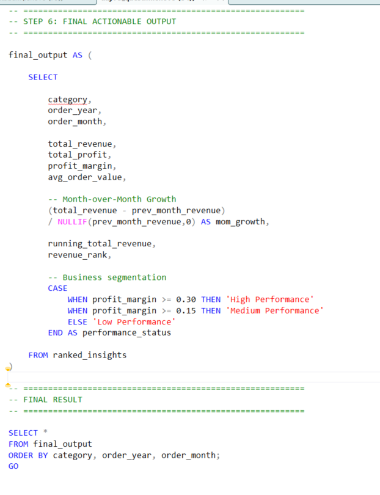
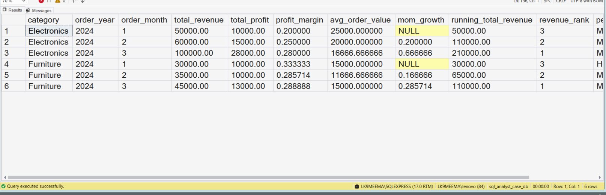

# End-to-End SQL Business Case Study Project | SQL Server KPI Analysis for Data Analysts

> A beginner-to-intermediate SQL portfolio project where I practiced cleaning messy business data, calculating KPIs, and generating business insights using SQL Server, CTEs, and Window Functions.

---

# 📌 Project Overview

As someone currently learning Data Analytics step-by-step, I wanted to practice how SQL is actually used in real business environments.

Instead of solving only small SQL questions, I tried building a complete end-to-end SQL workflow that simulates how analysts clean raw data, calculate KPIs, and generate business insights for reporting.

This project helped me understand that real SQL analysis is not just writing queries — it also involves:

- cleaning messy datasets
- organizing business logic
- building readable workflows
- analyzing trends
- preparing business-ready outputs

Through this project, I started understanding how SQL is used in reporting and analytics workflows inside companies.

---

# 🏢 Business Scenario

A company wants to analyze messy sales data collected from different cities and categories.

The raw dataset contains:

- inconsistent customer names
- messy city formatting
- business revenue and cost data
- order-level sales information

The goal is to clean the raw data and generate meaningful business insights for management reporting.

---

# 🎯 Project Objectives

In this SQL business case study project, I practiced how to:

✅ Clean messy business data  
✅ Standardize inconsistent values  
✅ Build structured SQL workflows  
✅ Calculate important business KPIs  
✅ Analyze monthly performance trends  
✅ Use Window Functions in reporting  
✅ Generate business-ready outputs using SQL  

---

# 🧾 Dataset Information

The dataset includes:

| Column Name | Description |
|---|---|
| `order_id` | Unique order identifier |
| `customer_name` | Customer names with inconsistent formatting |
| `city` | City names containing spacing and case issues |
| `category` | Product category |
| `order_date` | Order transaction date |
| `revenue` | Sales revenue |
| `cost` | Business cost |
| `quantity` | Product quantity sold |

I intentionally used messy data to simulate realistic business reporting challenges.

---

# 🛠️ SQL Concepts Practiced

In this project, I practiced:

- Common Table Expressions (CTEs)
- Multi-step SQL workflows
- Data Cleaning using `TRIM()` and `UPPER()`
- NULL Handling using `COALESCE()`
- Aggregations
- KPI Calculations
- Window Functions
- Running Totals
- Revenue Ranking
- Month-over-Month Growth Analysis
- Business Performance Segmentation

---

# 🔄 End-to-End SQL Analyst Workflow

## Step 1 — Raw Data Cleaning

I started by cleaning inconsistent values from the raw dataset.

I used:

- `TRIM()` to remove unwanted spaces
- `UPPER()` to standardize text formatting
- `COALESCE()` for NULL-safe calculations

This step helped me understand why data cleaning is one of the most important parts of analytics.

---

## Step 2 — Data Standardization

Next, I extracted:

- Year
- Month

from the `order_date` column to prepare the dataset for monthly business analysis.

This helped me understand how analysts prepare data before KPI reporting.

---

## Step 3 — KPI Calculation

After cleaning the dataset, I calculated important business metrics like:

- Total Revenue
- Total Cost
- Total Profit
- Profit Margin
- Average Order Value (AOV)

This gave me practical exposure to business-focused SQL analysis.

---

## Step 4 — Window Function Analysis

To improve the reporting workflow, I used Window Functions like:

- `LAG()`
- `SUM() OVER()`
- `RANK()`

Using these functions, I analyzed:

- Previous month revenue
- Running revenue trends
- Category performance rankings

This was one of the most valuable learning parts of the project.

---

## Step 5 — Final Business Output

Finally, I created a business-ready SQL output containing:

- KPI metrics
- Revenue trends
- Growth calculations
- Ranking insights
- Performance segmentation

This helped me understand how SQL outputs are prepared for dashboards and management reporting.

---

# 📸 SQL Query Execution Screenshot

## SQL Query Workflow Preview



📌 Note:

The SQL query used in this project is very long because I implemented the analysis step-by-step using multiple CTEs and business logic calculations.

So I captured only a partial screenshot of the query execution for better visibility inside the README.

👉 For the complete SQL workflow and full query implementation, please check:

- `day75_question_solution_end_to_end_case.sql`

This file contains the full end-to-end SQL business case solution.

---

# 📊 Final SQL Output Screenshot

## SQL Business KPI Output



This output helped me understand how SQL can be used to generate:

- Revenue insights
- Profit calculations
- Profit margin analysis
- Month-over-Month growth
- Running totals
- Business performance rankings

While practicing this project, I started understanding how analysts convert raw data into business-ready insights.

---

# 📈 Key Learnings From This SQL Project

While working on this SQL portfolio project, I learned that:

- Real business datasets are usually messy
- SQL analysis is a step-by-step workflow
- Clean data improves reporting accuracy
- Window Functions are extremely useful in analytics
- KPI calculations help businesses measure performance
- Structured SQL improves readability and scalability

This project improved both my SQL confidence and business thinking.

---

# 💼 How This Project Connects to Real Data Analyst Work

This project helped me understand how Data Analysts work in real companies.

Analysts often:

- clean raw datasets
- build reporting logic
- calculate KPIs
- analyze business trends
- prepare management reports

Through this project, I practiced the same workflow using SQL Server.

---

# 🚀 Tools Used

| Tool | Purpose |
|---|---|
| SQL Server | Database management |
| SSMS | Query execution |
| T-SQL | SQL development |

---

# 📂 Project Structure

```bash
03_advanced_sql_business_cases/
└── day75_end_to_end_sql_case_2/
    ├── README.md
    ├── day75_database_table_setup.sql
    ├── day75_question_solution_end_to_end_case.sql
    ├── day75_query_execution.png
    └── day75_output_result.png
```

---

# 📁 Project Files

| File Name | Description |
|---|---|
| `day75_database_table_setup.sql` | Database and table creation script |
| `day75_question_solution_end_to_end_case.sql` | Complete SQL business case workflow |
| `day75_query_execution.png` | SQL query execution screenshot |
| `day75_output_result.png` | Final KPI output screenshot |

---

# 🧠 My Learning Reflection

As someone currently learning Data Analytics step-by-step, I built this project to practice how SQL is actually used in real business environments.

Before this project, I mostly practiced isolated SQL questions.

But while working on this case study, I started understanding that real SQL analysis is not only about writing SELECT statements.

I learned that analysts usually work in multiple structured steps like:

- cleaning messy data
- organizing business logic
- calculating KPIs
- analyzing trends
- preparing reporting outputs

One thing I especially realized from this project is that clean and readable SQL matters a lot when queries become longer and more business-focused.

I am still learning and improving, but this project gave me better confidence in handling more realistic SQL reporting workflows.

---

# ⭐ Why I Built This Project

I am currently practicing SQL daily to improve my Data Analyst skills and build stronger hands-on portfolio projects.

This project is part of my learning journey to better understand how SQL is used in real business reporting and analytics workflows.

---

# 🔍 SEO Keywords

SQL Portfolio Project for Data Analyst  
SQL Project for Beginners  
End-to-End SQL Project  
SQL Business Case Study  
SQL Server Portfolio Project  
SQL KPI Analysis Project  
SQL Window Functions Project  
Data Analyst SQL Portfolio  
Real World SQL Project  
SQL Reporting Project  
SQL Data Cleaning Project  
SQL Revenue Analysis  
SQL Business Insights Project  
SQL CTE Project  
SQL Practice Project  
Aspiring Data Analyst Portfolio  
SQL Analytics Project  
Business Analyst SQL Project  
SQL Trend Analysis  
SQL GitHub Portfolio Project  

---

# 📬 Connect With Me

If you are a recruiter, analyst, or someone learning SQL, I would love to connect and learn together.

LinkedIn: www.linkedin.com/in/saideep-pallela  


---

# 📌 Final Note

This project may look simple from the outside, but it taught me how important structured thinking is in analytics.

I am continuing to improve my SQL skills by building more real-world analyst projects step-by-step.

---

