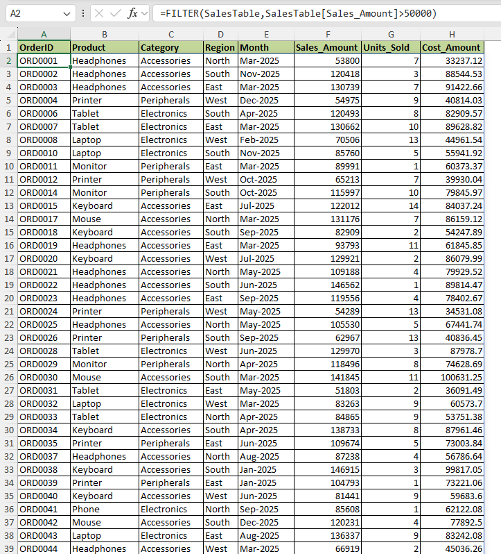
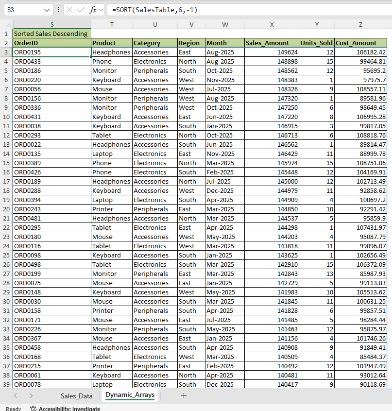
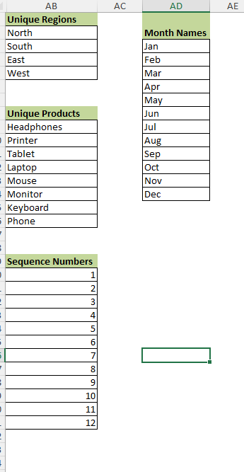

# Day 76 — Excel Dynamic Arrays Practice Project | FILTER, SORT, UNIQUE, SEQUENCE

## 📅 Date
May 12, 2026

## 📂 Phase
Phase 4 — Excel Advanced Analytics

## 🛠 Tool Used
Microsoft Excel

## 📊 Dataset
Indian Retail Sales Dataset (500 Rows)

---

# 📖 Project Overview

After taking a 23-day personal break due to my mother’s hospitalization, today I restarted my Data Analyst learning journey again.

For Day 76, I learned one of the most important modern Excel topics:

𝗗𝘆𝗻𝗮𝗺𝗶𝗰 𝗔𝗿𝗿𝗮𝘆𝘀.

In this hands-on Excel project, I practiced:
- FILTER
- SORT
- UNIQUE
- SEQUENCE

using a 500-row Indian retail sales dataset.

Before this, I used to manually filter data and copy formulas repeatedly.

But while practicing today, I understood how modern Excel formulas can dynamically generate complete outputs automatically using a single formula.

This project helped me understand how Data Analysts use Excel for:
- reporting automation,
- scalable analysis,
- dashboard preparation,
- and faster business insights.

---

# 🎯 Business Scenario

Retail businesses generate large amounts of sales data every month.

As an aspiring Data Analyst, I wanted to practice how analysts:
- filter high-value transactions,
- identify unique categories,
- sort business performance,
- and generate dynamic reports efficiently.

Dynamic Arrays make these tasks much faster and reduce repetitive manual work inside Excel.

---

# 📌 Excel Dynamic Array Formulas Practiced

| Formula | What It Does | Real Business Use |
|---|---|---|
| FILTER | Extracts matching rows dynamically | High-value sales analysis |
| FILTER with Category | Filters Electronics records | Category performance tracking |
| SORT | Sorts records dynamically | Top sales analysis |
| UNIQUE | Returns distinct values | Dashboard filters & dropdown lists |
| SEQUENCE | Generates number series | Dynamic indexing |
| SEQUENCE + TEXT | Generates month names | Reporting month creation |

---

# 📈 My Learning Reflection

Before this project, I only knew basic Excel formulas.

While learning Dynamic Arrays today, I realized how powerful modern Excel has become for Data Analysis work.

The biggest learning for me was this:

Instead of copying formulas again and again, one formula can dynamically generate an entire result set automatically.

As a learner, this project helped me improve:
- analytical thinking,
- formula understanding,
- and practical Excel workflow knowledge.

I still have a lot to learn, but this project gave me more confidence to continue building projects consistently.

---

# 🧠 What I Learned

### ✅ FILTER Function
Learned how to dynamically extract rows based on conditions without manual filtering.

### ✅ SORT Function
Understood how analysts quickly rank business data dynamically.

### ✅ UNIQUE Function
Learned how to generate distinct lists for products and regions automatically.

### ✅ SEQUENCE Function
Practiced generating dynamic number sequences and month lists.

### ✅ Spill Behavior
Understood how Dynamic Arrays automatically expand outputs into nearby cells.

---

# 🚀 Why Dynamic Arrays Matter for Data Analysts

Before learning Dynamic Arrays, I thought Excel formulas worked only one cell at a time.

But today I understood that modern Excel behaves more like a lightweight analytics tool.

Dynamic Arrays help analysts:
- automate repetitive work,
- reduce manual effort,
- create scalable reports,
- and build cleaner dashboards.

This topic completely changed how I look at Excel.

---

# 📷 Project Screenshots

## 1️⃣ FILTER Formula Output



---

## 2️⃣ SORT Formula Output



---

## 3️⃣ UNIQUE + SEQUENCE Formula Output


---

# 📂 Project Folder Structure

```plaintext
day76_dynamic_arrays_basics/
│
├── dataset/
│   └── retail_sales_dataset.xlsx
│
├── screenshots/
│   ├── screenshot_filter_sales_above_50000.png
│   ├── screenshot_sort_descending_sales.png
│   └── screenshot_unique_and_sequence_results.png
│
├── README.md
```

---

# 💡 Key Takeaways

- Dynamic Arrays reduce repetitive manual Excel work.
- Excel Tables make formulas easier to manage and scale.
- Modern Excel skills are highly valuable for Data Analyst roles.
- Small automation improvements can save huge reporting time in real companies.

---


# 🙋 About Me

Hi, I'm **Saideep Pallela** — an aspiring Data Analyst currently learning in public and building projects daily to improve my practical analytics skills.

I am currently focused on:
- Microsoft Excel
- SQL
- Power BI
- Python
- Business Analytics

This GitHub repository is my public learning journey where I document my daily practice, mistakes, improvements, and hands-on projects step by step.

My goal is to become industry-ready by consistently building projects and improving analytical thinking through practical work.

---

# 🔗 Connect With Me

## GitHub
https://github.com/saideeppallela/data-analyst-worklog-2026

## LinkedIn
https://www.linkedin.com/in/saideeppallela

---

# 🏷 SEO Keywords

Excel Dynamic Arrays Project  
Excel FILTER Function Example  
Excel SORT Formula Practice  
Excel UNIQUE Formula Tutorial  
Excel SEQUENCE Formula Project  
Excel Project for Beginners  
Excel Portfolio Project for Data Analyst  
Advanced Excel Project GitHub  
Excel Analytics Practice Project  
Microsoft Excel Dynamic Arrays Tutorial  
Data Analyst Excel Portfolio  
Excel Learning in Public  
Excel Practice Dataset  
Excel Reporting Automation  
Excel Project with Screenshots  
Dynamic Arrays in Excel 365  
Modern Excel Formulas for Analysts  
Excel Skills for Data Analyst Jobs  
Excel GitHub Project for Recruiters  
Aspiring Data Analyst Portfolio Project  
Excel Data Analysis Practice  
Excel Formula Practice for Beginners  
Excel Dashboard Preparation Project  
Open to Work Data Analyst  
NamasteSQL Excel Project
