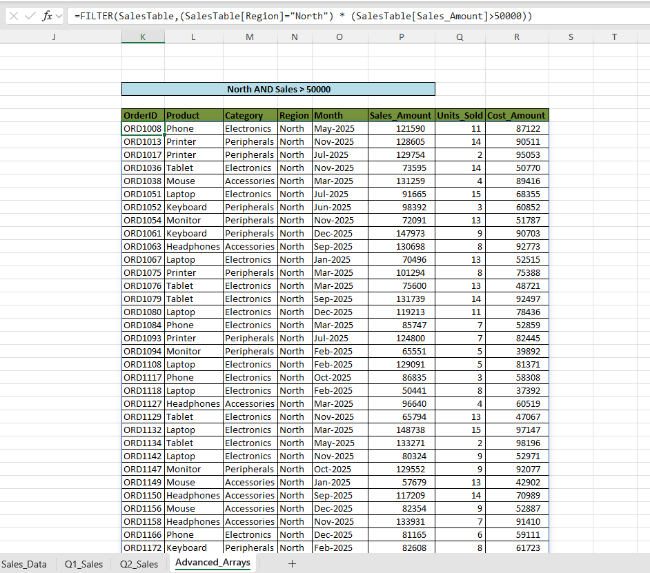
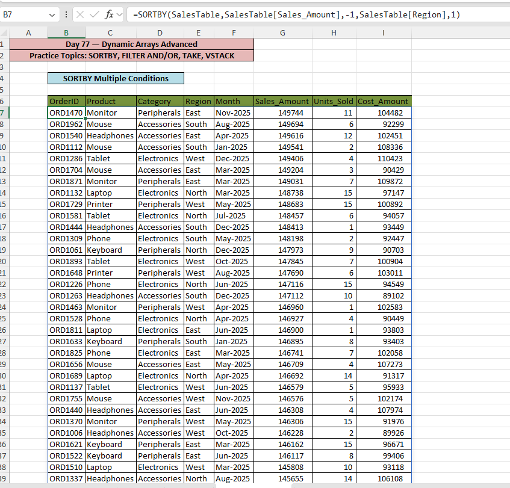
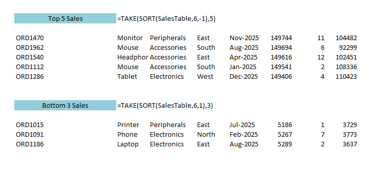
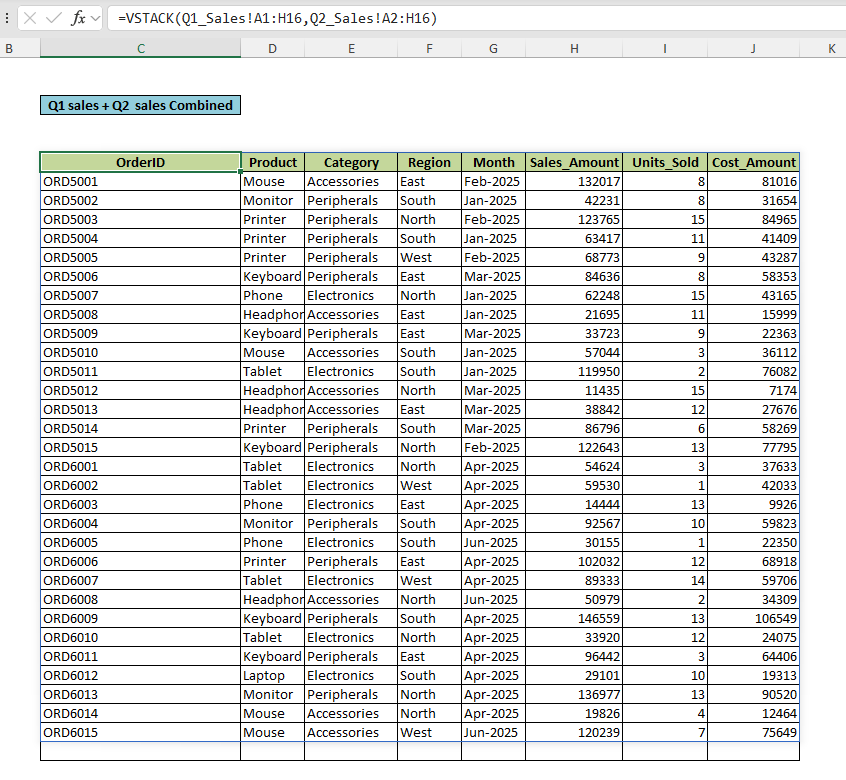

# Day 77 — Advanced Dynamic Arrays in Microsoft Excel for Data Analytics  
## SORTBY, FILTER AND/OR, TAKE, and VSTACK

📁 Folder Name: `day77_dynamic_arrays_advanced/`

---

# 📌 Project Overview

This project is part of my ongoing **120 Days Data Analyst Learning Journey**, where I am learning Microsoft Excel for Data Analytics through practical business-focused projects and structured GitHub documentation.

For Day 77, I focused on learning and practicing advanced Dynamic Array formulas in Microsoft Excel using realistic retail sales datasets and reporting scenarios.

Instead of only memorizing formulas, I tried to understand:

- how analysts use these functions in reporting workflows,
- how Dynamic Arrays reduce manual work,
- and how modern Excel supports scalable analytics workflows.

The main formulas practiced in this project were:

- SORTBY
- FILTER with AND logic
- FILTER with OR logic
- TAKE
- VSTACK

This project helped me improve both technical Excel skills and analytical thinking for business reporting scenarios.

---

# 🎯 Business Objective

Business analysts often work with datasets that require:

- multi-condition filtering,
- dynamic sorting,
- top/bottom performance analysis,
- and combining multiple datasets into a single report.

Manual Excel workflows become repetitive and difficult to maintain as datasets grow larger.

The objective of this project was to understand how Advanced Dynamic Array formulas can automate reporting workflows and improve analytical efficiency in Microsoft Excel.

---

# 🗂 Dataset Information

## Main Dataset

A 1000-row Indian retail sales dataset was used for analysis.

### Dataset Columns

| Column Name | Description |
|---|---|
| OrderID | Unique order identifier |
| Product | Product sold |
| Category | Product category |
| Region | Sales region |
| Month | Sales month |
| Sales_Amount | Revenue generated |
| Units_Sold | Quantity sold |
| Cost_Amount | Product cost |

---

## Additional Datasets for VSTACK

Two smaller quarterly datasets were created:

| Dataset | Purpose |
|---|---|
| Q1_Sales | Jan–Mar sales data |
| Q2_Sales | Apr–Jun sales data |

These datasets were combined dynamically using the VSTACK function.

---

# ⚙️ Excel Workflow

## 1️⃣ Dataset Preparation

- Organized raw sales data
- Converted dataset into structured Excel Tables
- Named the table as `SalesTable`
- Created separate sheets for Dynamic Array practice

---

## 2️⃣ Multi-Level Sorting using SORTBY

### Formula Used

```excel
=SORTBY(SalesTable,SalesTable[Sales_Amount],-1,SalesTable[Region],1)
```

### What I Learned

- Multi-condition sorting
- Dynamic ranking workflows
- Difference between SORT and SORTBY
- Cleaner business reporting methods

---

## 3️⃣ FILTER with AND Logic

### Formula Used

```excel
=FILTER(SalesTable,(SalesTable[Region]="North")*(SalesTable[Sales_Amount]>50000))
```

### Understanding AND Logic

Excel converts:

- TRUE → 1
- FALSE → 0

AND logic works using multiplication.

| Condition 1 | Condition 2 | Result |
|---|---|---|
| TRUE=1 | TRUE=1 | 1×1=1 ✅ Include |
| TRUE=1 | FALSE=0 | 1×0=0 ❌ Exclude |
| FALSE=0 | FALSE=0 | 0×0=0 ❌ Exclude |

### Important Learning

I also understood why this approach is incorrect:

```excel
=FILTER(SalesTable,AND(cond1,cond2))
```

Because `AND()` returns only one final TRUE/FALSE result instead of row-level filtering logic.

This was one of the most valuable learning points from today’s practice.

---

## 4️⃣ FILTER with OR Logic

### Formula Used

```excel
=FILTER(SalesTable,(SalesTable[Region]="North")+(SalesTable[Region]="South"))
```

### Understanding OR Logic

OR logic works using addition.

| Condition 1 | Condition 2 | Result |
|---|---|---|
| TRUE=1 | FALSE=0 | 1+0=1 ✅ Include |
| TRUE=1 | TRUE=1 | 1+1=2 ✅ Include |
| FALSE=0 | FALSE=0 | 0+0=0 ❌ Exclude |

This helped me better understand how Excel evaluates Dynamic Array filtering internally.

---

## 5️⃣ TAKE Function for KPI Analysis

### Top 5 Sales Formula

```excel
=TAKE(SORT(SalesTable,6,-1),5)
```

### Bottom 3 Sales Formula

```excel
=TAKE(SORT(SalesTable,6,1),3)
```

### Skills Practiced

- KPI analysis
- Top performer identification
- Bottom performer analysis
- Dynamic extraction of records

---

## 6️⃣ Combining Datasets using VSTACK

### Formula Used

```excel
=VSTACK(Q1_Sales!A1:H16,Q2_Sales!A2:H16)
```

### What I Learned

- Dynamic dataset consolidation
- Avoiding duplicate headers
- Quarterly report merging
- Reducing manual copy-paste workflows

This formula made me realize how Dynamic Arrays can improve scalability in Excel reporting workflows.

---

# 🧠 Excel Features & Formulas Used

| Feature / Formula | Purpose |
|---|---|
| Excel Tables | Structured data management |
| SORTBY | Multi-condition sorting |
| FILTER | Dynamic filtering |
| TAKE | Extract top/bottom rows |
| VSTACK | Combine datasets vertically |
| Structured References | Cleaner formulas |
| Dynamic Arrays | Automatic spill functionality |

---

# 🛠 Tools & Technologies

| Tool | Usage |
|---|---|
| Microsoft Excel | Data analysis and reporting |
| GitHub | Project documentation |
| Markdown | README documentation |
| Dynamic Arrays | Advanced Excel analytics |

---

# 📈 Key Learnings

- Dynamic Arrays can significantly reduce repetitive reporting work.
- SORTBY is more flexible than traditional sorting methods.
- TRUE/FALSE mathematical logic is important for understanding filtering behavior.
- TAKE helps simplify KPI reporting workflows.
- VSTACK improves dataset consolidation and scalability.

---

# 🚧 Challenges Faced During Learning

## Understanding Mathematical Logic in FILTER

Initially, understanding why:

- `*` works for AND
- `+` works for OR

was confusing.

After practicing row-level logical evaluation, the filtering behavior became much clearer.

---

## Handling Duplicate Headers in VSTACK

While combining quarterly datasets, I learned the importance of excluding duplicate headers to keep the final dataset clean and analysis-ready.

---

# 📚 Skills Improved Through This Project

## Technical Skills

- Advanced Excel formulas
- Dynamic Arrays
- Multi-condition filtering
- Dataset consolidation
- Reporting automation

---

## Analytical Skills

- Business reporting logic
- KPI analysis
- Data organization
- Workflow optimization
- Structured documentation

---

# 🎯 Learning Outcomes

By completing this project, I improved my understanding of:

- Advanced Excel for Data Analytics
- Dynamic reporting workflows
- Business-focused Excel analysis
- Analytical thinking
- Professional GitHub documentation

This project also helped me become more comfortable with modern Excel analytics techniques used in business reporting.

---

# 📂 Folder Structure

```plaintext
day77_dynamic_arrays_advanced/
│
├── Day77_Dynamic_Arrays_Advanced.xlsx
├── README.md
│
├── screenshot_filter_and_formula.png
├── screenshot_sortby_results.png
├── screenshot_take_top_bottom.png
├── screenshot_vstack_combined.png
```

---

# 📸 Project Screenshots

## 🔹 FILTER AND Formula Analysis

This screenshot shows the Dynamic Array FILTER formula using AND logic with mathematical filtering conditions.



---

## 🔹 SORTBY Multi-Condition Sales Ranking

This screenshot shows how SORTBY was used to rank sales dynamically by Sales_Amount and Region.



---

## 🔹 TAKE Function — Top & Bottom KPI Analysis

This screenshot demonstrates how TAKE was used to identify top-performing and low-performing sales records dynamically.



---

## 🔹 VSTACK Combined Dataset

This screenshot shows how Q1 and Q2 sales datasets were merged dynamically using the VSTACK function.



---

# 🚀 Future Improvements

In future Excel projects, I plan to learn and implement:

- XLOOKUP advanced scenarios
- INDEX + MATCH combinations
- Interactive Excel dashboards
- Pivot Tables and Pivot Charts
- Power Query basics
- KPI dashboard reporting
- Advanced business reporting workflows

---

# 🤝 Recruiter-Focused Conclusion

This project reflects my learning-focused approach toward becoming a Data Analyst through practical work and structured documentation.

Instead of only consuming tutorials, I am actively building projects, understanding reporting workflows, and improving my analytical thinking step by step.

I am continuously improving my:

- Excel reporting skills
- Business Analytics understanding
- Documentation quality
- GitHub portfolio
- Data Analytics workflow knowledge

My goal is to gradually build job-ready analytics skills through consistent hands-on learning and public documentation.

---

# 📬 Connect With Me

## GitHub
https://github.com/saideeppallela/data-analyst-worklog-2026

## LinkedIn
https://www.linkedin.com/in/saideep-pallela/

---

# 🔍 SEO Keywords

Microsoft Excel for Data Analytics, Excel Data Analysis Project, Excel Dashboard, Advanced Excel, Excel for Business Analytics, Excel Data Cleaning, Excel Pivot Tables, Excel Charts, Excel Formulas, Excel KPI Dashboard, Excel Analytics Portfolio, Aspiring Data Analyst, Data Analyst Portfolio, Excel Reporting, Excel Visualization, Business Analytics, Data Cleaning in Excel, Excel Learning Project, GitHub Data Analytics Portfolio, Real-world Excel Projects
