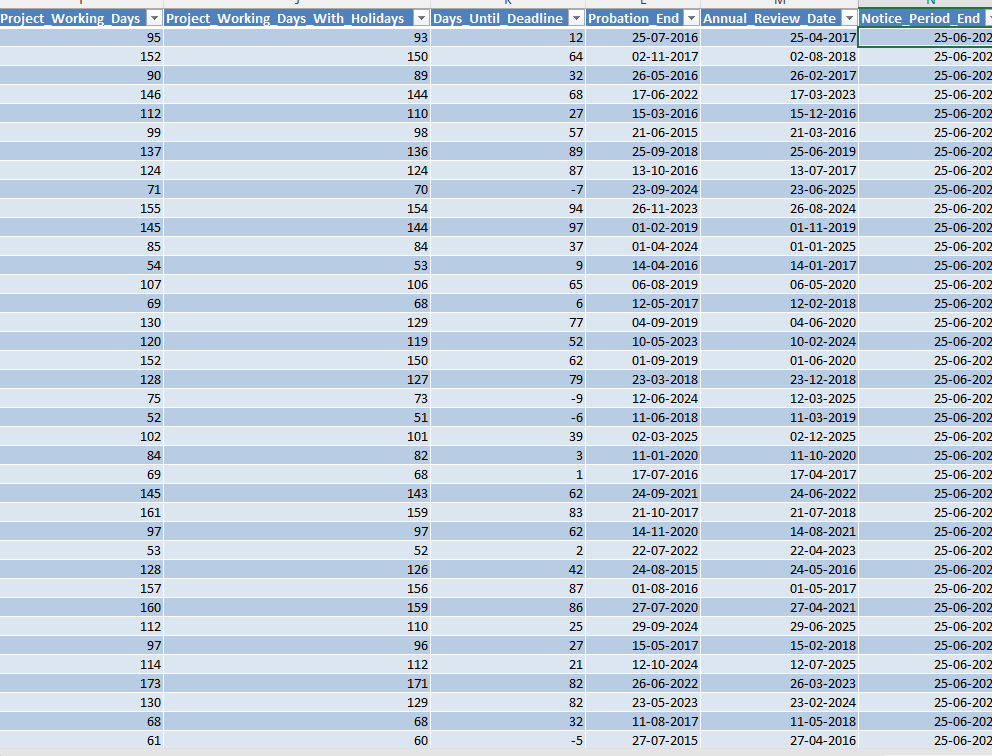
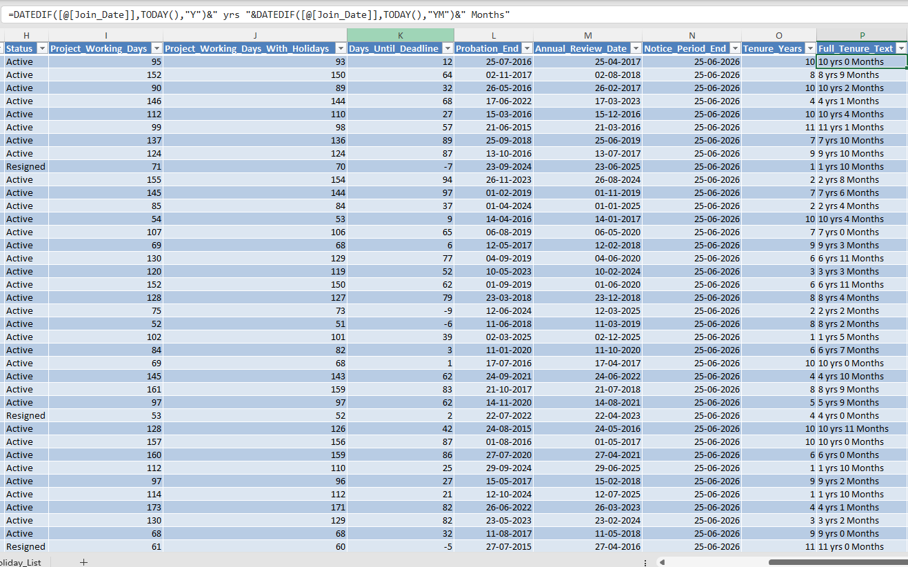
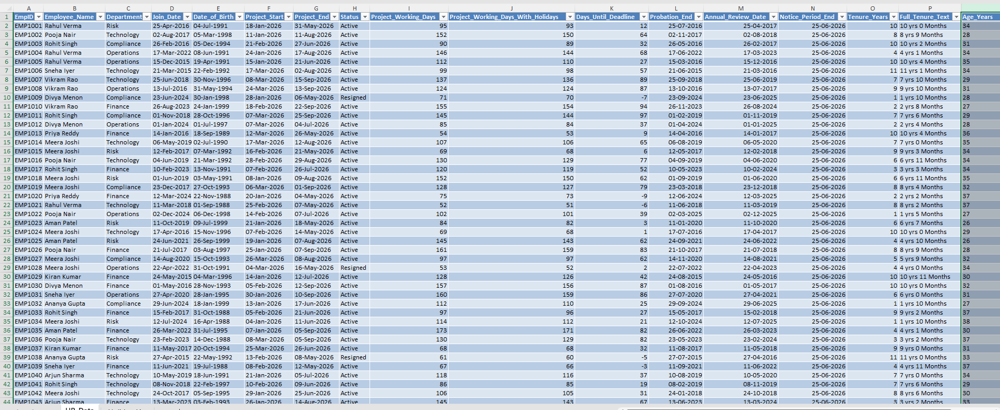

# Day 78 — Advanced Date Functions in Microsoft Excel for Data Analytics  
## NETWORKDAYS, EDATE, DATEDIF, WORKDAY | BFSI HR Analytics Project

📁 Folder Name: `day78_advanced_date_functions/`

---

# 📌 Project Overview

This project is part of my **120 Days Data Analyst Learning Journey**, where I am learning Microsoft Excel for Data Analytics through practical projects and structured GitHub documentation.

For Day 78, I focused on learning **Advanced Date Functions in Microsoft Excel** using a realistic BFSI (Banking, Financial Services, and Insurance) HR dataset.

Instead of only practicing formulas, I tried to understand:

- how HR teams use date calculations in real organizations
- how Excel supports employee lifecycle reporting
- how date functions reduce repetitive manual work
- how business workflows can be automated using formulas

Functions practiced in this project:

- NETWORKDAYS
- EDATE
- DATEDIF
- WORKDAY

This project helped me move beyond syntax and understand practical HR analytics workflows.

---

# 🎯 Business Objective

HR and Operations teams in BFSI organizations frequently manage:

- employee joining dates
- probation periods
- annual review schedules
- notice periods
- project deadlines
- workforce tenure tracking

Manually calculating dates across large employee datasets becomes repetitive and error-prone.

The objective of this project was to understand how Excel Date Functions can automate HR reporting workflows and improve analytical efficiency.

---

# 🗂 Dataset Information

A **2000-row Indian BFSI HR dataset** was created for this project.

### Dataset Columns

| Column Name | Description |
|---|---|
| EmpID | Employee ID |
| Employee_Name | Employee name |
| Department | Employee department |
| Join_Date | Employee joining date |
| Date_of_Birth | Employee date of birth |
| Project_Start | Project start date |
| Project_End | Project end date |
| Status | Employee status |

Departments included:

- Finance
- Operations
- Technology
- Risk
- Compliance

---

# ⚙️ Excel Workflow

## 1️⃣ Dataset Preparation

- Imported HR dataset
- Converted raw data into Excel Table
- Named table as `HRTable`
- Verified date formatting

---

## 2️⃣ Working Day Analysis using NETWORKDAYS

### Formula Used

```excel
=NETWORKDAYS([@Project_Start],[@Project_End])
```

### Holiday Version

```excel
=NETWORKDAYS([@Project_Start],[@Project_End],Holiday_List!A:A)
```

### Business Understanding

Banks and insurance companies use working-day calculations for:

- project deadlines
- audit schedules
- compliance reporting
- employee planning

---

## 3️⃣ Probation & Review Date Tracking using EDATE

### Probation End

```excel
=EDATE([@Join_Date],3)
```

### Annual Review Date

```excel
=EDATE([@Join_Date],12)
```

### Learning

I understood how future business dates can be generated automatically rather than calculated manually.

---

## 4️⃣ Business Day Calculation using WORKDAY

### Formula Used

```excel
=WORKDAY(TODAY(),30)
```

### Learning

WORKDAY automatically skips:

✅ Saturday  
✅ Sunday  

This removes manual effort while calculating future business dates.

---

## 5️⃣ Employee Tenure Analysis using DATEDIF

### Formula Used

```excel
=DATEDIF([@Join_Date],TODAY(),"Y")
```

---

# ⭐ Important Learning — DATEDIF is Undocumented

One of the most interesting things I learned today was that **DATEDIF is an undocumented Excel function.**

This means:

Microsoft still supports the function, but it does not officially appear in formula suggestions or autocomplete.

I found this especially interesting because it is still widely used in HR analytics and interview scenarios.

---

### DATEDIF Codes Practiced

| Code | Meaning |
|---|---|
| "Y" | Completed years |
| "M" | Completed months |
| "D" | Total days |
| "YM" | Remaining months excluding years |
| "MD" | Remaining days excluding months |

---

## 6️⃣ Employee Tenure Display

### Formula Used

```excel
=DATEDIF([@Join_Date],TODAY(),"Y")&" yrs "&DATEDIF([@Join_Date],TODAY(),"YM")&" months"
```

Example:

```text
4 yrs 7 months
```

This made employee tenure easier to understand inside HR reports.

---

## 7️⃣ Employee Age Analysis

### Formula Used

```excel
=DATEDIF([@Date_of_Birth],TODAY(),"Y")
```

Used for age-based employee reporting.

---

# 🧠 Excel Features & Formulas Used

| Formula | Purpose | BFSI Business Use |
|---|---|---|
| NETWORKDAYS | Working-day calculation | Project tracking |
| EDATE | Future dates | Review scheduling |
| WORKDAY | Business date calculation | Notice periods |
| DATEDIF | Tenure & age | Workforce analytics |
| Structured References | Cleaner formulas | HR reporting |

---

# 🏦 How Banks & Insurance Companies Use These Daily

These date functions support many operational activities:

- probation tracking
- compliance deadlines
- employee tenure analysis
- HR dashboards
- project planning
- review scheduling
- employee exits
- audit timelines

This project helped me understand that date functions are not only formulas; they support real business processes.

---

# 📈 Key Insights Learned

- Date functions automate repetitive HR tasks.
- NETWORKDAYS becomes more powerful with holidays.
- WORKDAY automatically ignores weekends.
- DATEDIF is hidden but still practical.
- Excel supports realistic workforce analytics workflows.

---

# 🚧 Challenges Faced During Learning

## Understanding DATEDIF

Initially, I thought DATEDIF was a regular Excel function.

Learning that it was undocumented made me curious and pushed me to understand how older Excel functions still remain valuable.

---

## Understanding Business Use Cases

The formulas themselves looked simple, but connecting them to HR workflows helped me understand their practical importance.

---

# 📚 Skills Improved Through This Project

## Technical Skills

- Advanced Excel formulas
- Date calculations
- Workforce reporting
- HR analytics
- Business-day calculations

## Analytical Skills

- HR process understanding
- Business reporting thinking
- Documentation structure
- Practical workflow understanding

---

# 🎯 Learning Outcomes

By completing this project, I improved my understanding of:

- Microsoft Excel for Data Analytics
- Date-based reporting workflows
- BFSI HR business scenarios
- Practical Excel applications
- Structured GitHub documentation

This project helped me focus more on business understanding rather than only memorizing formulas.

---

# 📂 Folder Structure

```plaintext
day78_advanced_date_functions/
│
├── Day78_HR_BFSI_DateFunctions.xlsx
├── README.md
│
├── screenshot_date_functions_main.png
├── screenshot_datedif_formula.png
├── screenshot_complete_hr_dashboard_view.png
```

---

# 📸 Project Screenshots

## 🔹 Advanced Date Functions Analysis

This screenshot shows multiple Excel date functions used together, including NETWORKDAYS, EDATE, and WORKDAY.



---

## 🔹 DATEDIF Formula & Employee Tenure Analysis

This screenshot shows DATEDIF formulas used for tenure calculations and readable tenure text generation.



---

## 🔹 Complete HR Analytics Workflow

This screenshot shows multiple calculated columns side by side demonstrating the complete HR analytics workflow.



---

# 🤝 Recruiter-Focused Conclusion

This project reflects my approach toward becoming a Data Analyst through practical work and consistent documentation.

Instead of only watching tutorials, I am trying to understand how Excel solves real business problems and how analytical thinking applies in business scenarios.

I am gradually improving my:

- Excel reporting skills
- Business understanding
- Documentation quality
- GitHub portfolio
- Job-ready analytics workflows

---

# 📬 Connect With Me

## GitHub
https://github.com/saideeppallela/data-analyst-worklog-2026

## LinkedIn
https://www.linkedin.com/in/saideep-pallela/

---

# 🔍 SEO Keywords

Microsoft Excel for Data Analytics, Excel Data Analysis Project, Excel Dashboard, Advanced Excel, Excel for Business Analytics, Excel Data Cleaning, Excel Pivot Tables, Excel Charts, Excel Formulas, Excel KPI Dashboard, Excel Analytics Portfolio, Aspiring Data Analyst, Data Analyst Portfolio, Excel Reporting, Excel Visualization, Business Analytics, Data Cleaning in Excel, Excel Learning Project, GitHub Data Analytics Portfolio, Real-world Excel Projects
