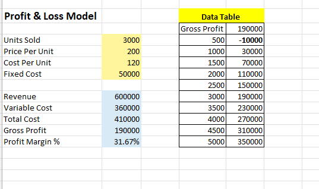
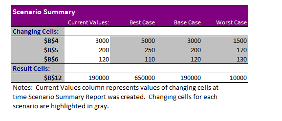

# 📊 Microsoft Excel for Data Analytics | What-If Analysis (Goal Seek, Scenario Manager & Data Table) | Day 81

<p align="center">


</p>

---

# 👋 Introduction

Welcome to **Day 81** of my **120-Day Data Analytics Learning Journey**.

Today's focus was understanding how **Excel What-If Analysis** helps analysts answer business questions without manually changing multiple values.

Instead of simply learning the tools, I built a small **Profit & Loss model** and explored how changing business assumptions affects profitability.

This hands-on exercise helped me understand how financial analysts and business analysts evaluate different business outcomes before making decisions.

---

# 🎯 Learning Goal

During this exercise I practiced:

- ✅ Goal Seek
- ✅ Scenario Manager
- ✅ Scenario Summary Report
- ✅ One Variable Data Table
- ✅ Financial Modeling
- ✅ Sensitivity Analysis

---

# 💼 Business Scenario

Assume a retail company wants to understand:

- How many products must be sold to earn ₹300,000 profit?
- What happens if sales increase?
- What happens if product price changes?
- What happens during a worst-case business situation?

Instead of manually changing values repeatedly, Excel What-If Analysis answers these questions automatically.

---

# 📊 Profit & Loss Model

### Inputs

| Input | Value |
|-------|-------:|
| Units Sold | 3000 |
| Price Per Unit | ₹200 |
| Cost Per Unit | ₹120 |
| Fixed Cost | ₹50,000 |

---

### Calculated Metrics

- Revenue
- Variable Cost
- Total Cost
- Gross Profit
- Profit Margin

---

# ⚙️ Workflow

### Step 1

Created a Profit & Loss model using Excel formulas.

---

### Step 2

Used **Goal Seek** to identify the number of units required to achieve a Gross Profit target of **₹300,000**.

Result:

```
4375 Units
```

---

### Step 3

Created three business scenarios using **Scenario Manager**.

| Scenario | Units | Price | Cost |
|----------|------:|------:|-----:|
| Best Case | 5000 | ₹250 | ₹110 |
| Base Case | 3000 | ₹200 | ₹120 |
| Worst Case | 1500 | ₹170 | ₹130 |

---

### Step 4

Generated an automatic **Scenario Summary Report**.

---

### Step 5

Built a **Data Table** to analyze how Gross Profit changes when Units Sold increase from **500 to 5000**.

---

# 📈 Scenario Results

| Scenario | Gross Profit |
|----------|-------------:|
| Best Case | ₹650,000 |
| Base Case | ₹190,000 |
| Worst Case | ₹10,000 |

---

# 🧠 What I Learned

This exercise helped me understand that every What-If Analysis tool solves a different business problem.

- Goal Seek works backward from a target.
- Scenario Manager compares multiple business assumptions.
- Data Table performs sensitivity analysis automatically.

More importantly, I learned when each feature should be used in a real business environment rather than simply learning the menu options.

---

# 🚀 Skills Improved

- Microsoft Excel
- Financial Modeling
- What-If Analysis
- Scenario Planning
- Business Analytics
- Sensitivity Analysis
- Decision Support

---

# 📸 Screenshots

## 📌 What-If Analysis Workflow

> Built the Profit & Loss model and performed Goal Seek along with Data Table analysis.



---

## 📌 Scenario Summary Report

> Compared Best Case, Base Case, and Worst Case business scenarios using Scenario Manager.



---

# 📂 Repository Structure

```text
day81_what_if_analysis/
│
├── README.md
├── Day81_What_If_Analysis_Dataset.xlsx
├── what_if_analysis_tools.png
└── scenario_summary.png
```

---

# 🌱 Learning Reflection

Every day I try to understand **why** a feature is used before learning **how** to use it.

Building this financial model and experimenting with different business situations gave me practical exposure to Excel techniques that are widely used in financial planning, reporting, and business analytics.

Although this is a learning exercise, it reflects the structured approach I want to bring to future Data Analyst projects.

---

# 🤝 Let's Connect

If you're reviewing my learning journey, I'd appreciate your feedback.

**GitHub**
> https://github.com/saideeppallela


---

# 🔍 SEO Keywords

Microsoft Excel for Data Analytics, Advanced Excel, What-If Analysis, Goal Seek, Scenario Manager, Data Table, Financial Modeling, Business Analytics, Excel Learning, Excel Analytics Portfolio, Aspiring Data Analyst, GitHub Data Analytics Portfolio, Data Analyst Portfolio, Sensitivity Analysis, Real-world Excel Learning.

---

<p align="center">

## ⭐ Day 81 / 120 Completed

**Learning one business problem at a time. Building one skill at a time.**

</p>
