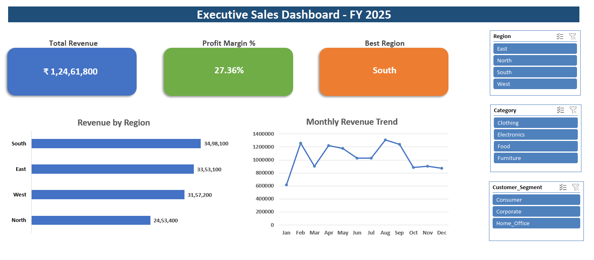
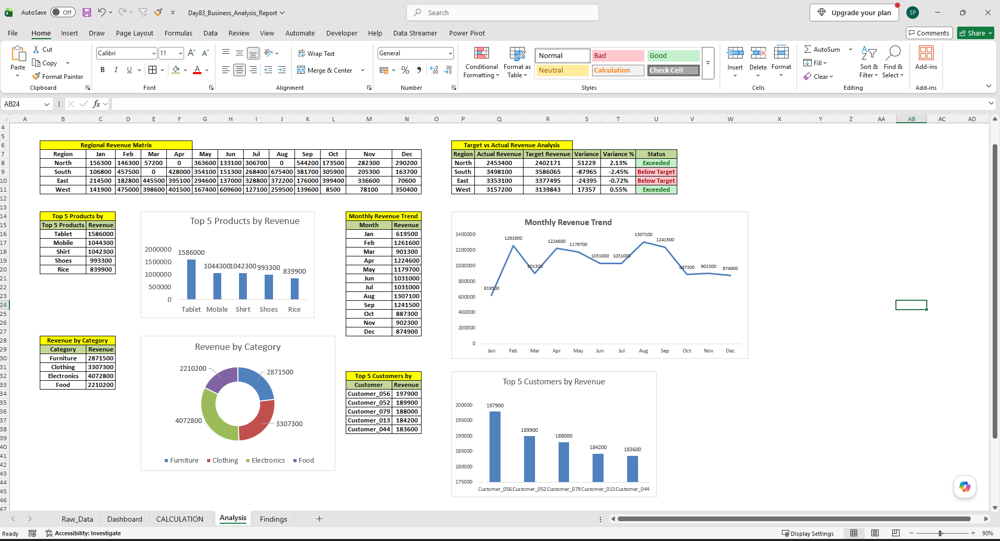
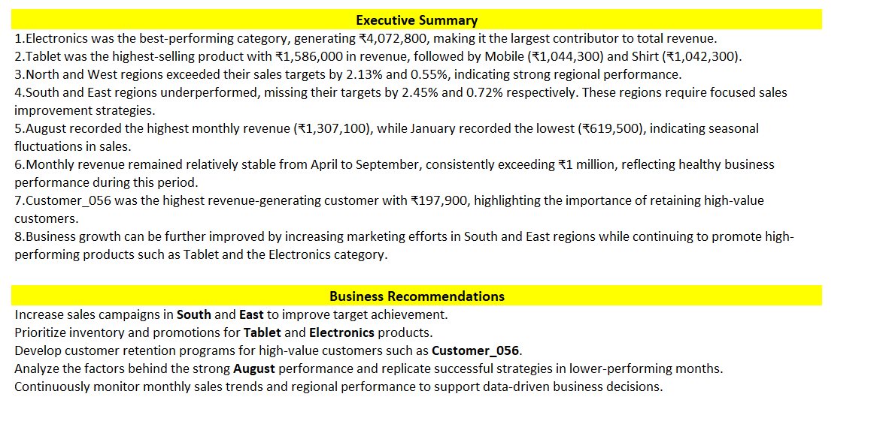

# 📊 Business Analysis Report using Microsoft Excel

<div align="center">


### Transforming Raw Sales Data into Actionable Business Insights Using Microsoft Excel

</div>

---

# 📖 Project Overview

This repository showcases a Business Analysis Report developed using **Microsoft Excel**. The project demonstrates how raw sales data can be transformed into meaningful business insights through analytical reporting, performance evaluation, and data visualization.

As part of my Data Analytics learning journey, I built this project to strengthen my practical business analysis skills by working on a realistic sales dataset and presenting insights in a structured, decision-ready format.

---

# 🎯 Business Objective

The primary objective of this project is to analyze business performance and answer important business questions by:

- Comparing regional revenue performance
- Evaluating actual revenue against sales targets
- Identifying top-performing products and customers
- Analyzing category-wise revenue contribution
- Understanding monthly sales trends
- Generating actionable business recommendations

---

# 📌 Project Highlights

| Feature | Status |
|---------|:------:|
| Regional Revenue Analysis | ✅ |
| Target vs Actual Analysis | ✅ |
| Top 5 Products Analysis | ✅ |
| Revenue by Category | ✅ |
| Monthly Revenue Trend | ✅ |
| Top 5 Customers Analysis | ✅ |
| Business Findings | ✅ |
| Business Recommendations | ✅ |

---

# 🛠️ Tech Stack

| Category | Technologies |
|-----------|--------------|
| Spreadsheet Tool | Microsoft Excel 365 |
| Excel Functions | SUMIFS, UNIQUE, TAKE, SORTBY, MAP, LAMBDA |
| Data Analysis | Structured References, Excel Tables |
| Visualization | Column Chart, Doughnut Chart, Line Chart |
| Reporting | Conditional Formatting, Business Reporting |

---

# 📊 Business Questions Answered

- Which region generated the highest revenue?
- Which regions exceeded or missed their targets?
- Which product generated the highest revenue?
- Which category contributed the most revenue?
- Which month recorded the highest and lowest sales?
- Who are the highest revenue-generating customers?
- What actions can improve overall business performance?

---

# 📈 Analysis Performed

| Analysis | Purpose |
|----------|---------|
| Regional Revenue Matrix | Compare monthly revenue across regions |
| Target vs Actual Revenue | Measure business performance against targets |
| Top 5 Products | Identify best-performing products |
| Revenue by Category | Analyze category contribution |
| Monthly Revenue Trend | Identify seasonal sales patterns |
| Top 5 Customers | Recognize high-value customers |
| Business Findings | Summarize insights and recommendations |

---

# 📸 Project Screenshots

# 📸 Project Screenshots

## Dashboard



---

## Analysis



---

## Findings



---

# 💡 Key Business Insights

| Insight | Observation |
|----------|-------------|
| 🥇 Highest Revenue Category | Electronics |
| 🏆 Best Performing Product | Tablet |
| 📈 Highest Revenue Month | August |
| 📉 Lowest Revenue Month | January |
| ✅ Best Performing Regions | North & West |
| ⚠️ Improvement Required | South & East |
| 👥 Top Customer | Customer_056 |

---

# 💼 Business Recommendations

- Focus marketing efforts on underperforming regions.
- Promote high-performing products to maximize revenue.
- Strengthen the Electronics category to sustain growth.
- Reward high-value customers through loyalty programs.
- Analyze successful sales strategies from peak-performing months.
- Monitor regional KPIs regularly for informed decision-making.

---

# 🎓 Learning Outcomes

Through this project, I gained practical experience in:

- Transforming raw data into business insights
- Building analytical reports using Excel
- Performing sales and revenue analysis
- Creating professional business visualizations
- Presenting findings with actionable recommendations
- Improving analytical and business problem-solving skills

---

# 🚀 Skills Demonstrated

- Business Analysis
- Sales Analytics
- Revenue Analysis
- Customer Analysis
- Product Performance Analysis
- Data Visualization
- Excel Reporting
- KPI Analysis
- Analytical Thinking
- Business Storytelling

---

# 📂 Project Structure

```text
day83_business_analysis_report/
│
├── Day83_Business_Analysis_Report.xlsx
├── README.md
└── screenshots/
    ├── 01_dashboard.png
    ├── 02_analysis.png
    └── 03_findings.png
```

---

# 👨‍💻 About Me

Hi, I'm **Saiidheep Pallela**, an aspiring **Data Analyst** passionate about solving business problems using data.

I'm continuously building hands-on projects in **Excel, SQL, Power BI, and Python** to strengthen my analytical thinking, reporting, and visualization skills while preparing for a Data Analyst role.

⭐ If you found this project helpful, feel free to explore the repository and share your feedback!
